This article gives you 10 ways to improve how you run your virtual meetings. It covers how to kickoff with the right energy, to time-saving techniques, and ways to increase participation. The tips are accompanied by real examples and free templates to use.

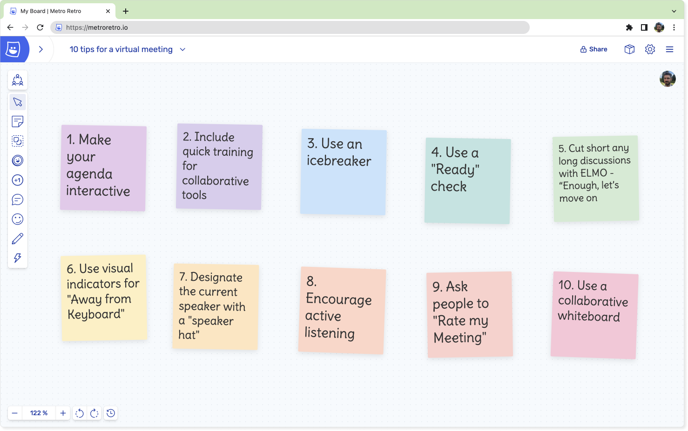

## 1\. Create an Interactive Agenda

An agenda keeps the meeting focused, and can vary from a few bullet points to a detailed table. Whichever you choose, next time try **making the agenda interactive**. This will:

1.  Encourage people to actually read the agenda.
2.  Promote active participation right from the start.
3.  Surface unspoken topics before the meeting starts, not halfway through.

Use a visual format for your agenda and leave space for comments and edits. Let participants move things around themselves. This can even function as your meeting icebreaker!

**Example: Interactive Meeting Agenda –** [Use Free Template Now!](/templates/meeting-agenda).

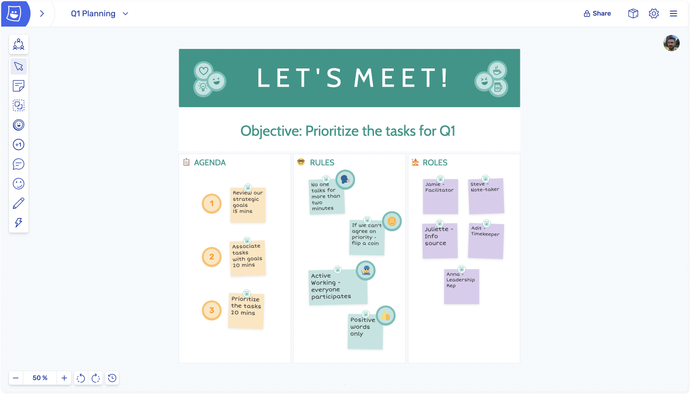

This agenda uses the OARR format (Objectives, Agenda, Rules and Responsibilities). Because anyone can edit it, the team can change it together before they start!

Alternatively, you can try running your meeting in the **Lean Coffee** style. Lean Coffee meetings have no pre-set agenda, so the participants pitch each other on what to talk about and then vote on their favourite topics to discuss. We’ve written a quick guide on [How To Run Lean Coffee Meetings](/templates/lean-coffee).

**Example: Lean Coffee** – [Use Free Template Now!](/templates/lean-coffee).

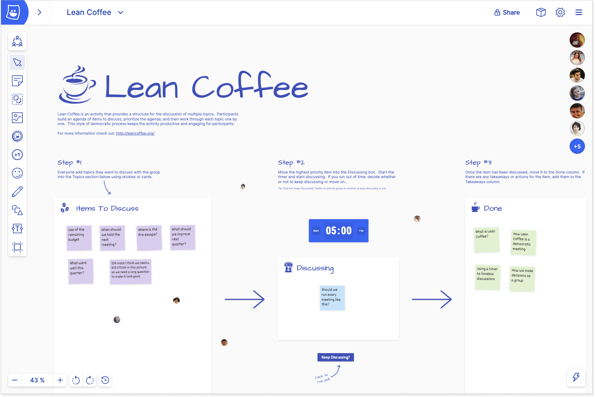

The Lean Coffee template in action

## 2\. Include training for your meeting tools

If you’re using a collaborative tool to run your meeting, make sure everyone knows how to use it. There will be varying levels of comfort with technology across participants, and they won’t always be vocal about it either.

Include some basic training about the tool being used, or better yet – make a tutorial.

If you need inspiration, check out the [interactive tutorial](/tutorial/) built in to Metro Retro (you need a Metro Retro account to try this).

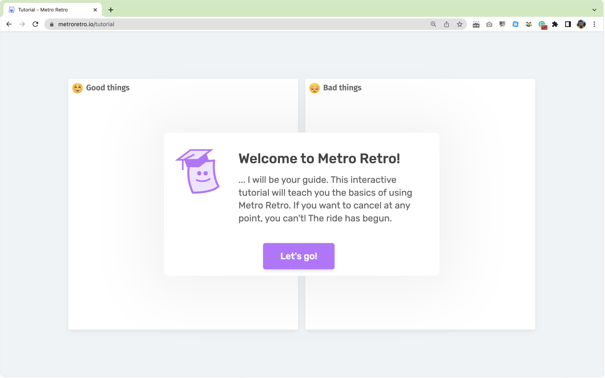

An interactive tutorial helps participants get used to the basics

## 3\. Use an Icebreaker

When someone joins your meeting, they will be carrying the mental baggage from their previous meeting or task with them. That might mean they arrive frustrated, upset, bored, over-excited, nervous, anxious, etc.

To combat this, use an Icebreaker or Energizer activity at the start of the meeting. It’s a short and usually fun activity that acts as a mental reboot for everyone and helps improve focus on the upcoming meeting.

**Example – Team Mood icebreaker** – [Use Free Template Now](/templates/team-mood-thermometer)

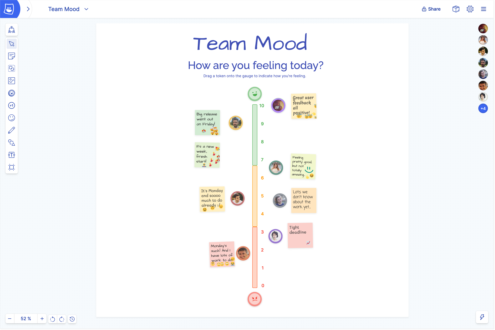

It doesn’t matter what type of meeting you are running, just use an exercise that gets people talking or engaging.

You can try interesting off-topic questions like “What’s the best piece of news you’ve had this week?” Keep up the practice. Experienced facilitators build up a list of appropriate icebreakers over time.  For ideas, take a look at our [31 Unique Icebreakers](/blog/unique-ideas-for-great-icebreakers)!

## Tip 4. Use a “Ready Check” to keep things moving

In a virtual meeting, how do you know when everyone has completed the current task? You can’t physically see that they have finished, so often meeting hosts need to resort to asking and waiting for replies. This is often clumsy to orchestrate. Using a Ready Check is an efficient and easy way to make sure everyone is ready to proceed from one activity to the next.

We built a Ready Check into Metro Retro so people can indicate when they’re done. It saves valuable time, and eliminates the need to keep asking if everyone is done.

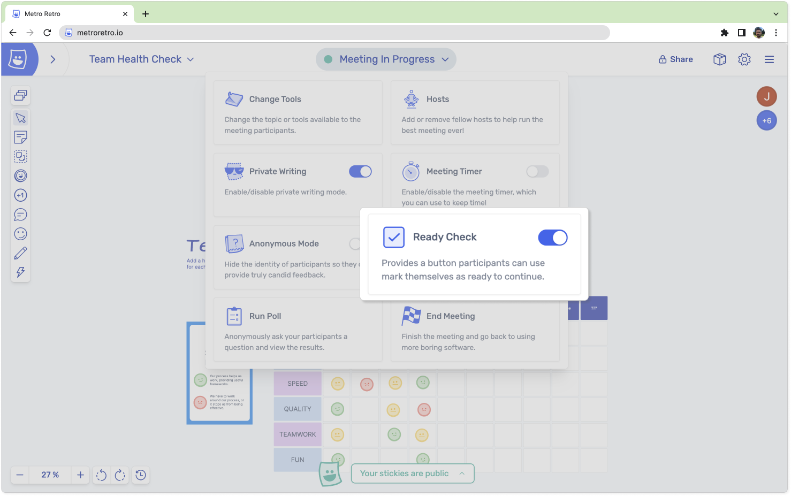

Enable the Ready Check feature from the host menu…

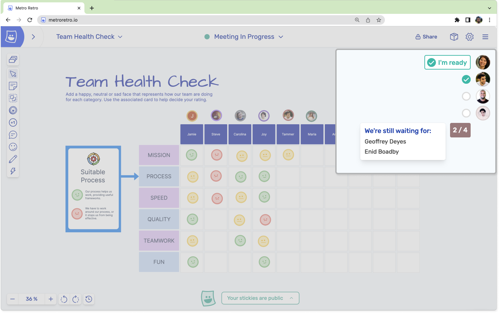

… so you can see who is ready to move on!

The ready check idea comes from online multiplayer games – where the leader of a group can ask if everyone is ready before they go fight a dungeon boss. World of Warcraft is a famous example. Here the leader initiates a ready check to see if the party is ready to enter a dungeon:

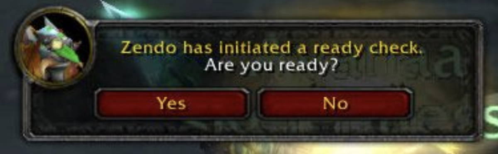

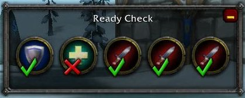

## Tip 5. Prevent discussions dragging on with the ELMO technique

Sometimes discussions drag on and on, taking too much time. You can use the ELMO protocol to cut short time-wasting debates. Aside from being a beloved(?) puppet from children’s TV, ELMO stands for **Enough, Let’s Move On!**‍

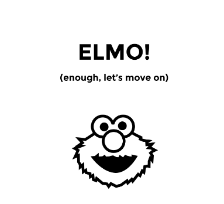

To try this, anyone can display a picture of ELMO when they think the discussion has run its course or needs to be taken out of the meeting. They can either place the ELMO picture on the board, hold a picture up to their webcam, or just dramatically scream out the word at the top of their lungs. If they are joined by more ELMOs, perhaps it is time to move on.

## Tip 6. Agree signals for AFK (Away From Keyboard)

In a virtual meeting you need people to be clear about whether they are present and focused. Together, come up with a way for people to visually indicate they are “Away From Keyboard” without having to interrupt everyone each time. This could be something you place on the virtual board, or as simple as switching your webcam off.

## Tip 7. Designate the current speaker

One way to manage who is talking at any given time is to reproduce the in-person technique where only the person holding the “speaking ball” is allowed to talk. To reproduce this virtually on a Metro Retro board, you can use the “Hats” feature. Whoever is wearing the “speaking hat” is the only person allowed to talk. 

To do this with your team:

1.  Ask the first person to speak to click on their icon at the top right and choose Wear Hat.
2.  Announce that this is the speaking hat and only they wearing the speaking hat shall speak.
3.  Ask the person with the hat to start speaking, and when done, then throw the hat into the board for someone else to pick up.

Throw Hat is available under the Gestures menu in the toolbar (if enabled) or by pressing W then 4 on the keyboard. We recommend also using the meeting timer to limit the amount of time each person gets to speak.

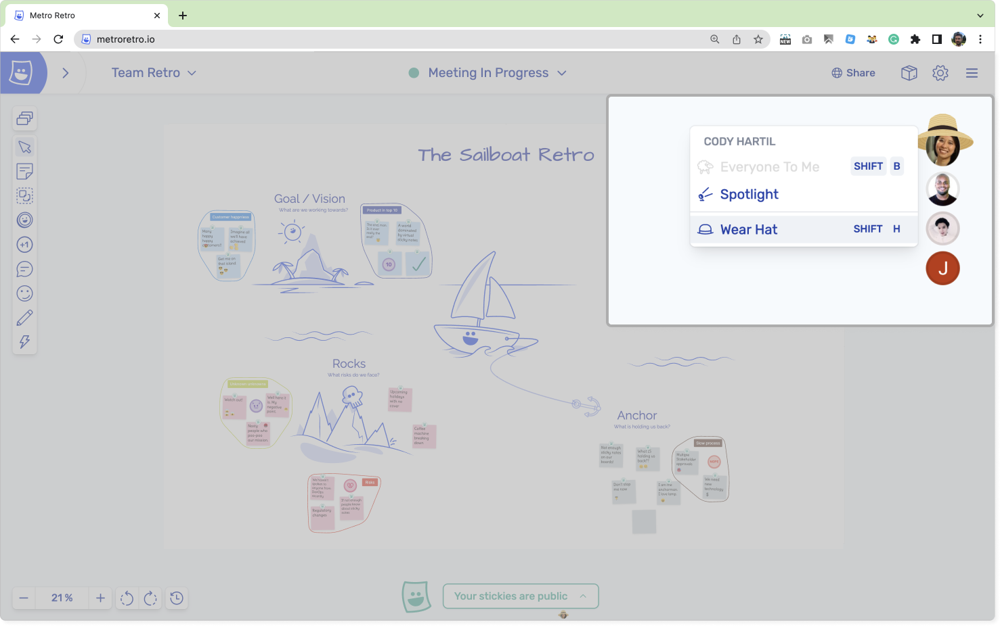

The designated speaker wears a hat

If you are more of a visual person, here is an instruction video:

## 8\. Encourage your team to use Active Listening

Active Listening is a way of paying full attention to someone when they are speaking. It involves more than just hearing the words; it means focusing on the speaker and trying to understand their thoughts and feelings. It’s a useful tool to help prevent software developers secretly writing code during a virtual meetings (and generally combat people getting distracted).

You can try implementing an active listening technique in the group, such as the “Key” method. When one person is talking, have everyone else draw or produce a picture of a key when the speaker has said a “key” point or has written a good idea on a sticky note. As the speaker it can be encouraging to see a round of keys flash up.

In Metro Retro there are a few ways to do:

- Use the Marker Tool to draw a keys in a central area of the board.
- Probably better, use the Reaction Tool with the key emoji and stamp the key an appropriate place, such as the sticky being discussed.
- Even better, use the Confetti Tool and have everyone pop confetti after a key statement.

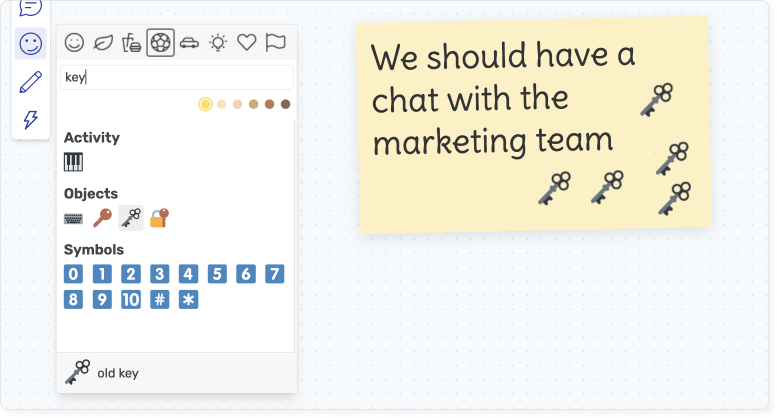

Stamp a key emoji on key points!

## Tip 9. Rate My Meeting

Are you the best meeting facilitator of all time? Are you the worst? You won’t know until you ask! The cost of a meeting is often an unacknowledged but significant amount. If you take the average hourly rate of your team and multiply it by the length of your meeting, you might be alarmed to see easily over $1000 for a 2 hour meeting. It’s important to get the most out of this time, so asking your team if it was a good use of their time is an important part of being an effective meeting leader.

Provide your participants a way to rate the meeting and you’ll start to learn whether it is valuable for them.

**Example – Rate My Meeting** – [Use Free Template Now](/templates/check-outs/roti-meeting-value-1-5)

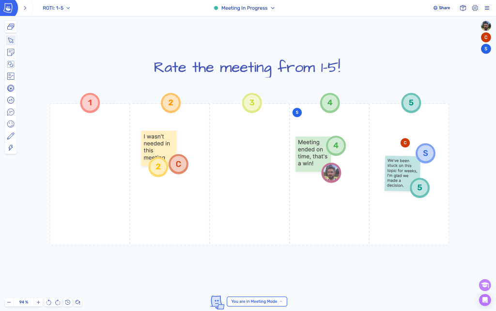

A simple but

It can be difficult to ask for this kind of information and you may discover some uncomfortable truths, but over the long term it will help you run better meetings. Ask your participants to rate the meeting from 1-5, make it anonymous if needed, and allow them to explain their rating – but only if they want to!

## Tip 10. Use Metro Retro to improve collaborative meetings

That’s right! It’s just a good old “use our app lol” coming in at #10. But wait! Before you hit that close button, we have actually put a lot of time and effort into building Metro Retro to be the best tool for running virtual meetings. Is it actually the best online whiteboard for meetings and workshops? Well that’s subjective, but to help you decide for yourself, here’s all the stuff it has that you won’t find in other tools at the time of writing this article, or if you do find it, it’s worse:

- Our sticky notes actually look like real sticky notes and don’t just feel like a soulless rectangle!
- You can write stickies in private and share them when you’re ready using our Private Writing feature.
- Easily run an anonymous session with the Hide Identities feature.
- Intuitively cluster ideas together with our dynamic Topic Tool.
- Test out your laptop fans with everyone’s favourite: The Confetti Tool.
- Dig into what people are thinking with voting rounds and polls.

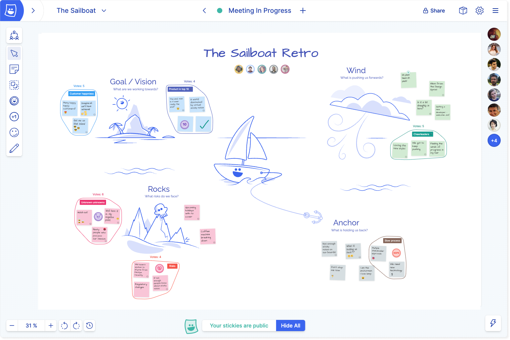

A collaborative meeting in Metro Retro

There are so many more features we could mention, but maybe you should just [go and see for your self?](/setup) And while you are in there, all of these tips in this article can be implemented in a Metro Retro board and adapted as needed. So what are you waiting for?

[Get started with Metro Retro](/setup)
