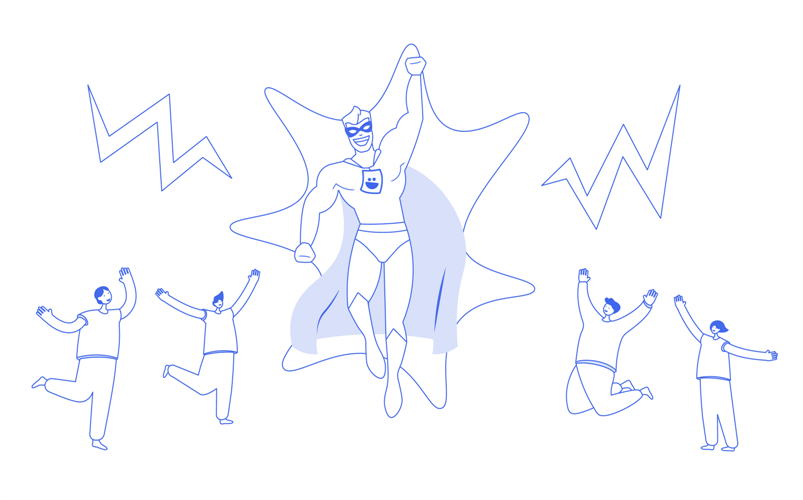
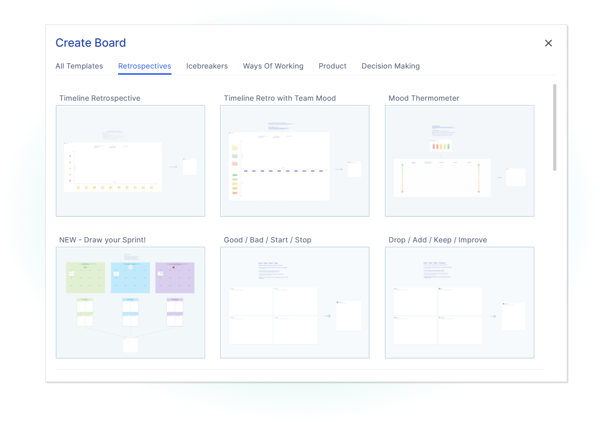
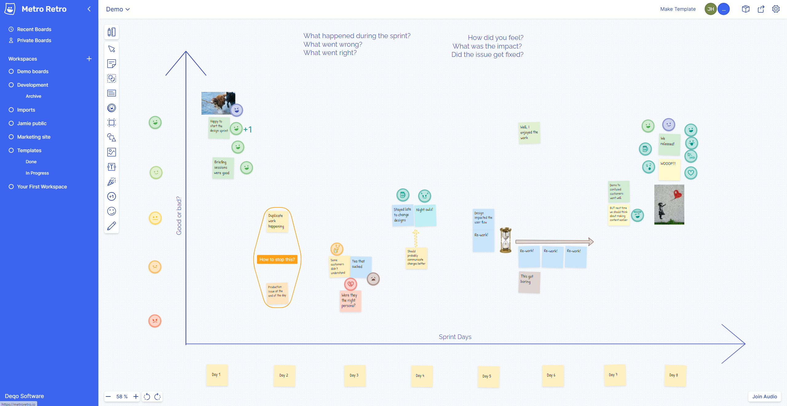
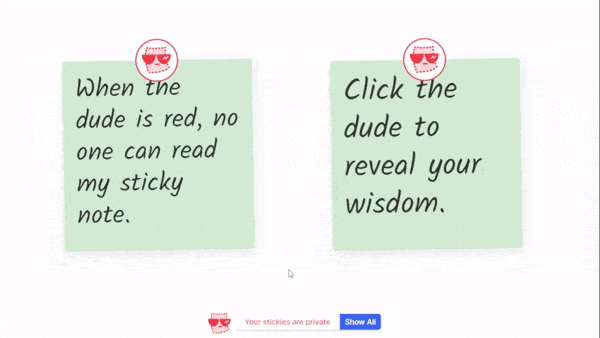
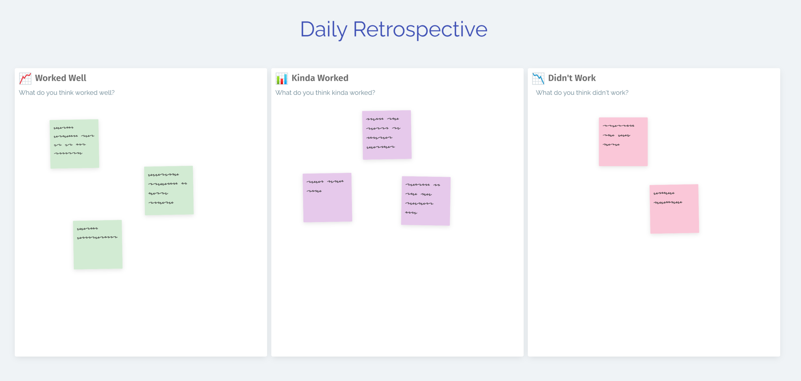
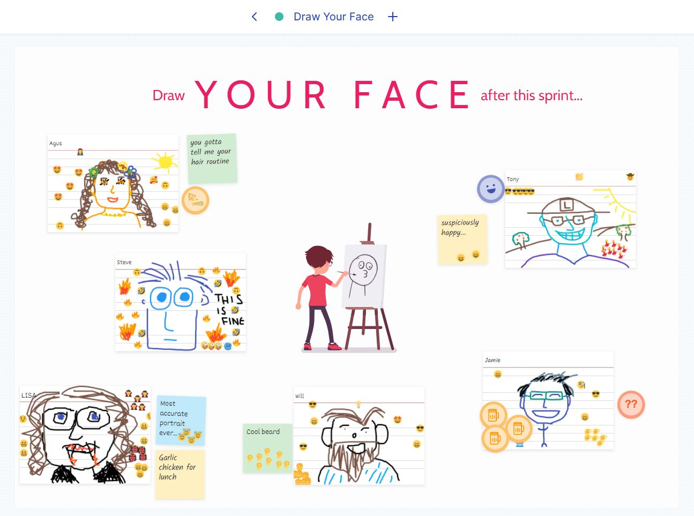
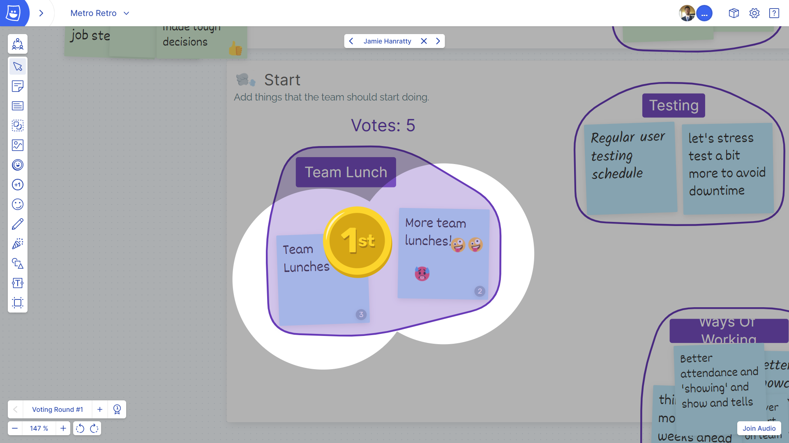
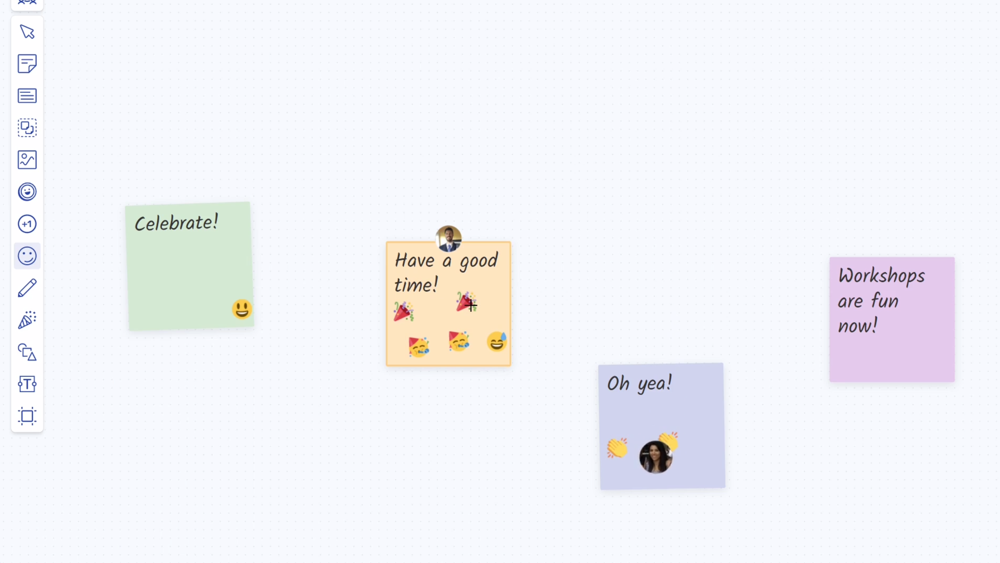

If you hadn’t noticed yet, we’ve built a completely [new version](/early-access) of Metro Retro. Go check it out if you haven’t already. In the new version we’ve improved the tools and templates for your retros, and in short, if you already love Metro Retro you will LOVE these upgrades!

Here is a generic picture to accompany this post…

## First, some context

Our goal is to be the best collaboration tool for agile, engineering and product teams.

Over 400,000 of you have been meeting with your teams in Metro Retro, and your feedback has helped us shape this new version. It is code-named “Metro Retro v2” or just “v2”, and is in Early Access. (We’ll come up with a better name soon). V2 is the paid version of Metro Retro, and you can get a [free trial](/early-access) to join the early adopters already transforming their team meetings.

There are LOADS of new things in v2 that make **all** your meetings and workshops better, not just retros. Soon we will show you how we’re improving your sprint planning, roadmaps, poker planning, brainstorms, workshops…. but today I’ll be focusing on how we’ve improved your retrospectives.

## 3 ways retros are better in v2

If you’re reading this, you probably use Metro Retro v1 to run your retrospectives, and you probably love it. However, if you want to squeeze even more juicy drops of progress from your retrospectives, here are three reasons why you will want to try v2 pretty soon:

1.  More templates with complete customization – giving you a fresh format every retro
2.  Improved whiteboarding – get visual and creative in your retros
3.  New, unique tools to help you facilitate the retrospective phases‍

### 1\. A fresh format for every retro

Some teams groan at retro time. This is usually because they follow the same retro format, which gets stale quickly. To help you combat this, V2 has a varied range of retrospectives, as well as new **icebreakers** to get people talking.

To keep it fresh and interesting, you can also:

- customize and combine every single element of the templates
- start from scratch to build your own retro, (with as many activities as you can fit on a board!)
- share personal templates with colleagues in your new team space

Lots more templates in v2 – 47 at time of writing!

### 2\. Get creative in your retros

We’ve massively improved the whiteboarding capabilities of Metro Retro.

Now instead of just stickies, zones and topics, you can throw everything related to the sprint into your board: upload images and GIFs, add CSV data, paste meeting notes, roadmaps, designs, sprint outputs, burndown charts, customer feedback or team happiness charts. Then annotate them with **sticky notes, cards, comments, drawings** and **arrows** to build up the picture.

> Tip: make a timeline of the sprint and have the team plot the key events and how each made them feel.

A team running a timeline retro to map the highs and lows of the sprint

### 3\. Improved tools for each retro phase

The new interactive tools encourage people to contribute even more than they did in v1 boards.

#### Private sticky notes – creating a safe space to open up

One of the key features for retros is **public/private sticky notes** – write your points in private and reveal only when you decide to. We’ve improved this in v2 so you can choose to reveal your sticky notes one-by-one, keeping the focus on each point in turn.

Now you can reveal each sticky note one-by-one

‍

_Coming soon_ – run **anonymous retros**. You will be able to choose to make retros completely anonymous. Sometimes anonymity can help people speak more honestly.

Lastly, if you decide to store your retro data elsewhere, you can **export the data anonymously**, so individuals can’t be identified.

Your private sticky notes can’t be read by other people until you reveal them

#### Generating deeper discussions

There are loads of ways to express yourself in Metro Retro v2. Make your point visually with drawings, emoji reactions, tokens, sticky notes, gifs, and images. Sometimes a picture really is worth a thousand words.

Regardless of creativity levels, any good discussion should be guided. The new **grouping, voting,** and **facilitator controls** help you keep the discussion on track.

> Spend your time talking about the sprint, not figuring out how to participate.

One fun way of showing how the sprint affected you!

#### Actions documented and shared

There’s no point running retros if you don’t agree on the next set of actions or experiments to try in the next sprint. Here’s how you wrap up a retro in v2:

- Identifying key actions is easy with the improved **voting** and **spotlight** tools.
- Let the team evaluate your retros with the new Closing Activities templates (e.g. rate this retro from 1-5).
- You can **export** any board data to use in your project management tools and Wikis.
- Each board is living documentation of your team’s continuous improvement. Look back at previous problems, solutions, actions, and experiments at any time.

_Coming soon:_

- ‍*image exports*
- _direct integration with your team tools like JIRA, Confluence, Slack, Teams etc._
- _analyze patterns & themes across your retros._

Easy to identify the top-voted action!

## Don’t forget to enjoy your meetings!

There are lots of ways to encourage people to loosen up with the fun Metro Retro tools. It will ultimately help them work through any issues that arise in the retro.

Try these in v2:

- Have a GIF battle, or build a sprint ‘pinboard’.
- Explore creative drawing with a marker pen. Draw how the sprint made you feel, or even draw your customers using your product!
- Slapping. Yes, you read that correctly. You can slap your team-mates in both Metro Retro v1 and v2. [It’s more fun in v2](https://www.youtube.com/watch?v=618nDVya1l0).
- Of course the confetti – We are proud to be the makers of the original confetti cannon and are flattered by the many imitations out there. Watch this space – we have plans to make the confetti cannon even more distracting!

No cynical people were harmed in the making of this blog post

## How to get your hands on v2

v2 is available with a subscription. Register for your [free trial here.](/early-access)

If you’d like to ask us any questions or request a demo of v2, please email us at contact@metroretro.wpsc.dev
