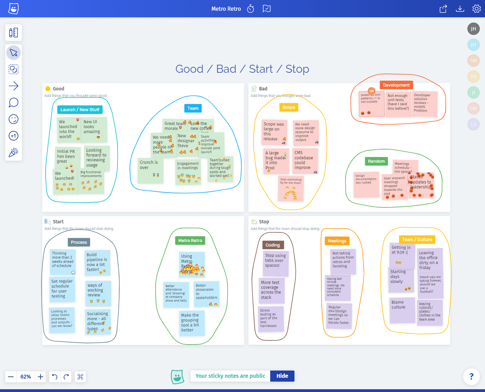
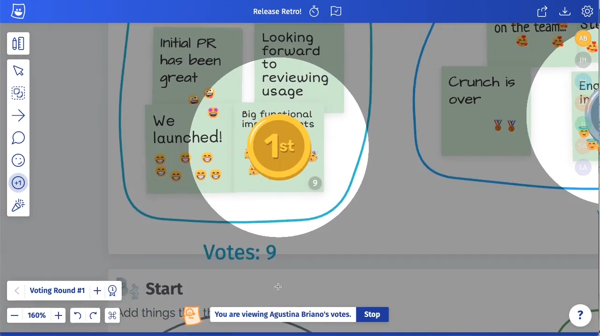

_Lillian is a Scrum Master with over 6 years experience in the software industry. Lillian uses agile methodologies to plan, organize and motivate scrum teams to exceed performance and delivery expectations; ensuring sprint releases, and continuously delivering business value._

Lillian, Scrum Master

## Creating for colleagues

We caught up with Lillian, the Scrum Master for the Mobile Foundation Team at a global financial institution. The Mobile Foundation Team is a development team creating reusable libraries, components, processes and standards to be used by nearly fifty of the company’s mobile app teams around the world.

The mission of the team is to provide a rich set of capabilities that allow mobile app engineers anywhere in the company to focus on creating new value as opposed to re-inventing the wheel. This ranges from login components to UI design libraries.

Because their work is the basis for many other App projects around the world, there is a high demand for the team’s time and attention. This demand means they need to be constantly innovating and iterating on their work, while maintaining an extremely high level of quality.

Lillian and the team conduct regular retrospectives in Metro Retro to ensure they are prioritising the right issues and working as efficiently as possible.  
Their retrospectives give them a chance to step back and think about what they can improve when working together.

## Better for remote collaboration

Lillian’s team have run their retros in Metro Retro for over a year now, holding over 30 retros together and creating well over 2000 virtual sticky notes! (_Imagine all that paper…!_)

> “Metro Retro gives us a better visualization of ideas, saves time during the retro and creates conversations between team members.”

> “Most importantly for us it meant that everyone could fully participate in the retro, whether working from home or in the office.”

“Before Metro Retro I used to spend a lot more time on the admin around a retro: choosing a format, preparing the session, booking a meeting room, then writing up the actions and outcomes from the whiteboard into Confluence.  
It also wasn’t a great experience for the remote team members who had to video call into the retrospective. We had to put their sticky notes up on the board for them while they explained them.”

## The best bits of Metro Retro

Lillian says the most valuable tools for them are the **Grouping** and **Voting** tools:

> “They make it easy for the team to agree which actions to take out of the retro. A lot of things can happen in a week for us, so the Grouping tool helps us spot patterns, and the Voting tool prioritises the most important issues”.

Identify topics with the Grouping tool

The Voting tool highlights the most important issues

## Team spirit during COVID-19

The team were able to continue their retrospective process when working from home during the COVID-19 lockdown. The interactive energy in Metro Retro keeps the team engaged with each other during the retrospective, at a time when it is easy to feel isolated from others.

> “Metro Retro has been so helpful for remote members and our dispersed team members through the last year. We didn’t need to change our retros drastically during quarantine because we were already used to using a virtual board.”

## The numbers

- 13 team members
- 30+ retrospectives
- 2000+ sticky notes created
- 100+ improvements identified
