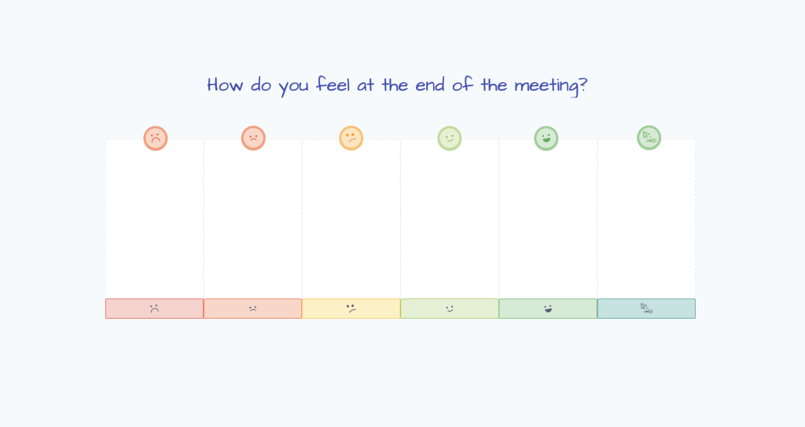

Was your last meeting was a good use of time?

How do you even measure this?

Well, reserving just five minutes at the end of your meeting for a check-out activity will give you the answer, and help make your next meeting more effective.

This is a guide on incorporating a check-out into your meetings, with free examples you can use immediately.

## What is a Meeting Check-Out?

Most people will start their meeting or workshop with a check-_in_ activity, however fewer people know about using a check-_out_ activity to wrap up a meeting. Both contribute to effective meeting results, but a check-out is more often missing from the agenda.

In the same way that a check-in or icebreaker is used at the start of a meeting to set the scene, a check-out is a short activity held at the end of the meeting that helps participants reflect on the results. It is also a chance to provide feedback to the meeting facilitator, which helps to improve the meeting for next time.

A check-out activity can take various forms, and we’ve provided some examples below, but a good check-out will focus on:

- summarising the meeting outcomes
- gauging participant’s attitude or mood post-meeting
- collecting feedback to improve the next time around

Asking how people feel after your meeting is a quick and simple way to gauge meeting success.

### Why Use a Check-Out Activity to End Your Meeting?

Most people know it’s best not to dive into a meeting or workshop “cold”, so will employ a form of [icebreaker](/blog/unique-ideas-for-great-icebreakers) or opening activity to get participants into the zone. The same applies to ending a meeting. End abruptly and you lose the benefits of a check-out activity:

- Creating a positive meeting finish
- Measure the value of your meeting
- Learn what can be improved for next time
- Summarise the key outcomes of the meeting
- Understand how participants feel after the meeting
- Participants become invested in improving their meetings
- Improve group cohesion and understanding of shared goals

Plus, with a little thought and preparation from the facilitator, these activities can invigorate participants, rather than feeling drained after the meeting.

## Example Meeting Check-Out Activities

Here are some of our favourite check-outs you can use in your next meeting, or use them to inspire your own:

### Measure the Value of Your Meeting with ROTI

At its core, a check-out activity gauges the effectiveness of the meeting. All meetings participants will care about slightly different things, so a check-out exercise helps extract feedback from each person’s perspective. Perhaps some people think their time could be used more effectively elsewhere. A check-out activity allows them a safe and polite space to voice this concern, rather than grumbling or complaining.

A ROTI exercise asks the participants to rate the “Return On Time Invested” – basically how much value the meeting provided for the time invested. You can simply use a numerical scale for this, or use a metaphor to make it interesting. (Although sometimes it’s best to use simple a ratings scale so you don’t dilute the purpose as a measurement tool).

Teams running a continuous meeting series, like a sprint retrospective, may want to use the same measure after each meeting and note any differences as their meeting practices evolve.

#### Example ROTI: Rate The Meeting

Use free template now: [Rate The Meeting 1-5](/BOUC9S0GU3E6)

#### Example ROTI: Treasure

This is an example of using a simple metaphor to elicit feedback. Participants can leave a token or sticky note on the pile of treasure that best represented the meeting’s value for them. You can optionally ask for a comment or idea for improvement.

Use free template now: [ROTI Treasure Template](/BO8WOI3Z6OPB)

#### Example ROTI: If This Meeting Was A Phone

Another example of using a metaphor to gather feedback on the meeting. Simply ask people to choose which phone best represents the meeting and why. Use their comments to improve your next meeting.

Use free template now: [If This Meeting Was A Phone](/BOSDLJH1JTVV)

### Gather Feedback: Words On The Door

If your team runs retrospectives, you’ll be used to making iterative process improvements on a continuous basis. There’s no reason why you can take the same approach to your meetings.

The Words On The Door activity asks participants to write a single sticky note on the door with feedback as they leave the meeting. If using a virtual whiteboard, each person can drop a sticky note onto a picture of a door. The benefit of a virtual whiteboard is that the facilitator can choose to make the contributions completely anonymous.

### My Takeaways

Some people will doubt whether a meeting has been an effective use of their time. To combat this, you can use a check-out to ask the group to reflect on the meeting results, their actions and priorities. “My Takeaways” is a reflective check-out that asks each person to answer questions like:

- What is the biggest takeaway for me?
- What are my priorities, have they changed?
- What have I learnt in this meeting?

You can decide whether these reflections are kept personal, or whether people share them with the group.

### A Fun & Creative Check-Out: Draw a Duck

Another way to make a positive experience is to include a check-out activity with a lighter tone, perhaps something completely off-topic to help people unwind back into their regular work. Depending on the group dynamics, this could be a light-hearted sketching exercise, such as “Draw a Duck” or answer quick-fire questions like “_What one thing are you looking forward to today?_ “.

The “**Draw a Duck**” activity ask participants to sketch a duck. That’s it.

It is a “light” exercise that is best used in the right context – usually when participants have some energy left, and are in an appropriate mood. Give them two minutes to sketch their best duck, and compare sketches together at the end. Again, you can choose to make this anonymous or not. You could even give a prize (or a forfeit) for the best and worst-voted duck. We did this at Metro Retro HQ in a recent retrospective, and my duck was voted the worst (spot it in the screenshot below). Obviously you can pick any animal or object – perhaps the team has a mascot, or a twist on the company logo?

This is what happened when we had a go during a meeting at Metro Retro HQ:

## How To Check-Out At The End Of a Meeting

Running a check-out is pretty simple, but follow these steps to make sure your check-out hits the mark:

1.  **Choose a tone and topic** – make sure it is appropriate for the context and participants. Add the check-out to the end of the meeting agenda. Keep an eye on the clock!
2.  **Introduce the check-out** – explain the activity, what you want people to do, and why. Explain how the information will be used.
3.  **Run the check-out** – set a short timer, say 1-3 minutes, and ask participants to provide their input.
4.  **Review** – discuss the results with the group, or take the feedback away to review yourself.
5.  **Improve your next meeting** – incorporate the feedback into improving the next meeting occurrence.

## Check-out FAQs

### What should be the focus while conducting check-out activities?

The focus of a check-out activity is to reflect on the meeting itself, in order to improve the next meeting occurrence. It also helps to summarise the meeting decisions and outcomes.

### What kind of tone should I set for check-out questions?

The tone of your check-out activity should be appropriate for the context, team, and topic of the meeting or workshop. If you are unsure, start with a simple 1-5 rating scale and optional request for feedback. Make it anonymous if you feel it will help people give honest feedback.

### What are good questions to ask in a meeting check-out?

- How do you feel after the meeting?
- Did we achieve our desired outcome?
- What went well? And didn’t go so well?
- What is your biggest takeaway for today?
- Rate the meeting effectiveness from 1-10.
- How was our teamwork during this meeting?
- How could this meeting be improved next time?
- What else should we have covered in this meeting?
- Rate the meeting value for the time invested from 1-5.
- How aligned are you with the outcome of the meeting?
- Is everyone in agreement with the decisions made in the meeting?

## Run your meeting in Metro Retro

If you run your meetings virtually, you’ll find 100+ [meeting and workshop templates](/templates) to use for free in Metro Retro, check-out activities included!

[Get started](/setup) with Metro Retro for free today, and make your next meeting the best one this year, with:

- 100+ beautifully-illustrated meeting and workshop templates
- Participants can write stickies in private and share them when they’re ready, using our Private Writing feature!
- Easily run an anonymous session with the Hide Identities feature!
- Intuitively cluster ideas together with our dynamic Topic Tool!
- Go mad with The Confetti Tool at the end of your meeting!
