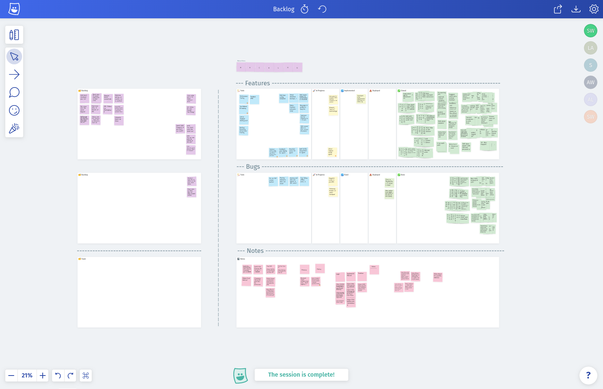
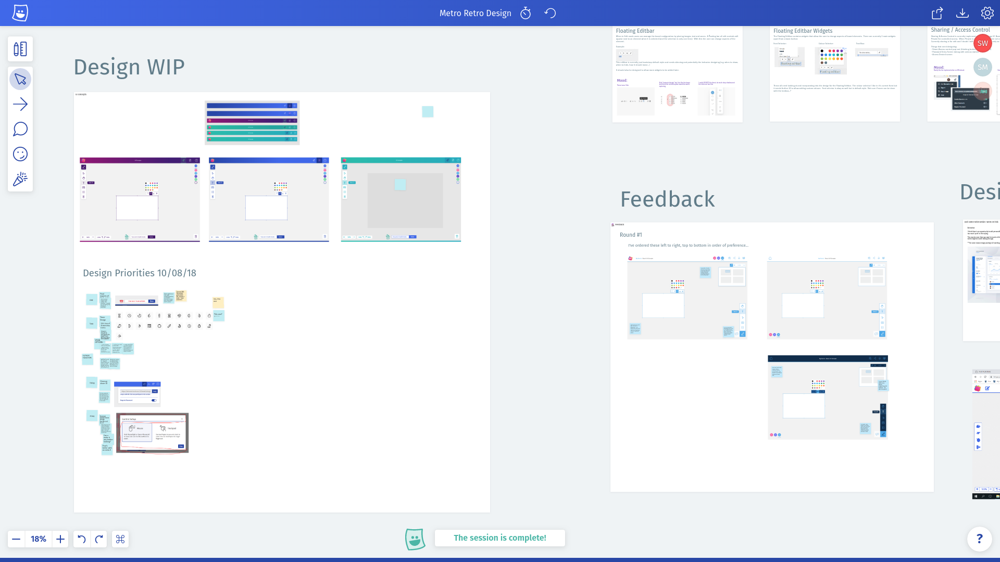
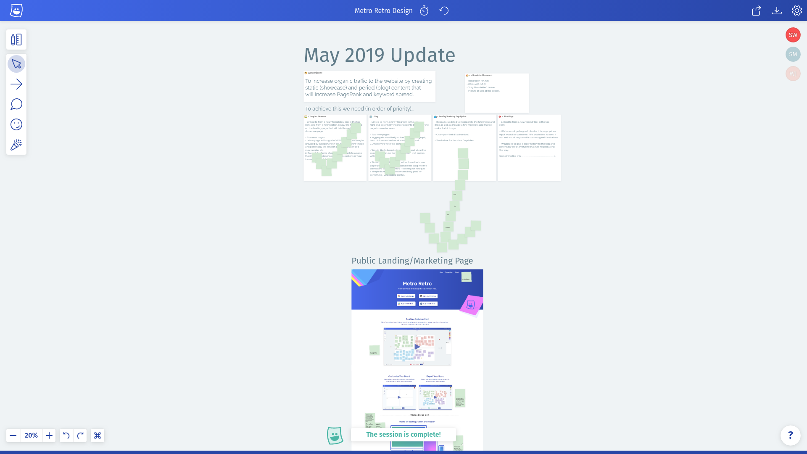
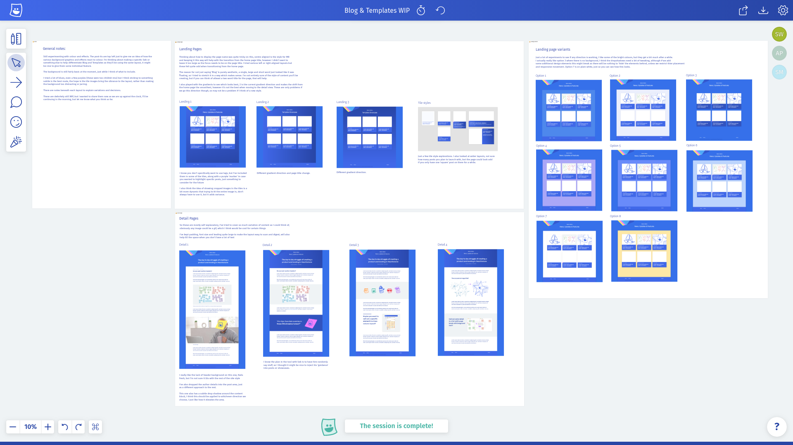
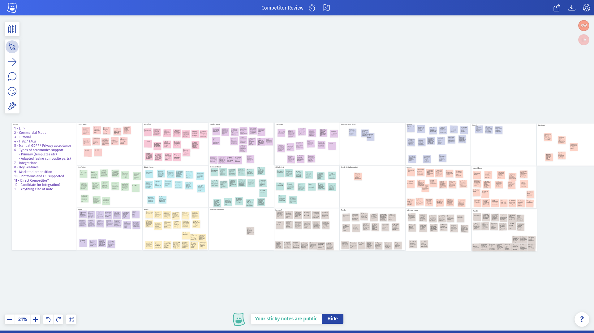
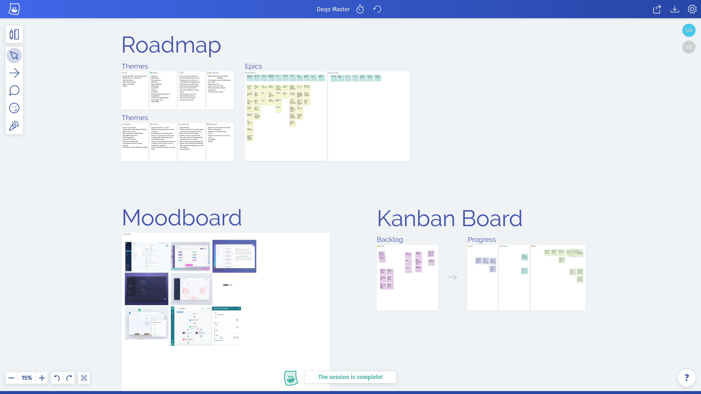

## Introduction

Flexibility is one of the core principles that influenced the design of Metro Retro. There are many ways to run a retrospective meeting ranging from a simple Good vs Bad setup to more exotic scenarios involving metaphorical starfish. Each user will have their own preferences based upon personal taste, time constraints and progress of their project. Metro Retro provides a bunch of common templates for retrospectives and other session types, but each template can be completely customized to suit individual needs.

This flexibility also opens the tool up for use in a broader set of scenarios, such as in a brainstorming workshop or as a makeshift product backlog. When developing Metro Retro, we tested the flexibility goal by utilizing the tool as much as possible for our own needs. This article presents the different ways that we currently [dogfood](https://en.wikipedia.org/wiki/Eating_your_own_dog_food) Metro Retro.

## Product Backlog

Since the earliest working version of Metro Retro was deployed, we have used the tool to manage our product backlog. The screenshot below depicts a snapshot of the backlog state just before launch. The board is setup with two Kanban-style sections with columns that progress through Todo, In Progress, Implemented, Deployed & Closed. One of these sections tracks Features while the other tracks Bugs. Surrounding these are a few miscellaneous panels for Notes, unprioritized tickets and a Trash section.

Snapshot of the Metro Retro backlog from March 2019.

We are still using this setup today! For our team of a single developer and single designer, using Metro Retro for the backlog over other tools had several advantages:

- It’s free.
- It’s fast.
- You see updates from other team members instantly without needing to refresh.
- It’s easy to understand and update.
- It’s unrestricted; we are not bound to a particular workflow or ruleset.
- You can multi-select and mass manipulate tickets (hi Jira).

If you have a project you are working on, and you don’t want the overhead of a fully blown backlog management tool, we’ve added the board configuration described above to the templates under Product Backlog. Give it a try!

## Design Brief & Feedback

In the early days of the project the user interface was pretty bad. Lacking any real artistic flare myself, I recruited UX designer [Steven Moseley](https://www.linkedin.com/in/steven-moseley-80b63314/) to help out. Throughout several iterations of design work, we’ve used Metro Retro each time to layout the brief in a visual way using a combination of sticky notes, images and text blocks.

The first brief (below) was comprised of six areas. Each area described a feature that needed working on including a screenshot, images for mood or style guidance and a text brief.

Our first design brief.

Once the first round was complete we used the same board to track feedback. A portion of this is visible in the screenshot below. The Comment Tool, which exists today as a way of discussing the contents of a sticky note, was originally created to help with the design feedback process. The first version allowed you to create comments anywhere on the board and we used this to feedback on early UI visuals.

Our first round of feedback.

The most recent round of design work began just after launch and includes the design of the blog you are reading right now, as well as a new template showcase and landing page updates. For the latter, we used a screenshot of the page and sticky notes as annotations of the elements that needed updating.

May 2019 design brief.

This update is still ongoing, but the blog and showcase page designs are complete. For these, Steve created a new board due to the volume of output, which you can see above. Top left are Steve’s notes and the blog list views, to the right are the 2nd iteration of these and bottom are the four variants for the page view.

May 2019 design output.

Using Metro Retro for the design process communication is working really well for us so we are definitely going to keep using it. To summarize:

- It’s free, fast and all the other advantages previously mentioned.
- Using a board is a great way to capture nonlinear information like a design brief.
- Being able to comment directly on visuals with sticky notes is a nice way to work.
- Panning and zooming around a board with the completed visuals on is nicer to consume than a PDF or any page based document/format.
- Reviewing outputs with the Present/Follow function eliminates the need for screen sharing tools.

## New Product Development

We are going to be updating Metro Retro with new features and any necessary bug fixes over the coming months. However, we are also working on something new, which is going to be a sequel of sorts, but with a much broader scope. It’s very early in development at the moment, so we don’t have a lot to share right now, other than Metro Retro is playing a key role in our planning!

New product competitor analysis.

Above you can see the output of a competitor analysis we completed which catalogued all our potential competitors and the propositions, features and pricing models they provide. Below is a snapshot of our work in progress board that includes output from a workshop, visual mood board and high level kanban board.

New product development board.

As with the design process, we are going to keep using Metro Retro on this project for the foreseeable future. It’s great because:

- Having your roadmap, moodboard and backlog in a single place saves time when switching between them.
- Nonlinear information is easy to capture and browse (e.g. competitor analysis).
- Did I mention it’s fast & free?

## Conclusion

Hopefully this gives you an insight into how we utilize Metro Retro for things other than just retrospectives, and maybe inspires you to do the same! If you have an idea that you’d like to share with us or if you have a question on how we could help you make a new board, then please either [chat to us on Intercom](/blog/how-we-use-metro-retro#Intercom) or send us an email to [contact@metroretro.wpsc.dev](mailto:contact@metroretro.wpsc.dev)!

Thanks for reading!

‍
