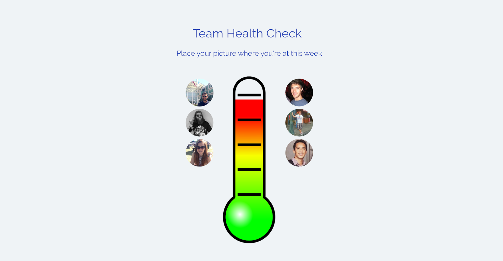
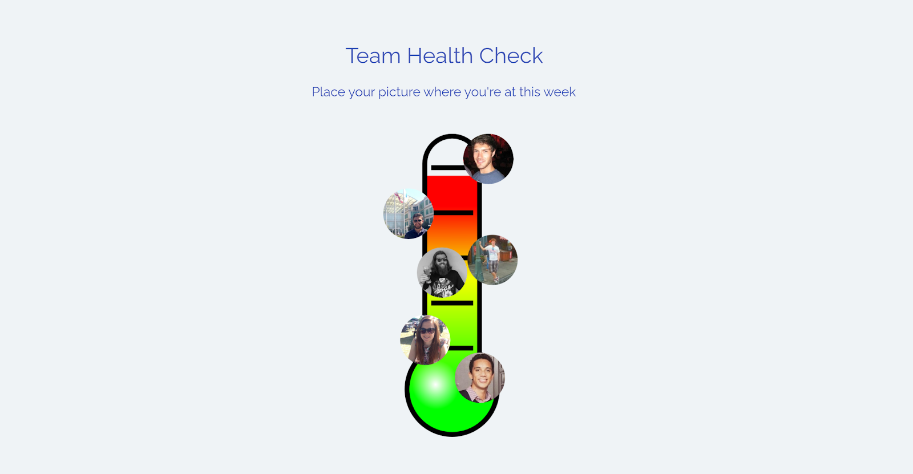
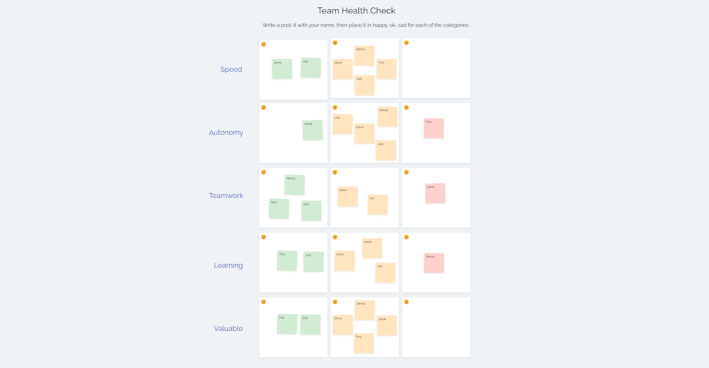
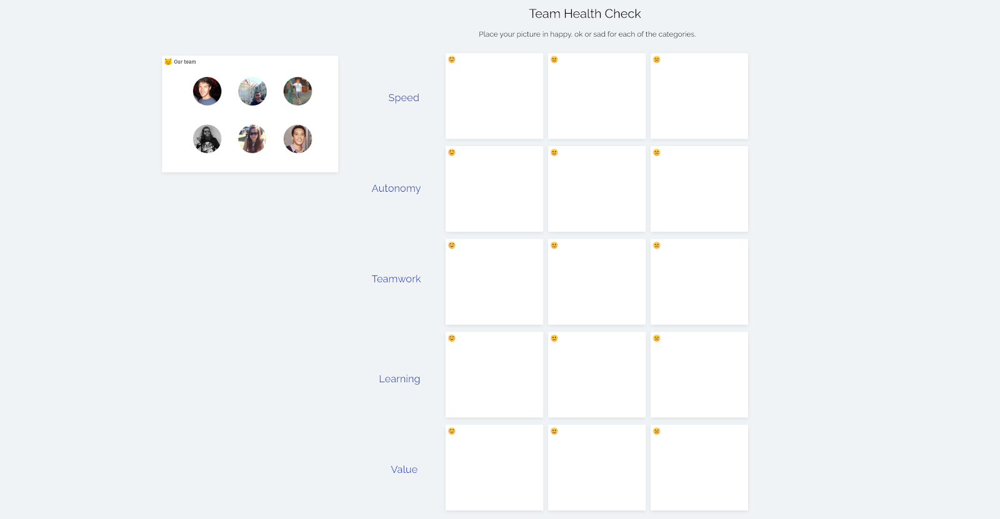
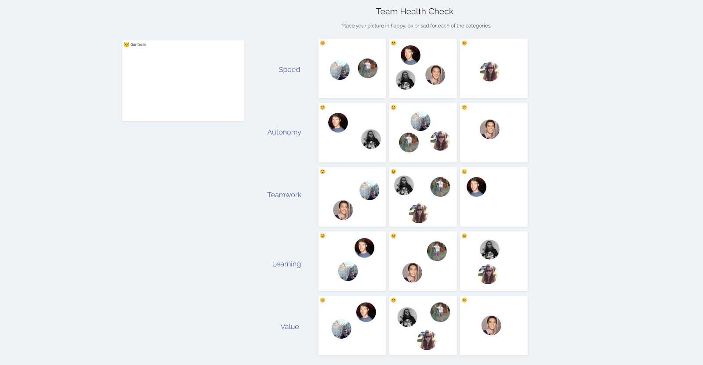
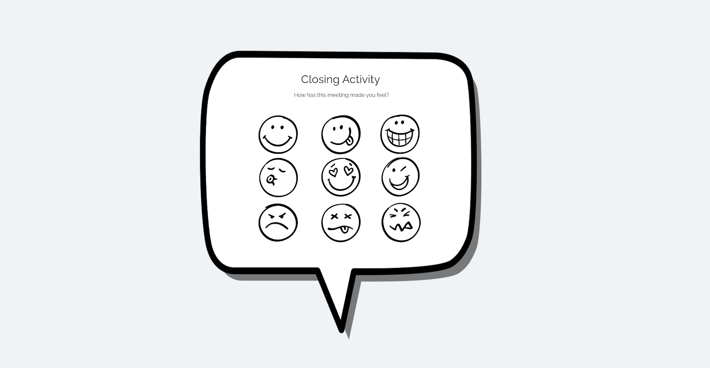
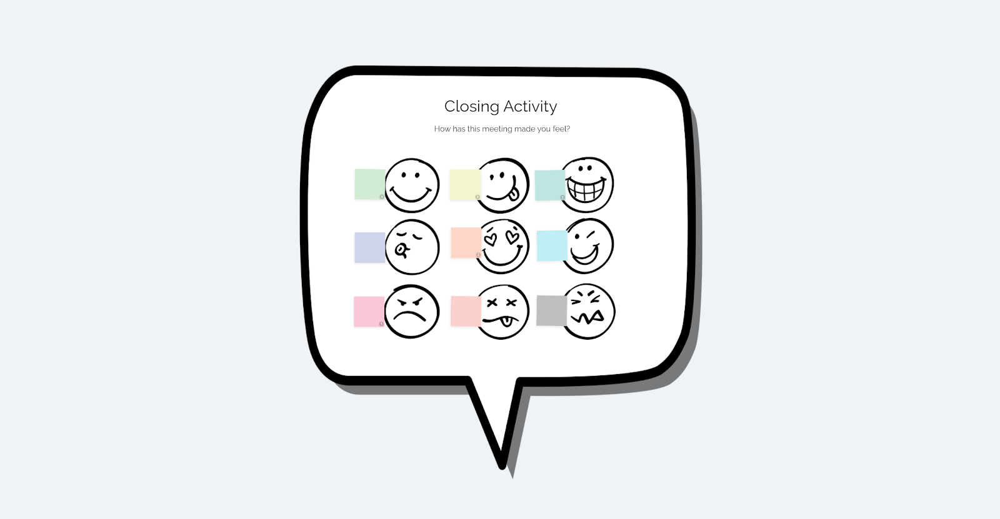
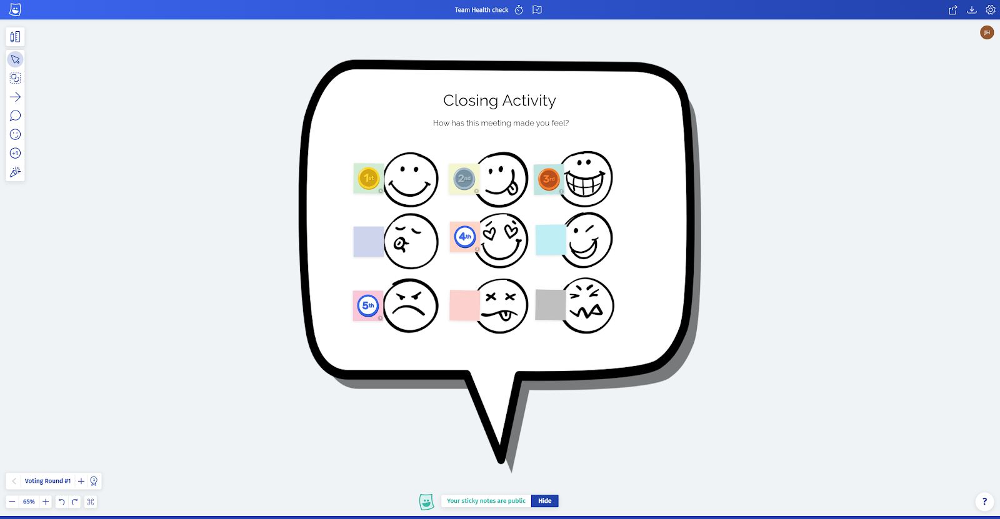
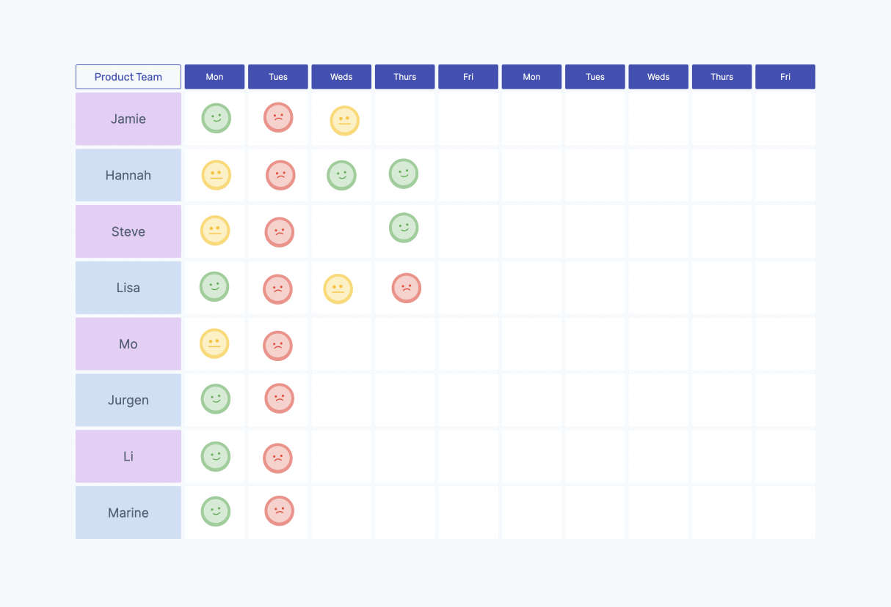

This is a short guide on team happiness/health/morale checks, why they’re important, and four practical examples you can run with your team.

A happy team is a productive team

## What is Team Happiness, Really?

Happy people are productive people, say [researchers from Warwick University](http://wrap.warwick.ac.uk/63228/7/WRAP_Oswald_681096.pdf). They found that improving an individual’s happiness led to 12% more productivity at work. Also, if people are happy, they are motivated to both do their work and support their colleagues, thus building collaborative, trusting, and adaptive teams.

So there are obvious benefits to people being happy at work, but happiness is a catch-all term used to mean a variety of emotions that are always in flux. Happiness comes in various forms, and it means something different to me than it does for you or anyone else.

### Why measure team happiness?

There is a circular relationship between how our work makes us feel, how we feel about our work, and how those feelings affect our work.

Measuring team happiness is not a box-checking exercise for HR, nor a managerial instrument to motivate, reward, or punish staff. It is a technique intended to help a team of people acknowledge and self-assess how they feel about their work. It promotes discussion of how to work better together.

### It’s not really about happiness

Cynics would say a team doesn’t need to be happy to perform. And they have a point. There isn’t, and shouldn’t be a single ‘happiness’ metric to chase. A team’s well-being and productivity is as varied and nuanced as the individuals in the team. So forget about measuring an overall happiness metric, but aim to uncover and discuss the different factors that contribute to your team health.

These are the underlying factors that make a job worth working for – autonomy, learning, feeling worthwhile, doing impactful work, feeling trusted, respect, cooperation, belief in the mission, and even having the appropriate tools to do the job. For example, [this Harvard Business Review](https://hbr.org/2015/03/positive-teams-are-more-productive) article points to research where team members report more satisfaction and positivity through practicing virtuosity at work than when they receive further compensation benefits.

### Don’t retrospectives cover this?

Team health checks are closely related to retrospectives. They expose similar surface-level issues but have different ways of getting to the root of problems. Retrospectives often look at the processes and factual events of a sprint, but rarely dig into the underlying emotional factors of working in a team.

### Do’s and don’ts of Team Health Checks

A health check shouldn’t feel as daunting as embarking on a wellness retreat with a green tea colonic round the corner. It is crucial to introduce the topic of team health checks carefully, taking the time to explain why you would like to try running one. Some key tips:

- Do – explain. This is to improve the team’s work environment, not to manage individuals
- Do – make it optional
- Do – keep the information within the team – do not share it with anyone else
- Don’t – use a health check as a substitute for having frank conversations

## 4 Ways to Run a Team Health Check

These are examples of how you can introduce health checks to your team.

### 1\. Simple health check – before a meeting

Use a team health check before a meeting to see how the team is feeling.

**Example – thermometer check-in activity –** [**use this template now**](/BOKRBNH5TNRQ)

Assemble the team

Place yourself according to how you’re feeling

**What is it?**  
A quick visual check-in activity.

**Why do it?**  
Helps the team settle into the session and reveals any problems before you start.

**How to run it**:

- Create your retrospective board in Metro Retro. Use an image or a metaphor to make it more engaging. 
- Explain the concept to the team and confirm they agree to participate.
- Ask them to place their avatar on the thermometer. You can debate which ends of the scale are good or bad!
- Optional – each person writes one word on a sticky note to describe their mood.
- Offer the option to discuss the results.

**Hints and Tips**

- Use the [free Metro Retro template](/BOKRBNH5TNRQ).
- Create multiple thermometers if you want to measure different factors.

### 2\. In-depth Health Check – replace a retrospective

Instead of holding a typical retrospective, offer the team the time to score how they feel across various factors. You will have more time to explore issues, so either run a variety of exercises with the team or deep dive into problem areas.

**Example – Team Health exercise in Metro Retro –** [**use a Team Health Check template now**](/BOV5FJ0RMK72)

Option 1 – using sticky notes for names. The sticky note colour will change depending on where they place it.

Option 2 – use your team’s pictures

Place your picture where you rank each factor

**What is it?**  
Similar to [Spotify’s Squad Health](https://pixabay.com/vectors/thermometer-temperature-hot-scale-153138) framework, ask your team to rate how they feel about various values that affect them or the team.

**Why Do It?**  
Visualizing the scores helps promote discussion and awareness between team members.

**How to run it**:

1.  Create the board with the list of values that are important to the team. Tip – it’s best to run a session with the team beforehand to agree your most important values.
2.  Ask the team members to place themselves on the happy, neutral, or sad faces zones for each value. You can either use post-its or pictures to represent each team member.
3.  Take time to look at the ranking of each measure, and start to ask the team to discuss what they’re seeing.
4.  Identify themes in the discussion and hold a voting round to identify the most important issues.
5.  Once you have the important issues, brainstorm solutions together, then hold another voting round to identify the top actions. No more than 3 actions is a good general rule of thumb for a retrospective, and the same applies here.

### 3\. Quick Health Check – after a meeting

Run a quick check to see if the team feels after a meeting.

**Example – a closing activity in Metro Retro**

Closing activity in Metro Retro

Have everyone vote on the sticky representing how they feel

Reveal the voting results

**What is it?**  
A quick activity to hold at the end of a meeting. Ask participants to rate how they feel after the meeting. You can use a variety of techniques, examples include a sliding scale, images, or just one word. This should be a quick exercise.

**Why Do It?**  
Meetings are a time that the team comes together – if people feel significantly different after a meeting, why is that? Is it something you need to explore?

**How to run it**:

- This should be a very quick exercise to create and run, it doesn’t even need to be anything visual, it can just be a conversation.
- The board above took 10 minutes to create in Metro Retro. It uses an image, text, sticky notes, and a voting round.

### 4\. Niko-Niko calendar – track daily mood

When a team wants to track their mood as a metric, there are various ways to collect, track, and analyze the data together. A Niko-Niko calendar is a simple, visual way to collect daily mood data.

[**Use the free Niko-Niko calendar template**](/BOU7UVFLE1G6)

Use a Niko-Niko calendar to track daily mood

**What is it?**  
Either collect the daily mood data with a [free Metro Retro template](/BOU7UVFLE1G6), or use a tool like [Team Mood.](https://teammood.com/)

**Why Do It?**  
A team may want to track their mood as an indicator of where they can improve.

**How to run it**:

1.  Team members will receive a daily email, asking for their mood of the day.
2.  One click and mood check is done! No need to login.
3.  Decide when to review the findings with the team. Review and analyse the findings, promote discussion, and decide any applicable solutions together.

> **Tip** – use this method carefully and make sure individuals can opt-in and opt-out as they want (offer to run it as an experiment that can be cancelled). Make sure the data is not offered up to management nor is treated as performance data, but is for the team’s eyes only.

## Summary

A Team Health check is one of the many tools you can use to help a team perform self-assessment and identify improvements. It provides a space to talk about team effectiveness and factors impacting it.

Team Health checks are not solely about chasing a happiness metric, but about uncovering all the elements that make people in your team feel happy and productive.

[Start a team space](/setup) in Metro Retro to get access to multiple Team Health Check templates.

### Further Reading Links

For more reading around team happiness and health, check out these blog articles I enjoyed reading.

[http://www.andycleff.com/2020/05/agile-team-health-check-models/](http://www.andycleff.com/2020/05/agile-team-health-check-models/)

https://www.intercom.com/blog/why-happiness-at-work-really-matters

> [Health checks for Teams and Leadership](https://blog.crisp.se/2019/03/11/jimmyjanlen/health-checks-for-teams-and-leadership)
