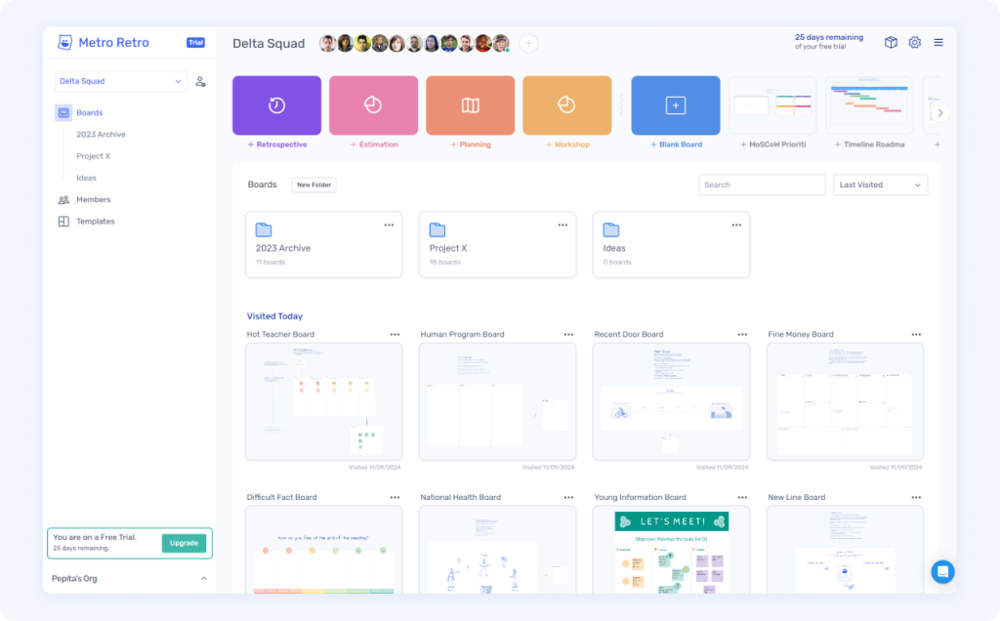
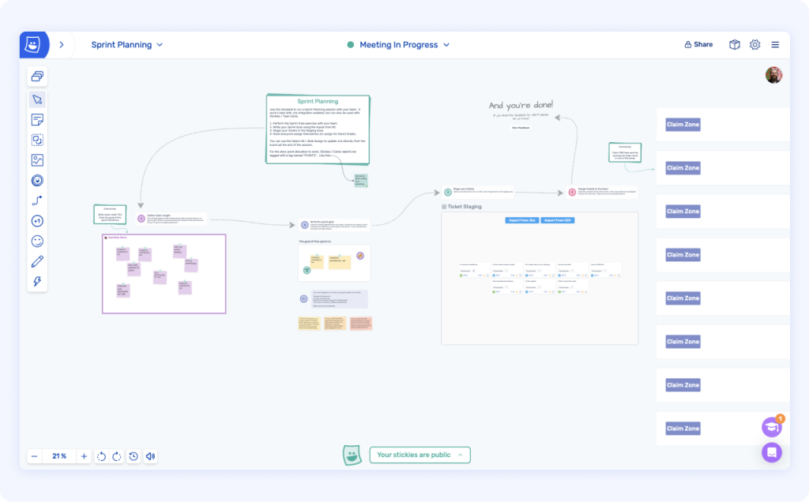
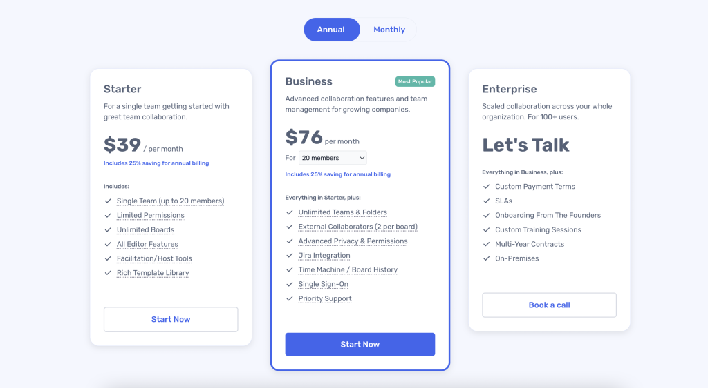

Today, we announce the end of the Free plan in Ludi, as well as reveal new team-based pricing plans, a new team dashboard, and other new features for agile teams.

## Free plan ending September 2024

As Ludi continues to grow and evolve, we’ve made some significant changes to our pricing model, which includes ending the Free plan, effective September 2024.

Teams that are currently on the Free plan will be placed on a 30 day free trial, then will need to transition to one of our new team-based paid plans, starting at $39 per month. These new plans offer more value and flexibility for teams of all sizes. Paying customers will remain unaffected by these changes in this update.

For more details, including what’s new in our team dashboards and upcoming features, keep reading!

## Key details

- The Free plan is discontinued.
- There are new team-based paid plans.
- Teams currently on the Free plan have 30 days to continue using Ludi.
- New teams get a 30 day free trial.
- At the end of their trial, a team must pick a paid plan to continue using Ludi.
- Customers on paid plans are unaffected and will continue on their current plans for now.

## Why We’re Discontinuing the Free Plan

After careful consideration, we’ve made the tough decision to discontinue our Free plan. This change will allow us to better support our growing customer base by focusing our resources on the experience for our paying customers. While this wasn’t an easy choice, we believe it’s a necessary step for Ludi to continue evolving as the go-to collaboration tool for agile teams worldwide.

We understand that this change may be difficult for some of our long-time users who have relied on our free plan. We want to thank you for being a part of our journey and for helping us grow Ludi into the tool it is today.

## What This Means for Current Users

### Teams on the Free plan have 30 days

Teams who were on the Free plan have been placed on a free trial of the new team plans. They have 30 days to continue using Ludi for free, after which they need to pick a plan to keep using their team space and boards. Their boards will still be accessible after the trial ends, but in a read-only mode.

### Customers on paid plans are not affected

Customers on paid plans are unaffected and will continue on their current plans for now.

## What’s New: Dashboard and Templates

### Simpler, more useful team dashboard

In previous plans, only licensed members could access the team dashboard. Now with team-based pricing, the entire team gets access to their team space and shared boards, with the ability to create their own boards for any meeting or collaboration need.

The new dashboard has improved template browsing, and functions like starring your favourite templates. It also paves the way for future features like meeting reports, team actions, personal mentions and notifications.

_Updated Team Dashboard_

### New templates for agile exercises

We’ve crafted new templates for key collaborative sessions that help agile teams perform at their best. Recent examples include [sprint planning](https://ludi.co/TP/f8b6a198-9dfa-46b1-9e8e-2d2527119914) and [backlog estimation](https://ludi.co/TP/58246001-8cf7-4151-b5b4-7ba566da6a32) templates – both integrate with your Jira backlog.

_Sprint Planning Template_

## What’s coming: The future of team collaboration in Ludi

We’ve really enjoyed hearing all the different ways people have been using Ludi over the last few years as the world moves into a hybrid/remote working model. During this time, it has become apparent that Ludi is most valuable to agile teams who value collaboration in delivering complex software products.

So our future roadmap includes more templates and activities for agile meetings, integrations with your team tools, automated team health/morale checks, the ability to design your team processes and ways of working, and AI assistance for getting the most out of your team boards and data.

## Introducing Our New Team-Based Plans

We have introduced new team-based plans with three tiers: Starter, Business, and Enterprise.

### Starter

1 team only. $39 per month, when billed annually. Perfect for a single team of up to 20 members. Includes all the essential tools you need to collaborate in your boards.

### Business

20-200 members. Starts at $76 per month, when billed annually (The equivalent Business plan licenses are $320 in Miro\*). Organise members into unlimited team spaces, with centralised admin and user management, SSO integration, Jira integration, and collaborate with external guests.

### Enterprise

Starts at 100+ members. Priced per user. When your organization needs more than the Business plan, the Enterprise plan is available.

You can preview the new plans on our [Pricing page](https://ludi.co/pricing).

 *\* Miro pricing comparison correct as of September 2024.*

### A New Chapter for Teams in Ludi

We understand that changes like these can be significant. If you have any questions about these changes, feel free to reach out to us. Whether you’ve been here a while, or are a new team exploring our platform, we believe these updates will make Ludi even more valuable for your collaborative efforts.

As we continue to evolve, we’re committed to delivering tools that empower your team’s best work. Thank you for being part of the Ludi community, and we can’t wait to see how your teams use these new tools to achieve even more.

Cheers,

Jamie and Steve, Ludi Founders

