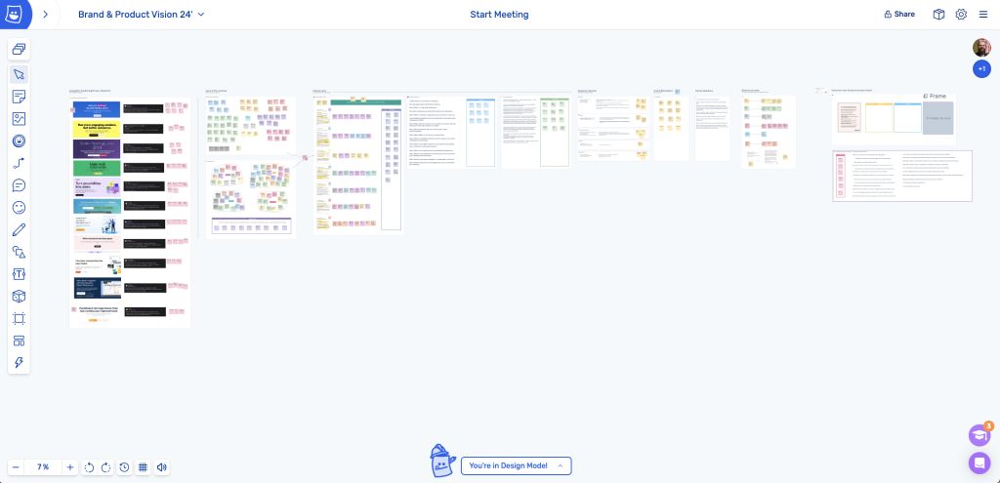
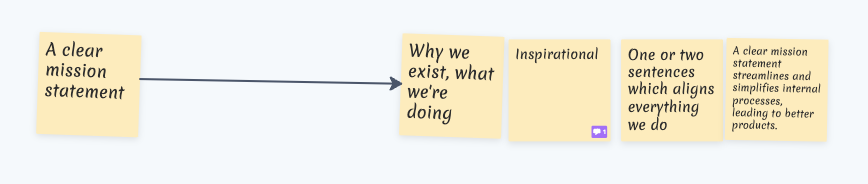
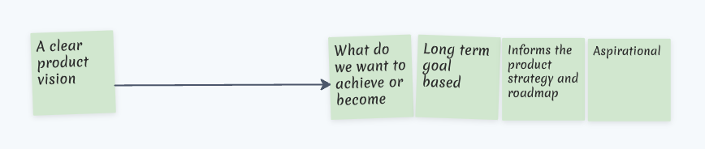
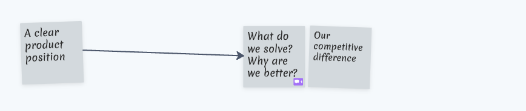
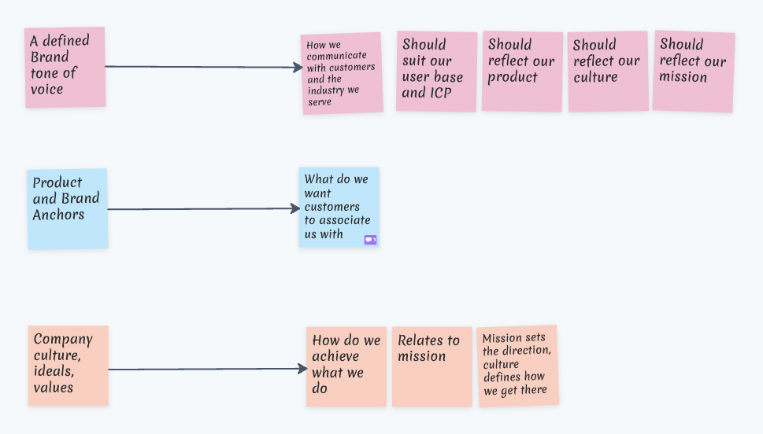

So what do these terms mean and why should you care about them?

I recently joined the team at Ludi to lead the efforts on Creative Strategy and guide the founders, Steve and Jamie on what we need to be doing to scale our audience and properly reflect the quality of our product.

In order to do this effectively I asked a few questions on the three core areas this post is about. What is our purpose (Mission), where are we going (Vision) and what makes us unique (Position).

Not surprisingly, there were a lot of answers to these questions, all really great but nothing definitive. Nothing set as the ‘North Star’ or guiding principle.

Before we go too far, you will find countless articles on these topics, but having just gone through this process with our team, it felt like a good piece of information to share and an opportunity to show some insight into our own working processes using our own product.

The image below is the Ludi board I created which we worked through, this post doesn’t go through it in detail but I think even at a high level you can see visually represented, the ‘filtering’ process of defining and understanding Product Mission, Vision and Position. 

You start on the left with as much information as you can about you, your customers and your market. Gather what is unique, remove what isn’t and get to the core of what makes you, you.

When I presented my work on this to Steve and Jamie in our whiteboard meeting it gave them clarity on what is needed and why, which is exactly what every Product Mission, Vision and Position should do for your team, customers and the market you operate in. 

Hopefully this trimmed down overview helps you too.

## So what are Product Mission, Vision and Positioning Statements?

These three areas of your business are a story. The story of why you exist, where you are going, how you plan to get there and why you belong there.

You use them to validate ideas, plan, make decisions and guide your team.

This is why it’s important to define them early. They are a benchmark to everything you do. This doesn’t mean they can’t adapt and grow as you do, but without them, or some version of them you risk being reactive in your processes rather than proactive (sorry, that was very cheesy but hopefully you get the point, they help!)

### Product Mission Statement

One of the most important things your product or business needs to define. It serves as a guide for almost everything you do. What is the core of why you do what you do.

#### What it is:

- It defines why you exist
- It explains what you are doing as a business or product
- It is inspirational
- It consists of one or two sentences which aligns everything you do

#### What it’s not:

- A list of competitive differentiation
- A long document of rules and boundaries
- An explanation of how you work

#### Why it matters:

- A clear mission statement streamlines and simplifies internal processes, leading to better products. It inspires and aligns every part of your business. Why you exist, who you serve, why you and your team come to work every day.

### Product Vision Statement

Exactly what it says on the tin. What is your product or business vision of the future? What does success look like?

#### What it is:

- A statement of what we want to achieve or become
- Long term and goals based
- It is aspirational (ambitious but also achievable)
- It is the milestones required to achieve the Mission

#### What it’s not:

- A description of what you do
- Difficult to explain. The vision should be clear and unambiguous
- Unachievable goals – this hurts motivation

#### Why it matters:

- While your mission focuses on what you are doing right now, your vision is about where you are going and how you get there.

It’s the getting there which is an important part of defining this, for us in particular as a Software Development company, the vision becomes a key part of release planning and feature prioritization.

To do this well you need to know your market and your customer needs.

### Product Positioning Statement

Your Position statement is the part of your overall marketing strategy which directly influences how you talk to your audience and frame the messaging you want to be front and center.

#### What it is:

- It explains what you are solving for your audience
- The things that set you apart from your competitors
- Defines how your product or service is the best in class at providing value

#### What it’s not:

- A list of product features or services

#### Why it matters:

- Strong positioning helps you frame the messaging to your audience. It helps them quickly decide if you are the correct product or service for them and the problems they need to solve. 

To get this right you need a deep understanding of your target audience and what your competitors are offering.

## The Relationship Between Mission, Vision, and Positioning Statements

From the brief descriptions above I’m sure you can now see how all of these statements work together and are interconnected.

The mission defines purpose, the vision sets the goals and the position articulates how the mission and vision are achieved in context of the market.

## So what’s the benefit of defining the Mission, Vision, and Positioning Statements

Hopefully from my ramblings this is fairly obvious by now but just in case it’s not. Doing this work with your team will:

- Provide clarity and focus
- Align your team
- Guide your product strategy and roadmap
- Inspire and motivate your team
- Provide frameworks for measuring success
- Frame the messaging you use when talking about your product or business

## What about Tone of Voice, Brand Anchors and Company Culture?

Well I’m glad you asked. Although not directly linked to defining your Mission, Vision and Position, these topics are definitely worth including when you think about overall marketing strategy.

They influence how you talk to customers, what customers think when they hear your brand or product name and layout the values you practice to achieve what it is you do.

I’ll leave you with a few stickies showing my initial thoughts on these topics but maybe let’s save the details for a future post.

Hopefully you found this helpful. If you have any questions about how you can use Ludi to run a fun and engaging meeting to work through these marketing challenges then please reach out to [contact@metroretro.io](mailto:contact@metroretro.io)

Cheers,

Steve (the other one)

Lord of Crayons @ Ludi
