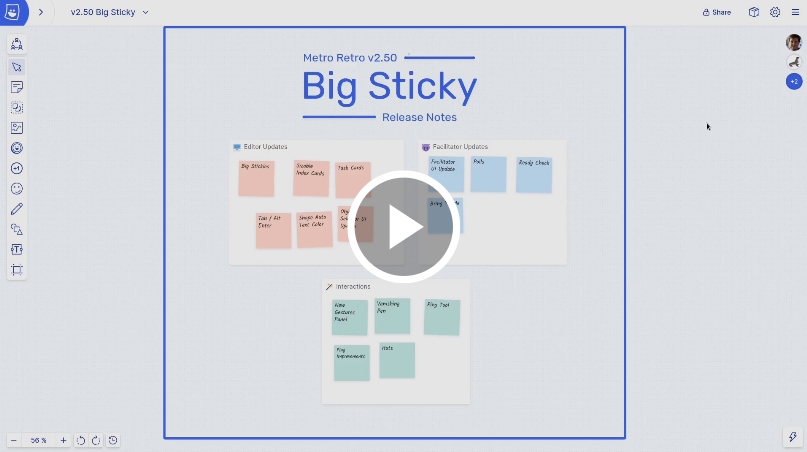
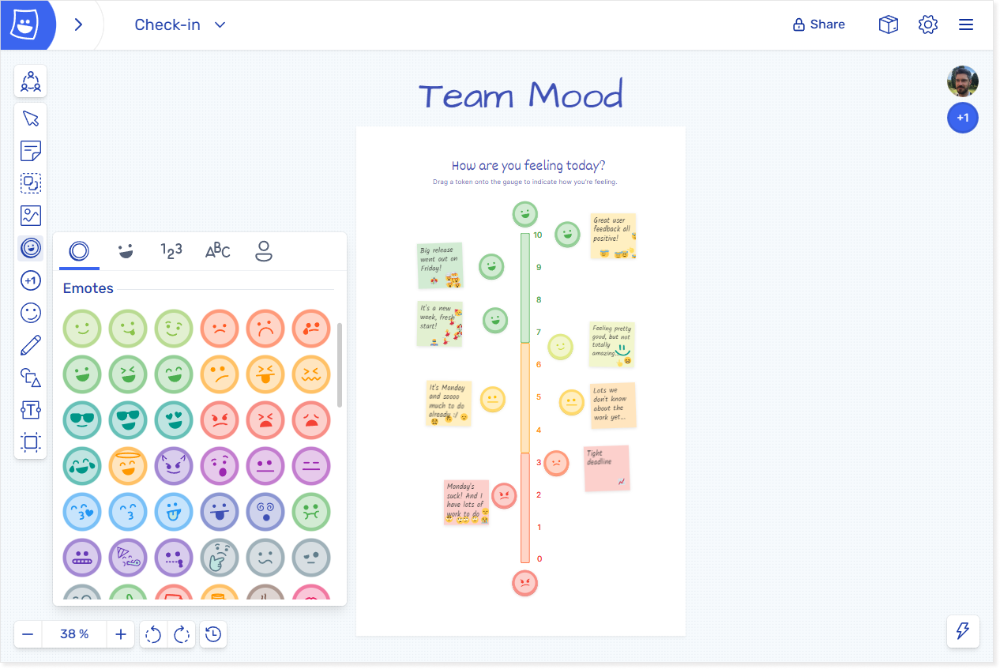
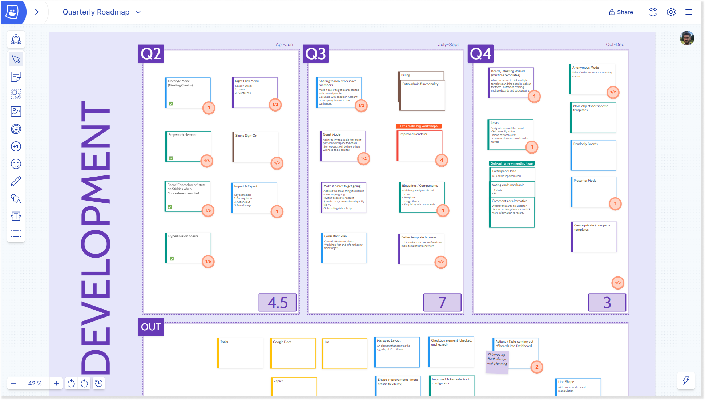
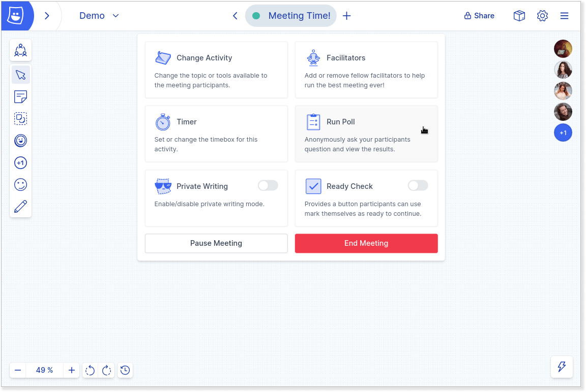
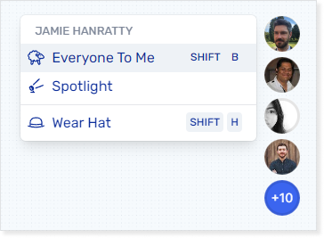
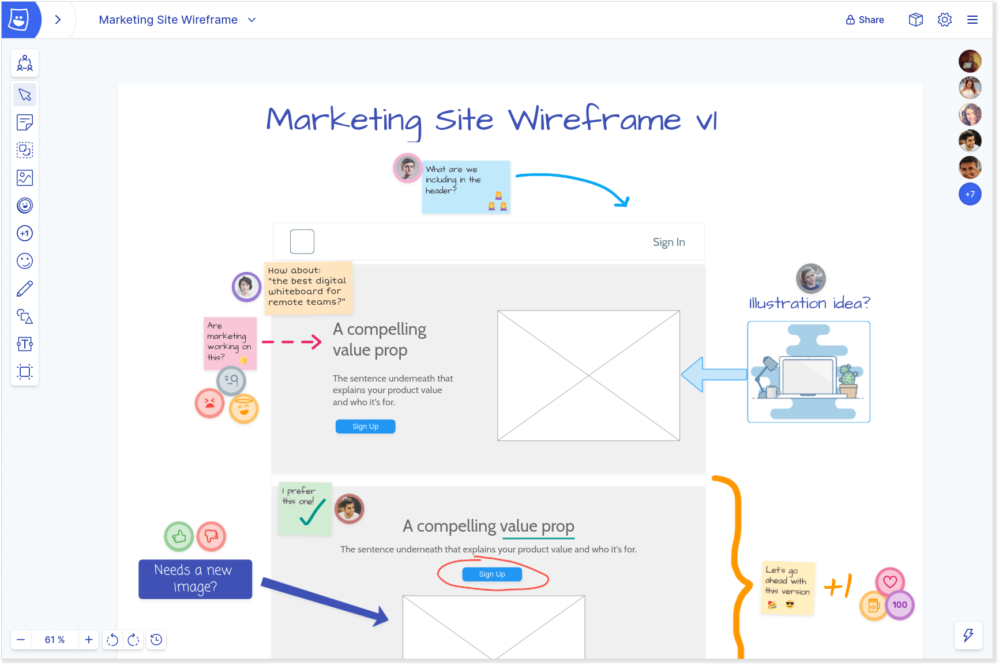
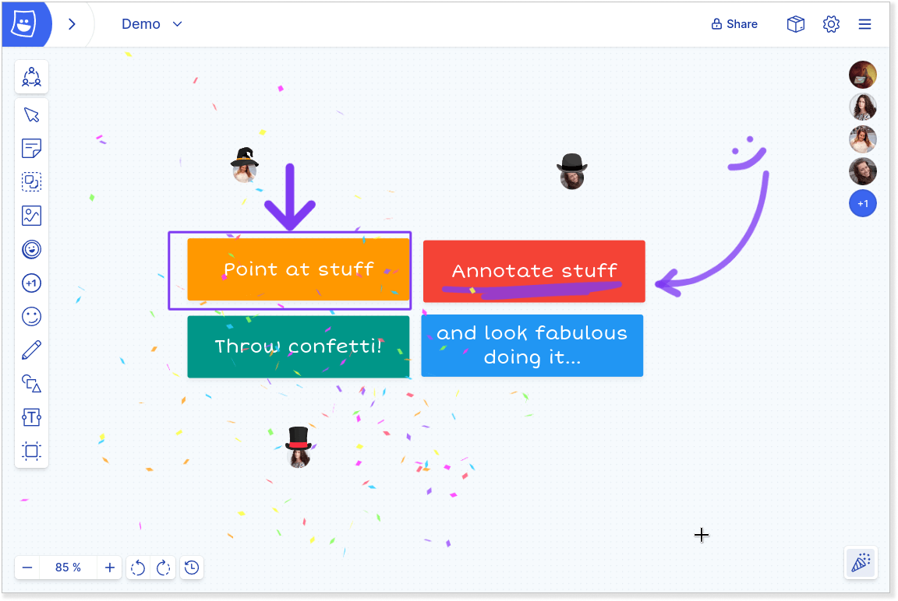

### Helping you improve team mood

Welcome to a new update of Metro Retro! With this one we’ve been focusing on everything that affects a team’s mood when working collaboratively, including:

- Keeping meetings efficient and smooth
- Fun interactions between team members
- Boards that look good (without needing to be a designer) and are easy to use
- Understanding your colleagues better (especially key for remote teams)

### July’s update

We counted and there are a total of 19 different changes & new features in this release. Steve demos all the updates [in this video](https://updates.metroretro.io/big-stickies-v2.50-3pbLa), and below we’ve given an overview of the changes and why we think they’re important.

Watch Steve walk through the updates one-by-one

### Ok, so what’s new?

We’ve focused on a couple of areas that will make Metro Retro an even more enjoyable place to work in, plus a few bonus things to boost your team’s mood…

#### 1\. New ways to use Metro Retro

If your team already love working in Metro Retro there are new object types for more occasions, such as using tokens to run a team mood check-in:

Using tokens for a quick team mood check-in

Or use the new Task Cards for collaborative roadmapping sessions (see the magic of [importing your backlog to Metro Retro](https://docs.metroretro.io/on-the-board/import-data-to-your-boards#how-to-import-and-map-your-data)):

Building a roadmap with the new Task cards

#### 2\. New facilitation controls

Running good meetings is hard work, so there are now more tools to help facilitators. The less stress it is to guide people through the different activities, the better you can focus on the purpose and outcomes of the meeting.

As the facilitator, use ‘Everyone to me’ to get everyone to the right place on the board, then check if everyone is ready to proceed with the new ‘Ready Check’, and after the meeting use a Poll to ask for anonymous feedback on the meeting. You’ll soon know how the team are feeling about your meetings!

Facilitate like a pro with the new controls

Summon everyone to you

#### 3\. Communicate your ideas

It’s difficult to know if everyone in a team is genuinely on the same page, so there are now more ways to communicate and give life to your ideas, without needing to be a designer.

Use the shapes, graffiti pen, images and emojis when you need a creative outlet, and present your ideas to the group with the new vanishing pen and pointer arrows. Also note the big stickies, a highly-requested item!

Collaborative design – 60% of the time, it works all the time

#### 4\. Blow off steam

Lastly – the most literal way to improve your team mood – blow off steam by firing confetti & throwing hats:

The new drawing, pointers & hats alongside the confetti cannon.

### Why focus on Team Mood?

Well, we think collaborative software should be enjoyable and fun to use. Why shouldn’t you be able to scribble a big fat ❌ on out of scope stickies, or just wear a virtual hat when you feel like it?

While Metro Retro helps thousands of people work through their meetings & workshops each week, we also like the idea that some features can be completely whimsical, and may evolve over time to find purpose. For example, hats are a bit silly, but they can be used to communicate things like someone’s birthday, during an event (like Santa hats at Christmas), or to show that someone has a particular role in the group. For example, the person with the ringmaster’s top hat is the meeting leader!

### Give your feedback

Have a play with the new updates and tell us what you like and don’t like. We’re are making Metro Retro the place where your team loves to work, so let us know what you would love to see in the tool!
