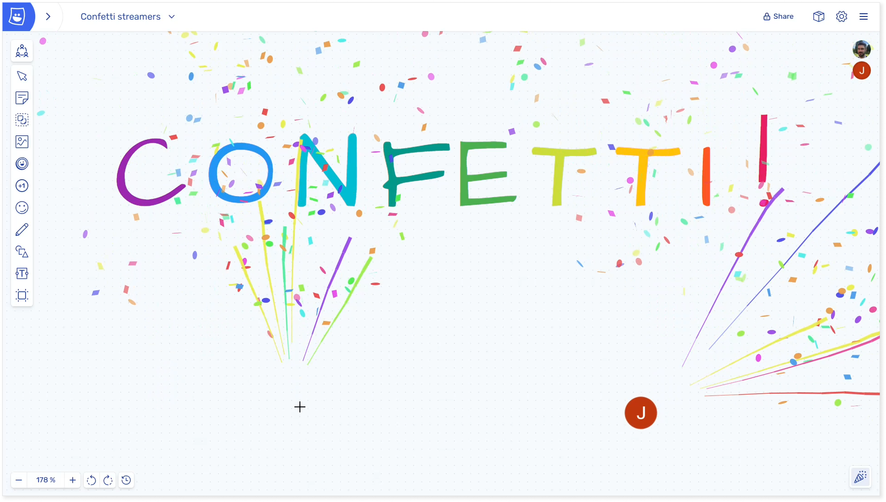

Hello all – it’s update time! We’ve got a bunch of changes across Metro Retro, starting with an improved confetti cannon! Friendly reminder that all updates are in the **new** version of Metro Retro – [upgrade your account for free](/setup) to try them out.

Testing the confetti cannon is a hard job, but someone’s got to do it.

### App Updates

This is a summary of the main updates, for full details see the [release notes](https://updates.metroretro.wpsc.dev/confetti-2.0-a-burst-of-updates-40NXO0).

- The confetti has new streamers – go and try it!
- Simplified team dashboard
- Changes to the Template Library
- Personalize your profile – add your picture, choose handwriting font & pen color.
- Super powers for consultants with the new [Host plan](/pricing)

We’re also now counting each piece of confetti fired as a metric. On the first day of counting there were 261,576 individual pieces of confetti burst, but the second day had 1.16 MILLION! It would be an ecological disaster if this were real confetti! We’ll find a fun way to share this trivia going forward.

### Templates

Metro Retro now has nearly 100 unique templates across a range of collaborative meetings, with more on the way for agile events, product & project management, icebreakers, brainstorming & more.

If there’s a template you think would be great in Metro Retro, [add it here](https://docs.google.com/forms/d/e/1FAIpQLScJxBLmhd_TDbBAIluMJyDeE2Nih7OVnnbgff_E3aCSrrLcmA/viewform) and we’ll build it for everyone to use.

### More resources for facilitators

We’ve recently written some short guides to help you bring a spark back into your retrospectives:

‍[Ran out of questions to ask in your retro? Try asking these instead](/blog/using-questions-to-rescue-a-stale-retrospective)[‍](/blog/unique-ideas-for-great-icebreakers)‍

‍[31 unique ideas for icebreakers](/blog/unique-ideas-for-great-icebreakers)

### Love Metro Retro?

Lastly, if you’ve got this far and love Metro Retro, please support us by [writing a quick testimonial](https://testimonial.to/metro-retro/all). It takes just 2 minutes and there are simple prompts so you won’t be stuck for what to write. If you need inspiration, you can [read what other people have said](https://testimonial.to/metro-retro/all) first.

The incredible growth of Metro Retro over the last 3 years is largely due to you sharing the tool with your friends and colleagues, so thank you.
