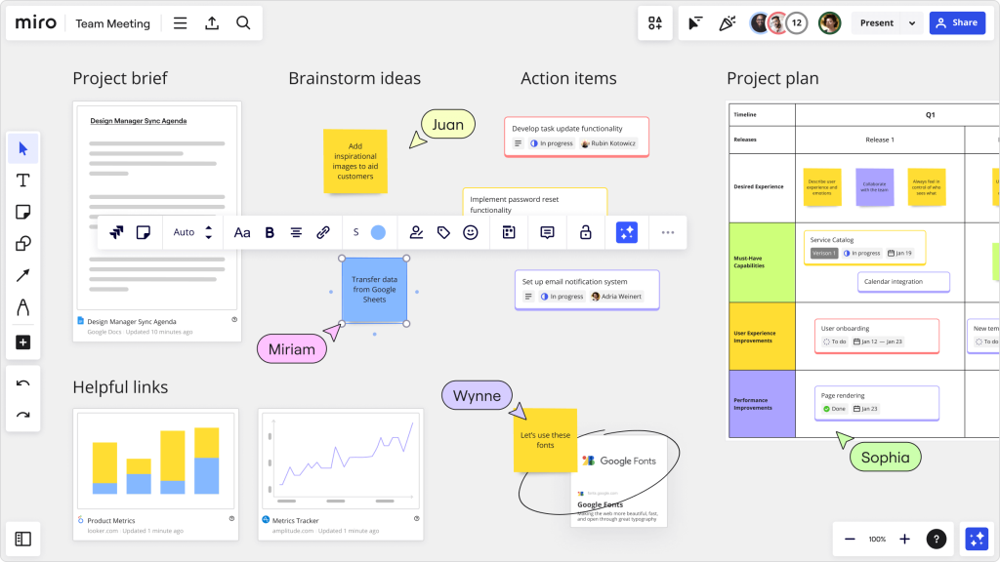
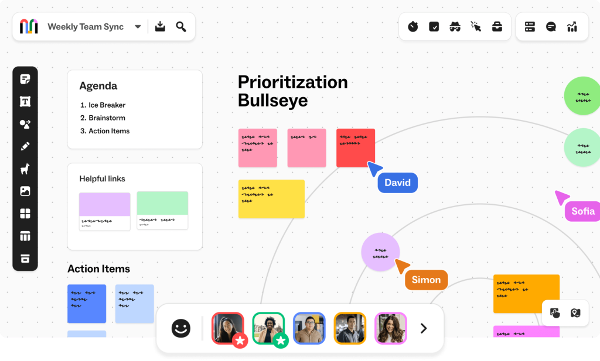
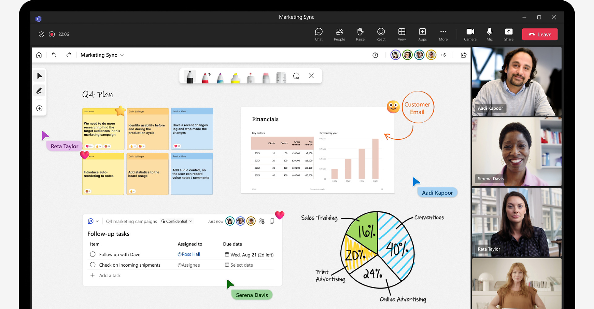
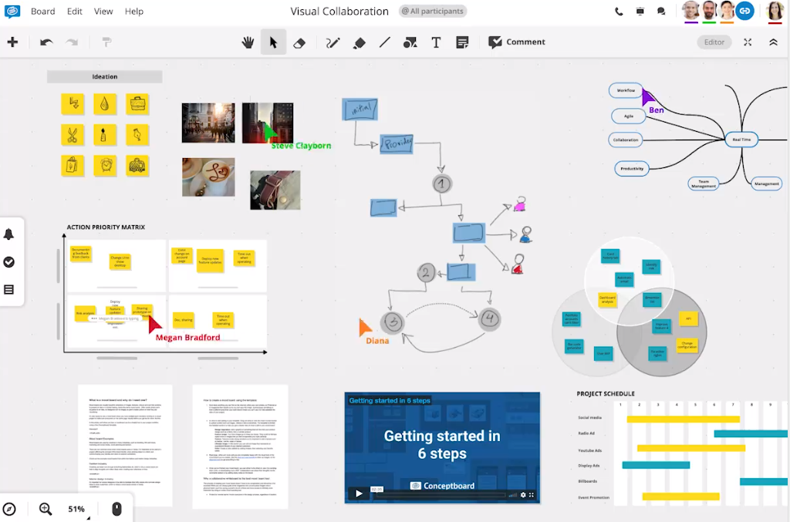
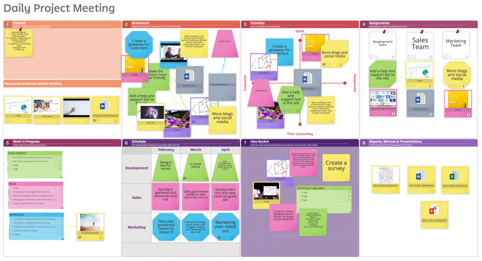
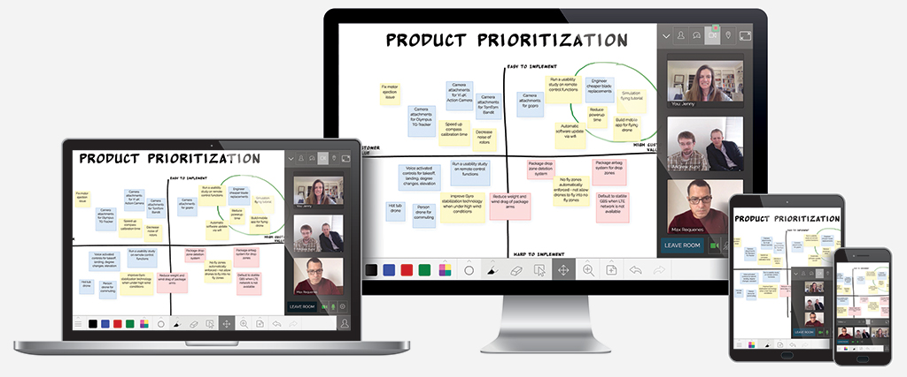

_Discover our guide to the best [online whiteboard](/online-whiteboard) tools to try in 2024._

Teams today work in an era of virtual meetings — Zoom, Google Meet, and Microsoft Teams are now akin to team members. Due to this, the humble whiteboard has undergone a digital transformation. As teams around the globe continue to adapt to distributed work environments, the demand for intuitive, feature-rich online whiteboard tools has never been greater.

In this guide, we’ll explore the online whiteboard tools that are revolutionizing the way teams brainstorm, plan, and innovate in real-time. From conducting brainstorming sessions with tools like Miro, to facilitating sprint retrospectives with tools like [Metro Retro](/), online whiteboard tools have become indispensable assets for modern organizations seeking to encourage collaboration, streamline communication, and drive productivity.

Whether you’re a seasoned remote worker, [a project manager overseeing distributed teams](/customers/eat-club), or an educator embracing hybrid learning models, this guide will equip you with the insights needed to make informed decisions about the tools that best suit your needs and the needs of your wider team. So, grab your digital markers and prepare to unleash your creativity as we dive into the world of online whiteboard tools.

## Why use online whiteboard tools?

You may be wanting to use online whiteboard tools for a variety of reasons, depending on your needs and the needs of your team. Some reasons are broadly shared, such as to improve remote collaboration — a common need for remote-first and hybrid companies —, whilst other needs are a little more niche. Here are six reasons why people use online whiteboard tools:

### 1\. Remote Collaboration

With the rise of remote work and distributed teams, online whiteboard tools provide a platform for real-time collaboration regardless of physical location. Team members can work together on a shared virtual canvas, making it easier to brainstorm ideas, plan projects, and solve problems collaboratively.

### 2\. Accessibility

The best online whiteboard tools are accessible from any device with an internet connection, making them convenient for teams spread across different locations or time zones. This accessibility ensures that everyone can participate in discussions and contribute to projects, regardless of their physical location or working hours.

### 3\. Visual Communication

Whiteboards are inherently visual tools, making them effective for conveying complex concepts, illustrating ideas, and organizing information in a visually appealing and more easy to comprehend manner. Online whiteboard tools allow users to draw, annotate, and manipulate visual elements, enhancing communication and comprehension. Some even include fun visual features, like Metro Retro’s emojis, sticky notes and [customizable illustrated templates](/templates).

### 4\. Documenting and Archiving

Unlike physical whiteboards, online whiteboard tools enable users to save, share, and revisit their work at any time. This makes it easy to document ideas, track progress, and refer back to previous discussions or decisions. Some tools, like Metro Retro, allow for boards to be saved and organized in folders that can be shared with the whole team.

### 5\. Integrations with other Tools

Many online whiteboard tools integrate with other productivity tools and platforms, such as project management software, messaging apps, and file-sharing services. This integration streamlines workflows by allowing users to sync their whiteboard content with other tools they use regularly.

### 6\. Engagement and Participation

Online whiteboard tools can enhance engagement and participation during virtual meetings and collaborative sessions. Interactive features such as [voting](https://docs.metroretro.io/boards/the-tools#voting-tool), [emoji reactions](https://docs.metroretro.io/boards/the-tools#reaction-tool), collaborative drawing, and [confetti cannons](https://docs.metroretro.io/boards/the-tools#confetti-cannon) enable active participation from all attendees, fostering a sense of inclusion and ownership for all team members.

## Online whiteboard tools to try in 2024

### Metro Retro

Metro Retro is an [online whiteboard tool specifically designed for conducting sprint retrospectives](/blog/what-is-whiteboarding), which are a fundamental part of the Agile development process. Our tool aims to streamline the sprint retrospective process, making it easier for Agile teams to reflect on their work, identify areas for improvement, and take actionable steps towards continuous improvement. It’s a valuable tool for fostering transparency, communication, and collaboration through a modern and creative approach to meetings.

Metro Retro is filled with pre-made templates to kick-start you meetings, such as our sprint retrospective templates like [The Sailboat](/templates/the-sailboat-retrospective).

⭐ **Highlights**:

- **Designed for Sprint Retrospectives**: Metro Retro is tailored to facilitate the retrospective meetings that typically occur at the end of each sprint in Agile methodologies. We provide features and [templates](/templates) specifically geared towards this purpose, allowing teams to reflect on their recent work and identify areas for improvement.
- **Collaborative Features**: Metro Retro supports real-time collaboration, enabling distributed teams to participate in retrospectives regardless of their location. This fosters inclusivity and engagement among team members, even when working remotely.
- **Template Variety**: With a variety of templates tailored for different retrospective formats, our tool helps to guide discussions and ensure that retrospectives are structured and productive.
- **Ease of Use**: Our platform is designed to be user-friendly and intuitive, with simple yet powerful functionality for adding and organizing content. This makes it accessible to teams of all skill levels, including those who may be new to Agile practices.
- **Customization Options**: While we provide predefined templates for retrospectives, users also have the flexibility to customize boards according to their specific needs. This allows teams to adapt the tool to their unique workflows and preferences. We also offer templates and tools for different types of meetings, and some ideas for [other ways to use the tool](/blog/how-we-use-metro-retro).

### Miro

Founded in 2011, Miro is one of the more widely known online whiteboard tools. You can add text and images to your board, create mind maps and diagrams, and work together with your team.

✅ **Strengths**: Miro is known for its versatility as a tool and numerous integrations, such as  with other tools like Slack and Google Drive. It supports real-time collaboration and is suitable for both brainstorming and project management.

⛔ **Limitations**: Some users find Miro’s interface to be overwhelming or cluttered, especially for larger projects. The versatility of Miro also means the tool is somewhat of a “Jack of all trades, master of none” in that technically, you can do a lot with the tool, but it isn’t designed for some tasks and therefore you may need to find a tool more suited to specific needs. Pricing can also be a concern for small teams or individuals, as it is on the more expensive side. They do have a free plan, but it is limiting and comes with no support options.

### Mural

Mural is an online whiteboard tool that enables the creation of simple but comprehensive mind-maps and diagrams. The virtual, collaborative board allows teams to share and organize ideas in lists, charts, or drawings.

✅ **Strengths**: Mural is generally easy to use and offers a variety of templates. The tool also allows for integration with other popular project management tools.

⛔ **Limitations**: Like Miro, pricing can be a downside for smaller teams. Moreover, while Mural is great for visual collaboration, some users may find its feature set lacking compared to more specialized tools such as Metro Retro, which is specifically designed with agile teams and retro facilitation in mind.

### Microsoft Whiteboard

✅ **Strengths**: The main pro to using this tool is that it is part of the Microsoft ecosystem, and is therefore compatible with other Office apps (and is free for Windows users). It’s also user-friendly and supports real-time collaboration.

⛔ **Limitations**: Like Mural and Miro, it may lack some advanced features compared to dedicated whiteboard tools. On top of this, compatibility issues can arise for users outside the Windows ecosystem.

### Conceptboard

✅ **Strengths**: Conceptboard is tailored towards visual collaboration for design and creative teams. It offers powerful markup tools, version control, and integration with popular design software.

⛔ **Limitations**: The learning curve might be steeper for new users, especially those unfamiliar with design collaboration tools. Pricing plans may not be suitable for all users.

### Stormboard

✅ **Strengths**: Stormboard is good for facilitating structured brainstorming sessions with its sticky note format. It offers a range of templates and collaboration features.

⛔ **Limitations**: Some users find the interface to be less modern or intuitive compared to other tools. Pricing plans may not be suitable for all users.

### Limnu

✅ **Strengths**: Limnu is known for its responsive drawing experience, making it suitable for brainstorming sessions. It offers a freehand drawing mode that mimics physical whiteboards.  
⛔ **Limitations**: The free version has limitations, and some users may find the interface less polished compared to other tools.
