When the pressure’s on and time is at a premium, often one of the first parts of a sprint to get sent to the chopping block is the retrospective. 

The usual excuse being that people need to be working, not talking about working. Whilst nobody wants to waste time on unproductive meetings, retrospectives are a key way to eliminate wasted time, rather than the cause. 

Here at Ludi, we hear from countless customers just how integral and indispensable a part of their projects retrospectives have become – which we love to hear.  

So, in this article, we’re going to take a closer look at the different types of retrospectives in Agile and highlight exactly why they are an invaluable part of the Agile development process. 

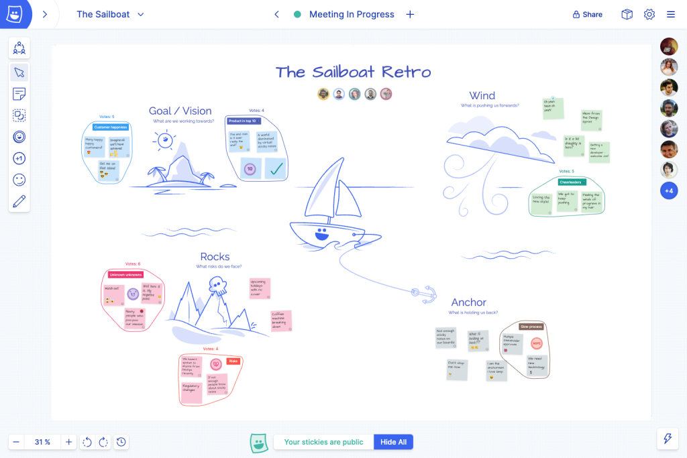

A remote team running the sailboat retrospective in Ludi

## What are Retrospectives in Agile?

In Agile software development, a retrospective, also known as a “sprint retrospective” (or simply “retro”), is a regular meeting that occurs at the end of each iteration (“sprint”). 

The main purpose of a retrospective is to reflect on the past iteration and identify opportunities for improvement in the team’s processes, communication, and collaboration.

During a retrospective, the Agile team (which typically includes developers, testers, Scrum Master, and product owner) gathers together to discuss what went well during the iteration and what could be improved. 

It provides an opportunity for the team to address any challenges or issues that arose during the sprint, but also to praise work that was done well and celebrate successes. 

The primary focus is on inspecting and adapting the team’s working methods to become more efficient and effective in the future.

There are many tools to facilitate agile retrospectives. For instance, [Ludi](/) is an online collaborative whiteboard designed for agile software development teams. 

Using the platform, you can run productive, engaging, and fun retrospectives to help your team inspect and adapt their processes.

The illustrated templates come with all the tools you need for the retrospective process, including private writing, grouping & themes, voting, actions, import & export, and all boards are completely customizable, so you can tailor your retro to the needs of your team.

## Agile Retrospective Stages

Agile retrospectives follow a structured format, which often involves the following key steps:

1.  **Set The Stage**

The facilitator (often the Scrum Master) sets the tone for the meeting and reminds everyone of the retrospective’s purpose and importance.

2.  **Gather Data**

The team members share their observations and data regarding the previous sprint. This data can include metrics, performance indicators, customer feedback, and any other relevant information.

3.  **Generate Insights**

The team discusses the identified positive aspects and challenges, seeking to understand their root causes and potential impacts on the project.

4.  **Brainstorm Improvements**

The team collectively brainstorms and proposes actionable ideas and improvements to address the issues and build upon the successes.

5.  **Decide on Actionable Items**

The team prioritizes the suggested improvements and decides which ones to implement in the upcoming sprint. 

These action items should be **specific**, **measurable**, **achievable**, **relevant**, and **time-bound** (**SMART**).

6.  **Close the Retrospective**

The team summarizes the key takeaways from the meeting and commits to implementing the agreed-upon improvements in the next sprint.

## Why are Retrospectives in Agile Important?

The primary reason retrospectives are important in Agile is because they are an integral part of continuous improvement, which is a key pillar of the Agile method.

They empower the team to be self-organizing and make their processes more efficient, leading to better software development outcomes over time. 

By frequently inspecting and adapting their working practices, Agile teams can be more responsive to changes and ultimately deliver higher value to their customers.

Retrospectives deliver a number of benefits that aid continuous improvement, including:

- Greater team empowerment,
- Encouraging and improving adaptability,
- Helping the team to learn from their mistakes,
- Encouraging innovation,
- Strengthening collaboration,
- Improving morale, and increasing mutual respect among team members,
- Increasing customer satisfaction.

Additionally, retrospectives are key to assessing results and identifying potential areas of improvement. They provide a way to measure the team’s progress over time. 

By comparing the outcomes of different sprints, the team can gauge the effectiveness of their improvements and celebrate their achievements when changes identified in retrospectives have brought about positive results. 

## Agile Retrospective Questions

While innovation and adaptability are key to the Agile methodology, there are some fairly consistent elements involved too. 

Not least of which are the questions that must be posed and answered in any worthwhile retrospective. Here are some you can ask:

### Primary Agile Retrospective Questions

**What went well during this sprint?**

This question allows the team to acknowledge their successes and build on what worked effectively.

**What could have gone better in this sprint?**

Encourages the team to identify areas of improvement and challenges they faced during the sprint.

**Were there any impediments or roadblocks? If so, how can we address them?**

Helps the team discuss and find solutions for any issues that hindered their progress.

**Did we meet our sprint goal? If not, what contributed to falling short?**

Promotes an honest assessment of whether the team achieved their sprint objectives and explores the reasons behind any deviations.

**Were all the necessary resources available and accessible?**

This question allows the team to evaluate if they had the right tools, equipment, and support to accomplish their tasks.

**Did we effectively collaborate and communicate during the sprint? If not, how can we improve?**

Encourages the team to assess their teamwork, communication, and collaboration to enhance overall effectiveness.

**Did the scope or priorities change during the sprint? How did it impact our work?**

Helps the team address the impact of changing requirements or priorities and discuss ways to handle such changes better in the future.

**What were the most significant lessons learned from this sprint?**

Fosters a culture of learning and allows the team to share valuable insights gained during the sprint.

**What can we do to improve the quality of our deliverables?**

Focuses on ways to enhance the quality of the work produced by the team.

**Are there any new tools, technologies, or practices we could incorporate to work more efficiently?**

Encourages the team to explore innovations that could improve their workflow.

**Is there anything we should start doing, stop doing, or continue doing in the next sprint?**

Encourages the team to create actionable items for improvement in the upcoming sprint.

### Secondary Agile Retrospective Questions

Secondary questions focus more on the team members themselves rather than the status and outcomes of the ongoing project.

This is important because it is human nature for people to become disengaged at times, even with the best of intentions. 

By asking the right questions, in the right way, you are able to bring people back into the fold and ensure that the meeting will be productive and worthwhile. 

- “How are your personal battery levels this week?”
- “How ready are you for the retrospective?”
- “What was the highlight of the week, and why?”
- “What surprised you the most this week?”
- “What’s one thing you could teach your colleagues from this week?”

Follow the link if you’re interested in learning more about questions to invigorate your team or [questions to revive a retrospective](/blog/using-questions-to-rescue-a-stale-retrospective). 

## Agile Retrospective Examples

As the leading retrospectives tool in the game, [Ludi](/) has a virtual shed load of ideas and templates that demonstrate the huge range of versatility some collaboration tools are now able to provide.

Right, now let’s take a closer look at some of the different types of retrospectives that Agile teams can benefit from.

### Good / Bad / Start / Stop

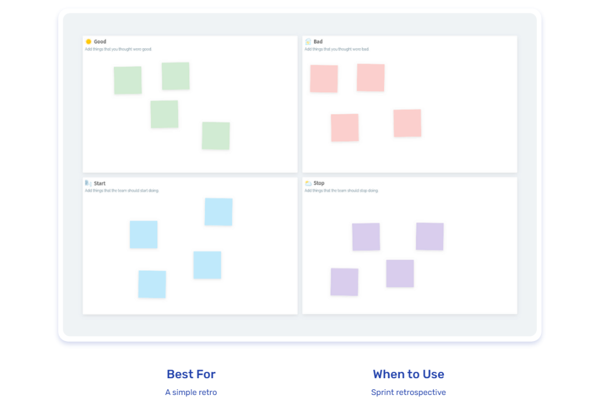

[The Good Bad Start Stop retrospective](/templates/good-bad-start-stop-retrospective) is easy to pick up and is usually one of the first retrospectives a team will try together.

It employs a classic four-panel retrospective board with categories of Good, Bad, Start, and Stop. 

**Tips for running this session**

Run this exercise similarly to most retrospectives:

1.  Ideate – ask people to write their sticky notes – 10 minutes
2.  Share and present their points – 20 minutes
3.  Identify patterns and group similar sticky notes – 10 minutes
4.  Vote on the most important issues – 5 minutes
5.  As a team, decide what actions to take for the top 3 voted issues. – 20 minutes

### Drop / Add / Keep / Improve

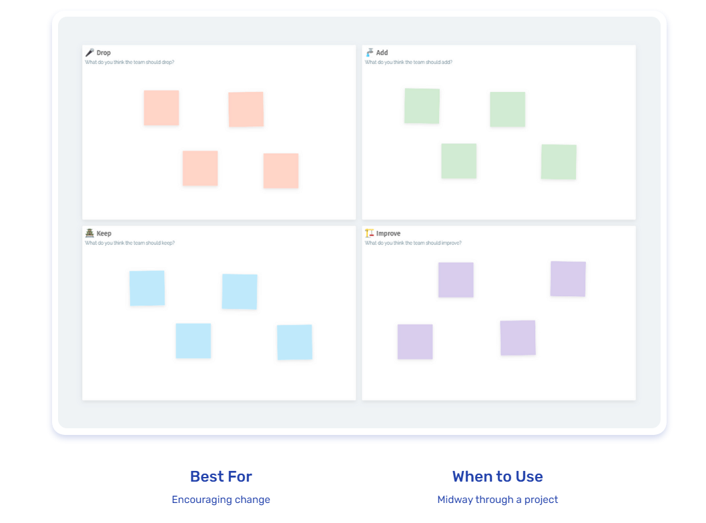

The Drop, Add, Keep, Improve (DAKI) retrospective is a structured format for conducting a retrospective in agile software development. 

The format is designed to help teams reflect on their recent work and identify specific actions to take moving forward.

In the [DAKI retrospective](/templates/drop-add-keep-improve-retrospective), team members are asked to reflect on four key areas:

1.  **Drop**: What should we stop doing that is not contributing to our success?
2.  **Add**: What new practices or processes should we introduce to improve our performance?
3.  **Keep**: What existing practices or processes should we continue to use because they are working well?
4.  **Improve**: What existing practices or processes should we modify or improve to increase their effectiveness?

By addressing each of these areas, the team can gain a comprehensive understanding of their recent performance and develop specific actions to improve going forward.

### Elephant in the Room

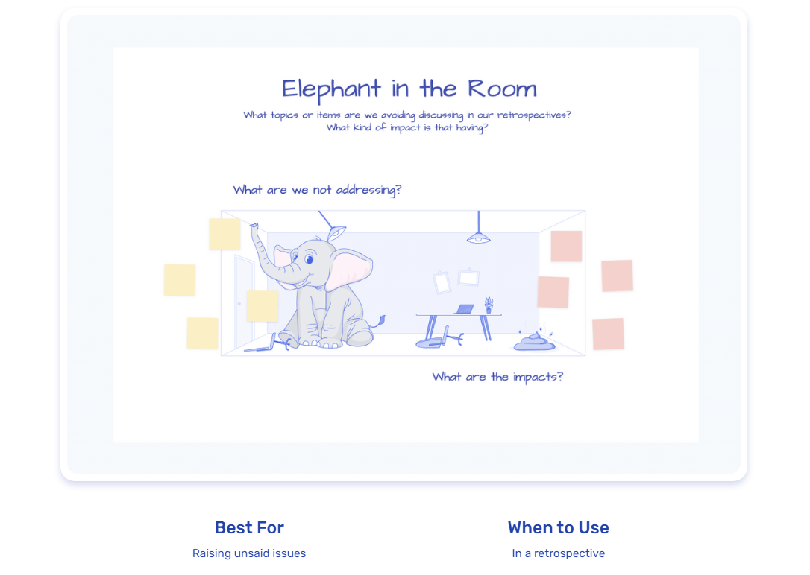

As the name suggests, the [elephant in the room retrospective](/templates/elephant-in-the-room) is designed to address problems or issues that are going unsaid and negatively impacting the project. 

This exercise challenges a team to talk about the topics they may be avoiding, whether that’s due to boredom, fear, apathy, or other reasons.

#### How to Run the Elephant in the Room Retrospective

1.  **Introduction**: explain the activity, and enter Meeting Mode to enable private sticky notes. The team may want their contributions to be anonymous, so you can also turn on “Hide Identities”.
2.  **Add stickie**s: each person adds one or two sticky notes for their issues, and what impact it is having.
3.  **Share issues and cluster**: reveal all sticky notes and group similar items.
4.  **Vote and discuss**: hold a vote to find the top 1-2 issues to discuss.
5.  **Reflection and action**: if action items are decided through the course of the discussion, write them down and assign an owner and due date.

### Energy Insights

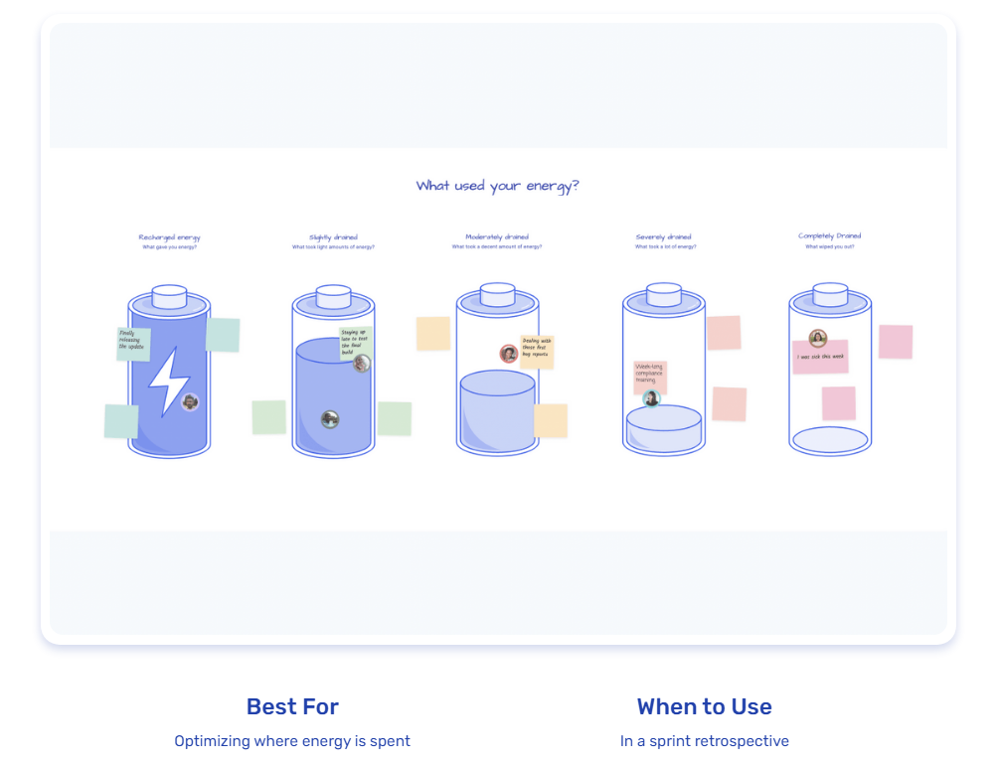

[Energy Insights](/templates/energy-insights-retrospective) is all about understanding the team’s energy and drive at both a group and individual level. 

Each person adds stickies to the corresponding batteries for what charged, drained, or completely flattened their energy. 

The team uses the results to discuss what happened and how to better use or preserve their energy in the next sprint.

It’s a really effective way of establishing which areas of a project are causing a disproportionate drain on the team’s resources. 

### Genie in a Bottle

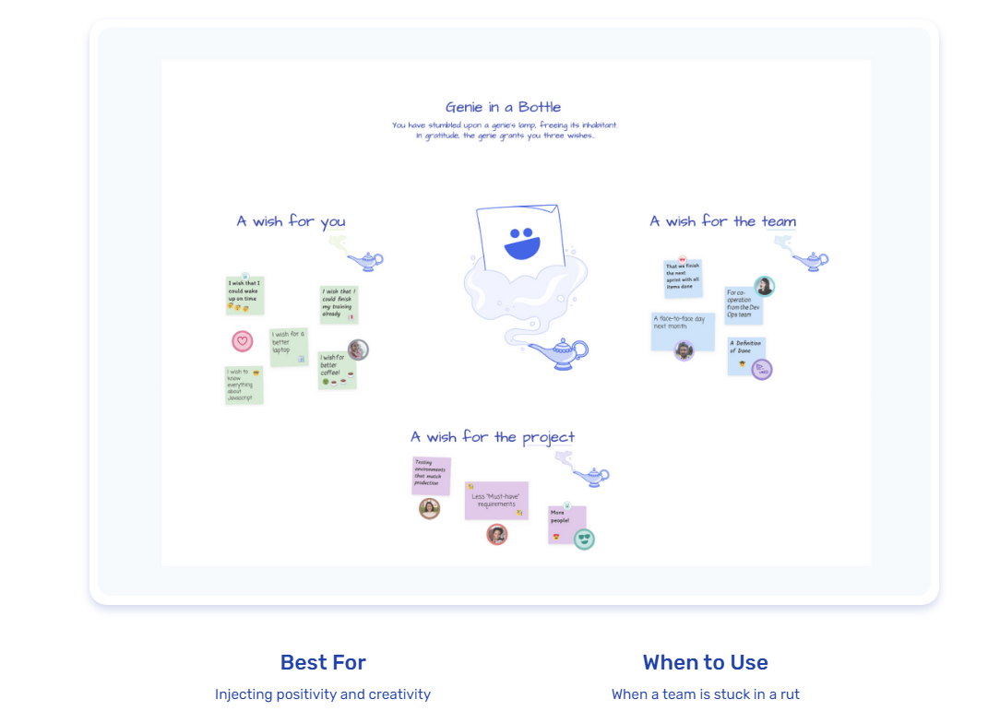

The “Genie in a Bottle” retrospective is designed to identify future goals, desires, and objectives and also any obstacles or impediments that might stand in the way of accomplishing your desired objectives. 

They can be especially useful for injecting positivity and creativity into a team showing signs of dissatisfaction. 

**The Three Wishes**:

- **A Wish For You**: A personal wish. This might concern professional growth, like desiring additional time for certification studies.
- **A Wish For the Team**: A wish for team enhancement. For example, a proposed weekly team celebration to foster unity.
- **A Wish For the Project**: A wish for the wider project. For example, better cooperation with other teams.

#### How to Run the Genie in a Bottle Retrospective

1.  **Introduction**: explain the activity, and enter Meeting Mode to enable private sticky notes.
2.  **Add wishes**: each person adds one sticky note to each area.
3.  **Share wishes**: each person reveals their sticky notes and explains their wishes.
4.  **Group wishes**: cluster similar wishes and discuss the topics.
5.  **Reflection and action**: finally, distill the wishes into actionable items where possible.

[The Genie in a Bottle retrospective](/templates/genie-in-a-bottle-retrospective) can also be run as a futurespective ([what is a futurespective?](/blog/what-is-a-futurespective)).

### Glad / Sad / Mad

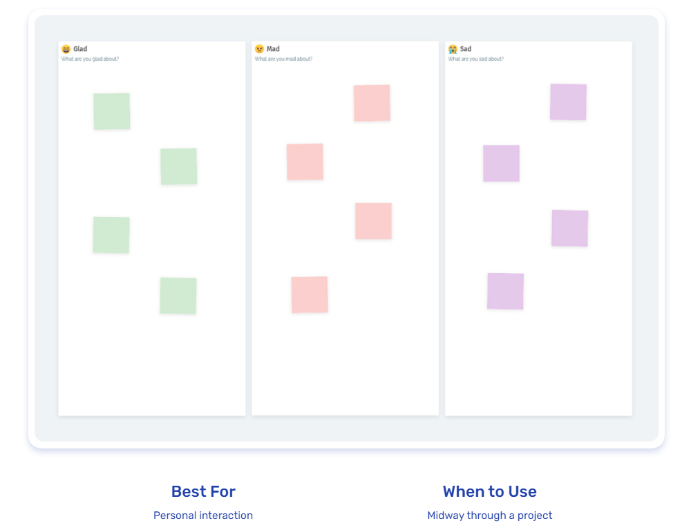

The [Glad Sad Mad retrospective](/templates/glad-sad-mad-retrospective) is a way of exploring how current team members are feeling about various aspects of the project. It also serves well to increase empathy among team members and improve team bonding. 

By using emotive language, it allows team members to present their points with a human perspective. 

This serves to remind team members that they are working with fellow human beings, each with their own problems and feelings.

### In the Boxing Ring

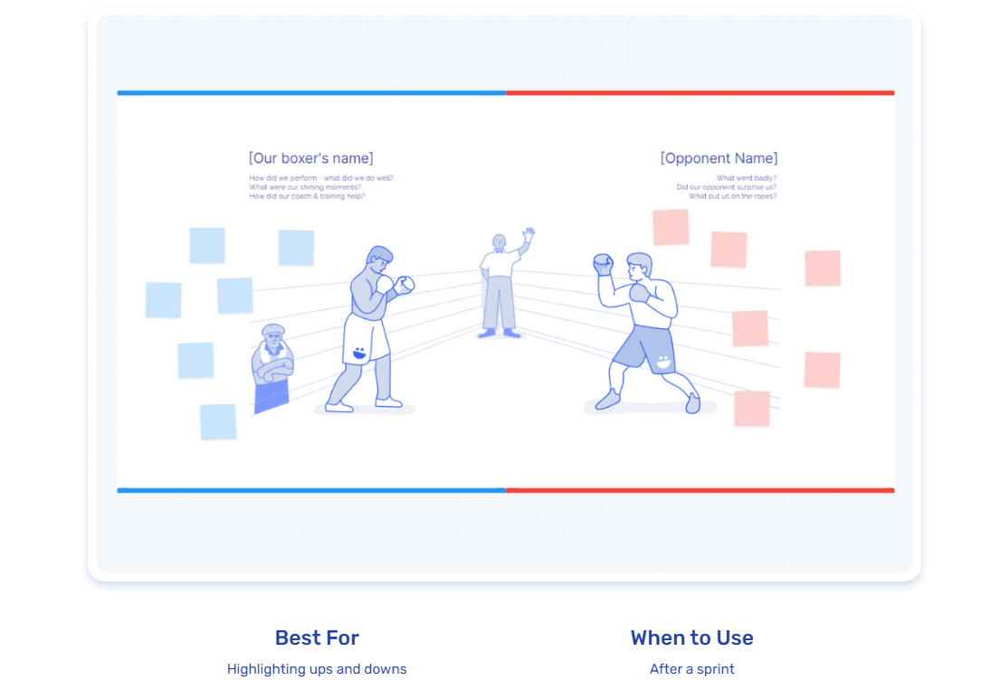

The [Boxing Ring retrospective](/templates/in-the-boxing-ring) is a fun way of working out what worked and what didn’t in a previous sprint. 

The template is made up of an icebreaker to get the team loosened up (name your boxer), follows with the main event (the retro), and ends with the team deciding actions for the next sprint.

### Joy, Fear, Excitement!

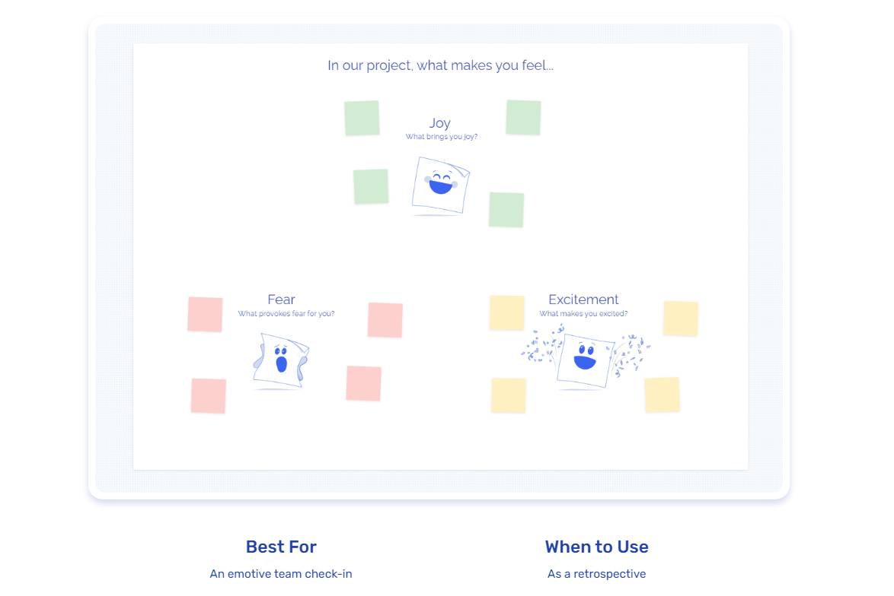

The [Joy, Fear, Excitement retrospective](/templates/joy-fear-excitement) is a great choice for a team looking for a positive and energizing retrospective exercise that looks at emotions as well as factual data.

The retrospective is also forward-looking as well as backward-looking, as it encourages team members to think about what they want to feel more of (joy and excitement) and less of (fear) in the future. 

This can help to create a more actionable plan for the team to work on moving forward.

The retrospective can be used as a main retrospective or as an add-on to a meeting. 

It’s a good choice for a team that wants to check in with each other emotionally and build a more positive and supportive team culture.

### Keep / Add / Less / More

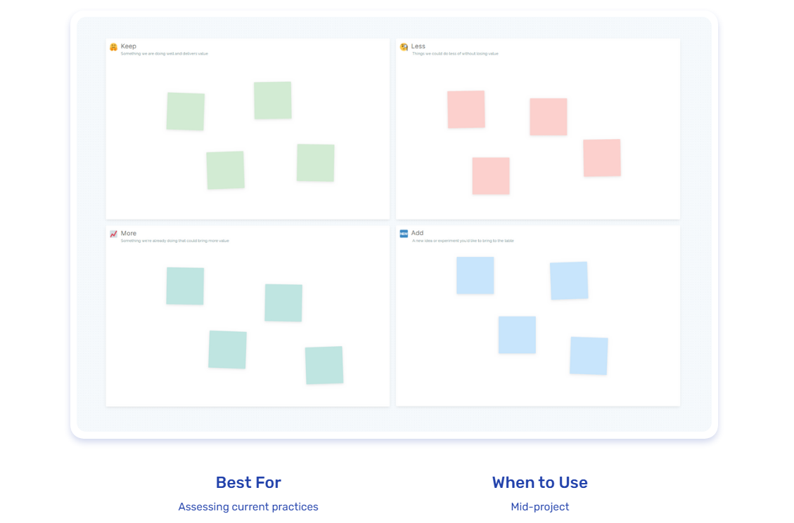

The KALM retrospective is used by a team to assess the things they are doing to deliver value and what could be improved. 

You’ll look at your current processes from four different perspectives, and each person will contribute their own ideas.

It should take a team 45-75 minutes to complete, depending on team size and the number of sticky notes. 

This retrospective format provides a polite way for team members to contribute their opinion, so is good for occasions where people might feel uneasy sharing.

The four perspectives are:

**Keep** – Something we are doing well and delivers value

**Add** – A new idea or experiment you’d like to bring to the table

**Less** – Things we could do less of without losing value

**More** – Something we’re already doing that could bring more value

### Liked, Learned, Lacked, Longed For, Retrospective

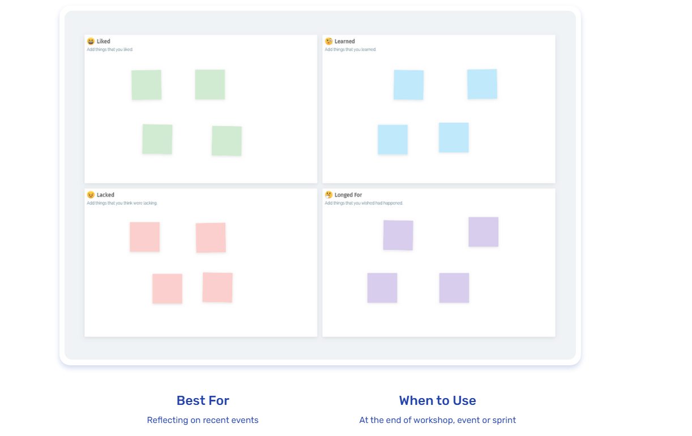

The [4 Ls retrospective](/templates/liked-learned-lacked-longed-for-retrospective) format gives people an opportunity to express themselves through a range of categories. It uses a popular four-panel design that asks teams to give feedback on the positives and negatives of a particular topic or activity. 

**How to run this session**

_Time needed: 60 minutes_

Run this exercise similarly to most retrospectives:

1.  Ideate – ask people to write their sticky notes – 10 minutes
2.  Share and present their points – 20 minutes
3.  Identify patterns and group similar sticky notes – 10 minutes
4.  Vote on the most important issues – 5 minutes
5.  As a team, decide what actions to take for the top 3 voted issues. – 15 minutes

## Retrospectives in Agile Best Practices

### Regular and Timeboxed Retrospectives

Hold retrospectives at the end of each sprint or iteration, adhering to a fixed timebox (e.g., 1-2 hours for a two-week sprint). Regularity ensures continuous feedback and improvement.

### Create a Safe Environment

Foster a culture of openness and psychological safety, where team members feel comfortable sharing their opinions, ideas, and concerns without fear of judgment or reprisal.

### Diverse Participation

Involve all team members in the retrospective, including developers, testers, Scrum Master, and product owner, as their diverse perspectives enrich the discussions and decisions.

### Set the Stage

Start each retrospective by reminding the team of the retrospective’s purpose and importance. 

Review the team’s goals and any relevant data from the previous sprint.

### Use a Facilitator

Designate a facilitator (e.g. the Scrum Master or Product Owner) to lead the retrospective. 

The facilitator ensures everyone gets an opportunity to speak and that discussions stay focused and constructive. 

### Follow a Structured Format

Use a retrospective format that suits your team’s needs, such as the “Start-Stop-Continue,” “Mad, Sad, Glad,” or “4Ls” (Liked, Learned, Lacked, Longed for) approaches we looked at earlier. 

### Focus on Specifics

Discuss concrete and specific situations rather than making vague statements. 

Use data, metrics, and real examples to back up observations.

### Identify Actionable Items

Ensure that the retrospective leads to actionable outcomes. Create specific, measurable, achievable, relevant, and time-bound (SMART) action items that the team can implement in the next sprint.

### Prioritize Improvements

When generating action items, prioritize them based on impact and feasibility. 

Focus on a few crucial improvements rather than attempting to address every issue at once.

### Closure and Commitment

Summarize the main takeaways and agreed-upon action items at the end of the retrospective. 

Ensure that the team commits to implementing the improvements in the next sprint.

### Review Progress

At the beginning of the next retrospective, review the progress made on the action items from the previous retrospective. Celebrate successes and discuss any challenges encountered.

### Experiment and Innovate

Encourage the team to experiment with new ideas and innovative practices during the retrospectives. Embrace a mindset of continuous learning and exploration.

### Document and Share

Keep records of the retrospective outcomes, action items, and progress. Share the learnings with stakeholders, other teams, or management to promote transparency and encourage cross-team learning.

By following these best practices, Agile teams can conduct productive retrospectives that lead to tangible improvements, stronger collaboration, and, ultimately, better outcomes in their software development efforts.

## Conclusion

Retrospectives in Agile development are a versatile and effective way of achieving continuous improvement throughout the entire development project cycle. 

By implementing retrospectives after each sprint, an Agile team can realize a number of benefits, from improving team morale to increasing customer satisfaction and more rapidly identifying what has worked well and which areas are in need of immediate improvement. 

Additionally, using the right kind of retrospectives can enhance team coherence and communication, and also facilitate more honest and productive feedback across teams. 

All of this will serve to achieve the continuous improvement that all Agile teams are seeking to accomplish.

One of the key elements of any effective Agile team is having the right tools that enable them to achieve their goals, including virtual whiteboards and collaboration tools that will allow them to run effective and impactful retrospectives. 

Ludi is an online whiteboard designed for software and product teams. Over 10,000 Agile teams use Ludi to improve their retrospectives. [Give it a try](/login?source=%2Fsetup) today.
