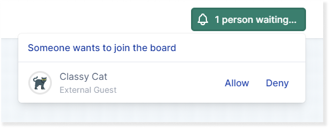
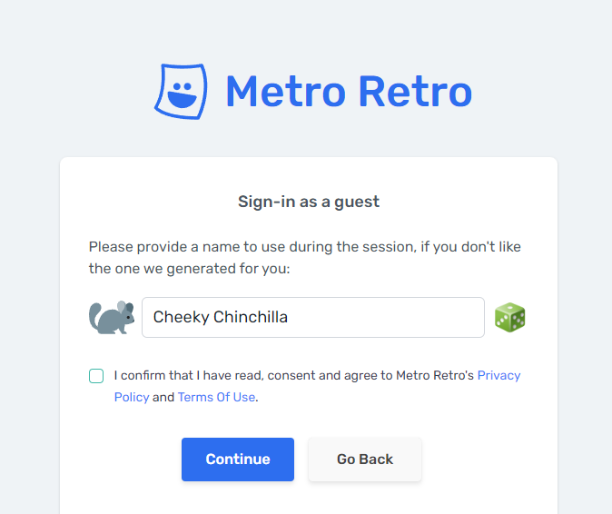
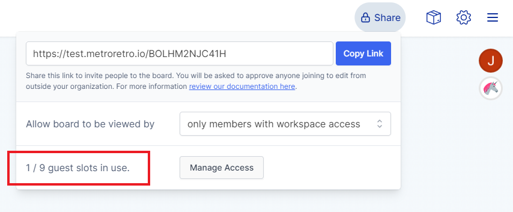

### Work securely with external guests

Ludi is great for working with your colleagues but sometimes you need to collaborate with people outside your team, so this month we’ve brought you the ability to share your board securely with external guests. It’s perfect for working with clients, customers and partners without needing to invite them into your space as a full member.

This update comes alongside other changes to sharing boards, as well as more new features and templates. You can read the full details in the [May 2022 release notes](https://updates.metroretro.io/external-guests-better-sharing-v2.49-uuvn2), or get started with the quick guide to guests below.

A guest requests access to a board

### What is a Guest?

A Guest in Ludi is someone you give temporary edit rights to your board. They do not need to signup or login, and you manage their access. They have the basic editing / contribution functions and can use all the tools like sticky notes, drawing & confetti.

### When would I use Guests?

Here’s some examples of how our customers are already using Guests:

- To invite clients into remote workshops
- To run interactive webinars
- When interviewing engineering candidates
- To supplement an agency pitch

### How do I invite Guests to my board?

Simply share the board link with your intended Guest(s), wait for them to request access to the board, then allow them in (note – you must be on the board to do this).

### What can a Guest do?

A guest can participate like a regular member (using stickies, images, voting…), but they cannot start or run meetings, change the sharing settings, or manage other people’s access to the board.

### Guests do not need to login

Guests do not need to login or create an account. They just provide their name and choose one of the randomized animal avatars, then ask for permission to access the board.

Guests choose an avatar and name

### Manage Guest access to your board

You can see all the guests that have access to to the board, and you can kick guests off the board. A guest’s access to a board lasts 24 hours, after which they will need to request access again.

### Your team space is hidden to Guests

Guests can only access and work on the board you share with them, so you can be confident that everything else is kept private. They do not have access to your team space.

### Guests are available to teams with a subscription

Teams on a subscription get a free allocation of Guests on every board. The limit scales with your team members. More team members = more free guests. The limit applies separately to each board and you can remove existing guests from a board to add other guests.

All plans get unlimited free viewers (no sign-in required), but Guests are not available teams on a Free plan. If you wish to collaborate with someone on a Free plan you must first add them to your team.

This team can have up to 9 guests on every board
