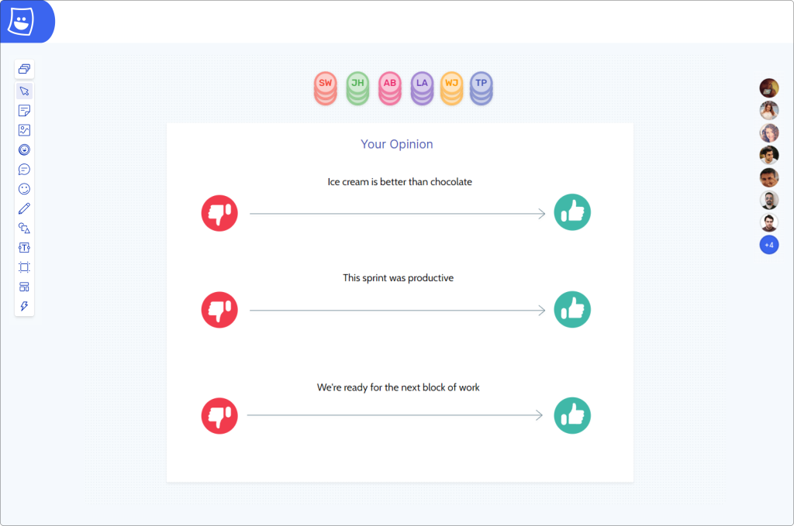
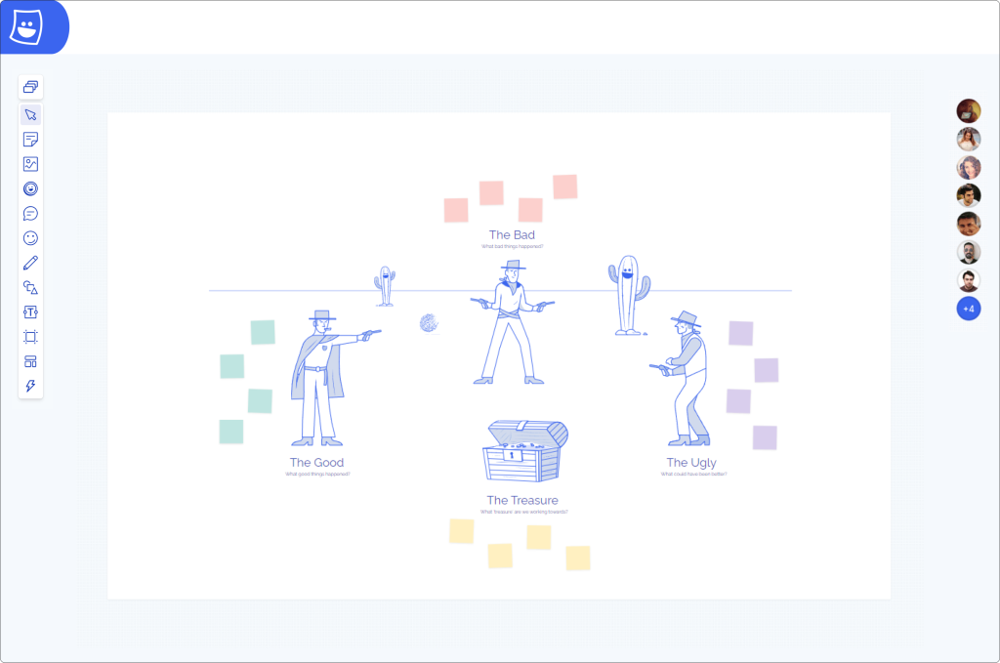
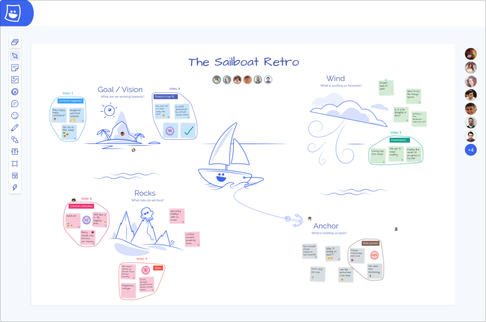

_Transform your meetings with this fool-proof sprint retrospective agenda that will keep your team connected._

Though a final touchpoint in the process, [sprint retrospectives](https://metroretro.io/sprint-retrospective/) are an important part of any sprint. In saying this, they require effort in order to get the value out of them that returns a reward going into future sprints. In this article, we’ll provide you not only with the what and why, but also with the how so that you can learn to improve your retros for the greater good of your team.

## What is a Sprint Retrospective?

Put simply, a sprint retrospective is a review conducted after a sprint. It is key to Agile methodology, working to determine what went well, where the team had problems, and how to improve next time. 

## The Benefits of an Effective Sprint Retrospective

### Improving Future Sprints

Sprint retrospective meetings allow everyone to share and understand what has worked and what hasn’t, which in turn allows you to improve your Agile processes and simplify your next sprint. Ultimately, the opportunity to reflect on your latest sprint allows for improvements to be made for future sprints, continuously leading to fewer obstacles and greater success going forward. 

### Improving Team Morale

By asking the whole team to contribute, and valuing all feedback in order to improve future sprints, team morale can be boosted and individual team members can grow more confident, more easily recognise ways to improve processes, and feel more empowered to speak up.

### Improving Transparency

During sprint retrospectives, transparency is key. The only way bottlenecks and other issues can be identified and improved is via honest conversation. These meetings enable team collaboration, and help to build trust between team mates.

## The Sprint Retrospective Agenda you Should Try

Now that we’ve covered the basics, we’re going to let you into a secret: our sprint retrospective agenda for success. Before you start, set yourself up a free account on [Metro Retro](https://metroretro.io/) if you don’t already have one — this is the tool that will take your retro game up a notch.

### Step 1: Set the goal and tone of the meeting

Just like any other meeting, a retrospective should have an agenda and an ultimate goal. The goal of sprint is to collect feedback from different perspectives and use that feedback to set goals and improve Agile processes. Welcome the team to the meeting and make sure the goal is clear from the get-go.

This moment is also a good chance to set the tone of the meeting. Everyone should feel like they have a voice at a sprint review, so set that tone from the beginning of the meeting by encouraging participation with an icebreaker or energiser. Starting your meeting with this will encourage people to share honestly — without fear of blame but instead with the promise of progress.

Try our [‘Agree and Disagree’ icebreaker template](https://metroretro.io/templates/agree-or-disagree-icebreaker) to get started straight away!

_Icebreaker template for step 1 of our sprint retrospective agenda._

### Step 2: Get feedback

So, the team is aware of the goal of the meeting, and feeling engaged… what’s next? Well, now it’s time to gather feedback about the latest sprint. 

Load up Metro Retro’s ‘[The Good, The Bad and The Ugly](https://metroretro.io/templates/the-good-the-bad-and-the-ugly-retrospective)’ retrospective template to gather feedback by asking what team members think was good, what was bad, and what needs to be improved during a sprint. This retrospective template comes with features such as private writing, so maybe relieve some pressure and give everyone a set amount of time to write in private before revealing contributions when everyone is ready. 

_‘The Good, The Bad, The Ugly’ template by Metro Retro._

### Step 3: Decipher the themes and insights

Now that the team has contributed their individual thoughts, it’s time to bring it all together. These ‘thoughts’ are actually data on how a sprint has performed, and should be treated as such. With this in mind, it’s time to look for patterns and insights. Using Metro Retro, you can go through the points in each section using the [topic tool](https://docs.metroretro.io/boards/the-tools#topic-tool) and [voting tool](https://docs.metroretro.io/boards/the-tools#voting-tool) to find patterns and themes.

These insights that you gather are a key part of setting goals and actions, so make sure the whole team is encouraged to contribute any thoughts they may have. Different perspectives are key at this stage in the retro.

_Here is an example of the topic tool and voting tool in use on our retro template, ‘[The Sailboat](https://metroretro.io/templates/the-sailboat-retrospective)‘._

### Step 4: Set actions

Following on from using the topic and voting tool to generate insights, as a team you can then prioritize the issues and brainstorm improvements, actions, or experiments that will address them. Make sure the team assigns an owner and due date to each action, and share your Metro Retro board to allow the whole team to remind themselves of the actions and who’s responsible.

### Step 5: End the meeting

You and your team have now reviewed your latest sprint and decided on how to improve your next one, so it’s time to close out the sprint retrospective meeting. To end the meeting, give an easy to understand summary of takeaways from the meeting (including any urgent actions), and express gratitude for the contribution, which will encourage future contribution.
