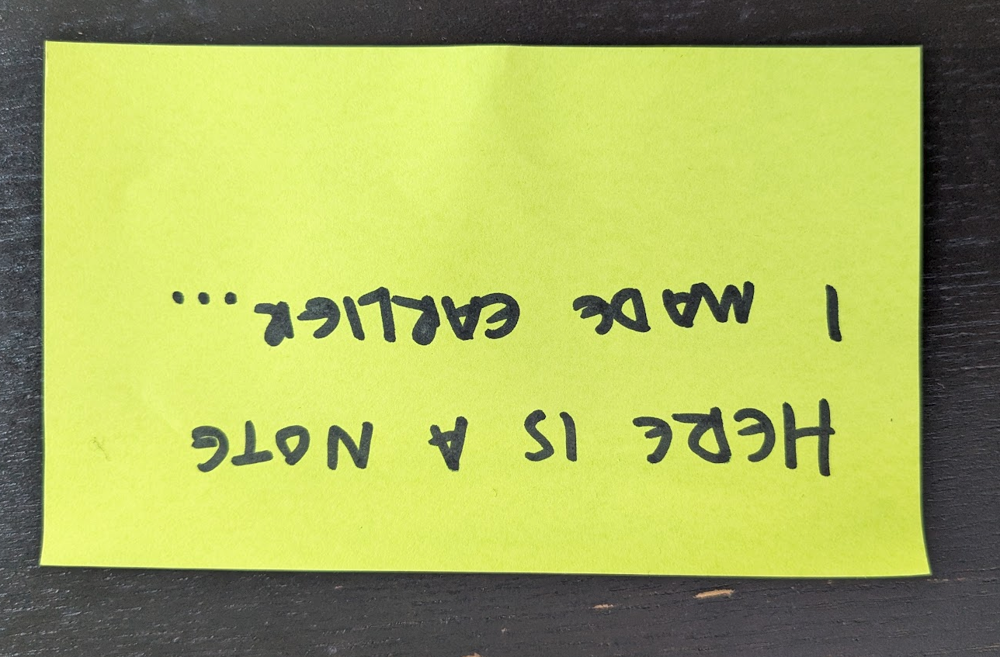
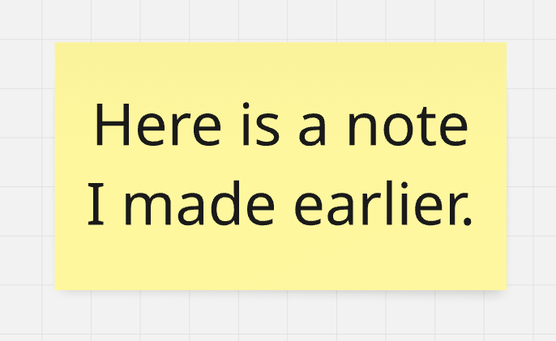
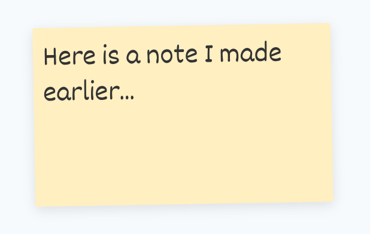

## Enjoy the little things!

It's one of my favourite sayings. Usually I say it as a joke, but the real joke is we've built an entire product, used by thousands of people, with this concept at its core. When you care about the little things in your software, they usually add up to a big thing; it makes people happy.

Thousands of stickies are created in Metro Retro every day. Sticky notes are the basic unit of exchange in Metro Retro. We have a lot of different object types, but the sticky note is at the center of everything. It's so important that we even made it our logo!

When designing our sticky notes, our objective was to create something so intuitive and so natural to use that you don't even notice it's there. Something that has "invisible design". In this article, I'd like to pull the curtain back and show you all the little things we did to turn a simple coloured rectangle into a soulful, natural representation of a real world object, and in our opinion, the best one available in any tool on the market today.

## What is a sticky note?

<!-- The answer to this feels obvious, but sometimes the obvious you overlook what's actually there and end up missing the important parts. So, saying it aloud; a sticky note is a small coloured rectangle of paper usually written on with a pen by a human being. -->

A sticky note is a small coloured rectangle of paper usually written on with a pen by a human being.

Here is a photo of one I wrote earlier:

Now, here is a version of this sticky note created in a popular collaborative whiteboard application:

And here is the same sticky note in Metro Retro:

Which one looks most like the real one?

## Making stickies that feel real

To compare the two, there are a number of things that we've considered when designing our sticky notes to get them feeling like the real thing. I'll go through these below, and discuss why we went to the effort of doing them:

### We use handwriting fonts.

People write stickies. Every application I've seen that has virtual stickies uses a uniform font for every user, and almost all use an application UI font like Helvetica. To us, this feels cold and robotic.

We want people who use Metro Retro to feel like they are using a tool that other humans use, because at the end of the day it's a collaboration tool for humans. Each user in Metro Retro gets assigned a random handwriting font, and all their stickies will be presented using that font. Once you've got a few people on a board writing ideas, the advantage of this becomes obvious. It's immediately easier to tell apart who has written each idea, and on top of that, it feels human and feels like you are working with people. And it also just looks nice.

_[A board so nice, I put it in a frame]_

### We use natural alignment.

Look at the first picture and note the alignment of the handwriting. It's possible for people to write center/center aligned in a sticky, but generally speaking, we don't do that. Naturally, people start in the top left and write usually smaller than the space available, because it's hard to gauge the exact size of text needed at the start.

In Metro Retro stickies are default left / top aligned by default. The font also scales to the size of the box, but its maximum size is capped to be a natural size so that if you write a few characters there is relatable free space around the text.

It just looks more real that way.

### They are messy by design.

Metro Retro generally has two kinds of object; layout objects and content objects. Layout objects have a more complex manipulation net, they generally snap to the grid system and snap to guide lines as you move them around. Content objects, such as Stickies, Cards and Tokens, are free from the authority of the grid and snapping system. This makes them feel more responsive, more fluid, and generally nicer to move around the board.

_[interactive example of content vs layout]_

As users, we usually want to make sure that board designs & layouts are aligned properly, because it's most aesthetically pleasing that way. However, with content objects like stickies, if they are all perfectly aligned and with chisel accuracy, it feels unnatural and robotic, because a bunch of humans in a physical room with physical stickies would never achieve perfectly aligned rows and columns of notes. They'd not even be able to keep them all pointing in the right direction.

This is why we disable the grid and snapping for stickies. It feels better to use and looks more natural. But we go even further than that; our stickies have a little random tilt applied to make them really look like they were put there by a human.

_[demo of tilting]_

### Stickies come to the front.

Nobody ever rearranged a physical board of stickies while maintaining the physical z-order of the paper. Imagine, moving notes around and sliding them exactly in place so that they appear under another note. Whether physical or digital, never do you actually want to move a sticky and it does not come to the fore so you can read it, just as if you picked it off a physical board with your hand.

_[interactive stacking of stickies]_

In other apps, if you have layered stickies like this, something just feels off about moving them. In Metro Retro, it feels implicitly obvious that they should come to the front. It just feels right, because it's what would happen in real life.

### They come in any size you want, as long as it's regular or large.

Most (if not all) collaborative whiteboard or diagram applications that have virtual sticky notes allow you to arbitrarily scale sticky notes to any size, sometimes even changing the proportions as well.

_[picture of a massive sticky, next to a not massive sticky]_

A problem we have observed many times with this approach is it gives the user no sense of scale. It's not uncommon for a template built by one person to be constructed at an arbitrary scale that doesn't match other templates built by other people, making them difficult to combine and use together.

If you can arbitrarily size all content, there is no anchor that guides how things should be. Stickies in Metro Retro cannot be scaled; they exist in two sizes, regular and large. This gives the user an understanding of what the scale of the application is, and helps guide them in building board designs that fit their expected content. Our regular stickies are 150x150, and so users know intuitively that if they need a Zone or Frame with room for 20 stickies, they need a box about 800 wide and 600 down, approximately. They don't do the math, it's just kinda obvious, which is the point.

## Moving beyond the real world

I've spent a lot of time above describing how we make our stickies feel as close to the real thing as possible. We do that to create a connection with the user and their real life experiences. It helps draw them in and forget they are using software.

Having said that, they are using software, and clearly the software realm is superior to the physical realm for powerful interaction. Our focus on realism of the base entity is to trigger recognition and comfort. Beyond that, we add a level of interaction to our stickies that bests all other tools, and adds a layer of delight as seasoning to the realism bit.

### Responsive & delightful

For reasons not clear to me, most other apps do not have hover states or interaction states for their board objects. We believe one of the core foundations of good user experience is subtle but continuous feedback on your actions. To that end, our stickies have hover states, selection states and click states for the main element as well as attached metadata.

### Four types of metadata

As the basic unit of exchange, people default to creating stickies, even when they might best be served by something else. We lean into what people want to do, rather than getting in their way. If you want to pimp out your sticky notes into fully fledged data objects, you can. Due to no small amount of work, you can comment on, vote for and tag (with values) stickies. You can also assign them to yourself or others, to be tracked as action items on our team dashboard.

_[interactive example of a sticky with mega annotations]_

### You can write in private

A feature we pioneered. Now available, in most products in some form, we had this when we launched in 2019 and it hasn't really changed much. In principle, many collaborative sessions benefit from users being able to write privately and share once they are happy with their ideas and notes. This is true in retrospectives through brainstorms.

When Private Writing is enabled in Metro Retro, other users' stickies appear as redacted, as you can see below. When ready, users can either share one by one or share all their notes, revealing them to everyone.

To get this to work properly required a bit more thought than is immediately obvious. Copying and pasting a private sticky note has to prevent the content from reaching the clipboard of other users, so they can't peek. The same problem exists with export functions. Further, as our renderer currently uses HTML, it would be possible to inspect the DOM with the DevTools and peek at the content there if we didn't scramble the content when in the view layer.

### And, you can just draw all over them

Finally, a beloved feature of Metro Retro is the ability to graffiti your or your colleagues stickies with emojis or marker pen. Drawing functions are standard in whiteboards, but in Metro Retro you are drawing directly on the object, rather than on a separate vector object. We never get tired of seeing boards our users share with us, and seeing the joy they've cleared by just drawing all over everything.

## Conclusion

Hopefully you've enjoyed this insight into how we designed our virtual sticky notes. As you can see, we sweat the little things, because.
