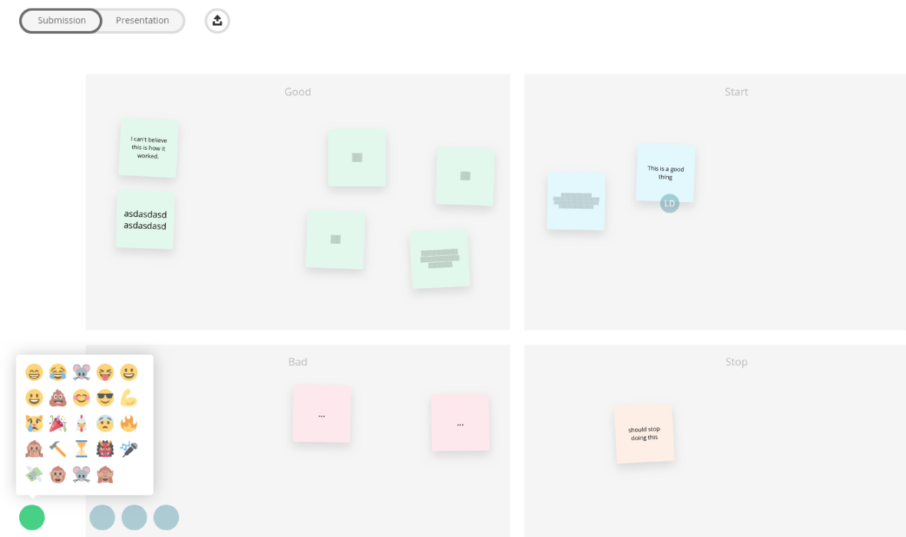
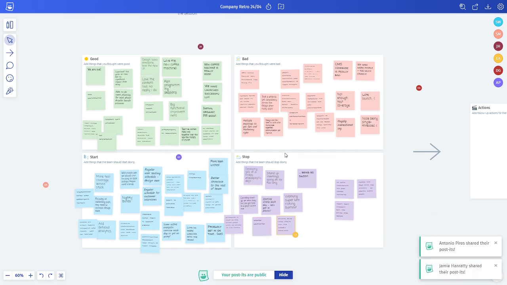

## Introduction

On April 29th this year, many months later than I had intended, Metro Retro was [listed on Product Hunt](https://www.producthunt.com/posts/metro-retro) and launched to the world. It took about a year and a half to build, much of this being evening and weekend work, finishing with a couple of months of full time. It’s the first product that I’ve worked on and launched independently and I’m super excited to have it live.

This week is the launch of the Metro Retro Blog and this is the inaugural post. Over the coming months I (and hopefully others) will be writing about how Metro Retro was made, what’s being worked on next and anything else I can pretend is interesting in order to improve the SEO of the website. To kick it off I’d like to take you right back to the beginning…

## Yay Agile

Agile can be a controversial topic that invokes a broad range of reactions depending on who you talk to. Personally, I’ve worked at several companies that liked to call themselves Agile but in reality were just disorganized, which might be part of the reason for the hate. The exception to this pattern is the company I worked at for about three years until 2017, which did implement Agile (specifically Scrum) accurately and it was pretty successful (at least for my team). We worked in a fortnightly sprint pattern with the standard Scrum “ceremonies” each cycle.

This was my first exposure to the process _working as intended_ and it was a welcome change from the chaotic agency life I had been living for the few years prior. The ritual of refinement, planning and then retrospective each week was much more agreeable than being given five JPGs of a website design and told to crack on. One thing I noticed, however, was that while our team made use of many software tools (such as Jira, Confluence, Git, etc) we didn’t use any that facilitated the Scrum ceremonies.

As a lead developer, I often found it frustrating running sprint planning sessions and having to laboriously update Jira with sub-tasks and estimates, especially if any of the participants were remote. Refinement was usually led by the Product Owner with Jira on a shared screen, which was fine except that only one person could drive, and it was also difficult with remote team members. For the retrospective, our whole team would write their feedback on sticky notes, stick them to a whiteboard or wall and discuss them in turn. At the end, our project manager would write them up manually into Confluence. This would take sometimes up to 30 minutes and at the end of it the paper would all be thrown in the trash. To top it off, involving remote participants was basically too hard to bother with.

## The Hackathon

So, I started working on a prototype for an ultra adaptable, collaborative productivity tool that would solve all these problems. This progressed pretty slowly and eventually I parked it due to, among other things, lack of discipline and focus. About a year later, our company announced a hackathon for its employees. The brief was completely open and employees were encouraged to mix and team up with people they didn’t work with day to day. All outputs would be open sourced and not controlled by the business. I decided to use this opportunity to resurrect the ideas from the prototype but the focus on solving a single problem rather than multiple.

On 18th November 2016 I teamed up with my good friend and colleague at the time, Dan Greane (Developer) and [Dvorak](https://en.wikipedia.org/wiki/Dvorak_Simplified_Keyboard) extraordinaire Bartek Nowojski (Designer) and started work. We spent 24hrs coding, drinking, eating Rustlers, watching [The Purge](https://www.imdb.com/title/tt2184339/) and napping… but at the end of it all we had the first working version of Metro Retro.

And it was pretty cool, if you like bugs:

Our prototype, in all it’s glory.

It took me about two hours of hacking just to bring you this single screenshot. The original code is three years old and the JavaScript ecosystem is not kind to old projects with out of date dependencies. Resurrecting it was cool though because I had forgotten what it was really like and how much has changed but also how much is actually really similar to the version online today.

The prototype featured real time updates, private sticky notes and a CSV export just like it’s big brother. It doesn’t have any customization though, the board is fixed into a Good, Bad, Start and Stop configuration. There are no tools like the comment or reaction tools, the only other features are an emoji messenger that allows you to send an emoji to all other participants (which has no real use) and a toggle to switch from Submission to Presentation mode (allowing you to see everyones notes). It’s also really buggy, which is why none of the initials are showing up on the user bar at the bottom.

## Philosophy

Currently there are something like 10 other products (that I know about) attempting to provide teams with a way of holding digital retrospectives to save paper, time or enable remote working. A bunch of these were around when we built the prototype. Almost all of them follow the same rough template; take a Trello like column system and add more specific behavior, maybe some voting and label customizations and jazz it up with a Web 3.0 design. To me this is pretty dull.

With Metro Retro, it was important that we did something a bit different and broke a few software norms. It needed it to feel as close as possible to doing a real retrospective, in person, with paper. It needed to look like sticky notes on a whiteboard and not like a Jira or Trello board. It needed to have real-time updates from other users so it felt like you were in a shared session together. It had to let you delete or move sticky notes of other users because, in real life, you can walk up to and bin someone else’s paper notes if you want… so you should be able to in the software version. Most of all though, it needed to be fun!

So that’s what we made. Bartek made some great mockups, Dan flexed his elite JavaScript skills on the backend and I built the front end. We added little touches like the slight rotation of sticky notes to make the board look more natural and the emoji messenger to inject a bit of fun into a session. We ended up winning the vote for best product of the day even though a lot of the other teams made really cool products. The following week we dropped the prototype onto AWS and version zero of Metro Retro was live.

## The Rebirth

After the deployment, other priorities took over and the project was left to gather dust, despite some cool ideas we had for new features and improvements. About a year later, I discovered to my surprise that Dan and some other ex-colleagues (we had all moved on to new companies at this point) were still using the Metro Retro prototype. Even though it was buggy, unfinished and probably unable to support more than a handful of users, they were getting value out of it. I had been thinking about restarting my original prototype for a collaborativity tool anyway, so I decided that Metro Retro deserved a reboot and doing properly.

At the end of 2017 I started the new version and spent about a year working evenings and weekends on the project. In late 2018 I went part time on my day job and spent the rest of the time on Metro Retro. In April this year I went full time and it launched a month later!

The reborn Metro Retro.

The new version is much bigger, shares very little code with the prototype and looks quite different in many ways. At the core though, it remains true to the philosophy of the prototype; be free, be fun, be engaging. And it also has confetti!

Since launch we’ve had several thousand people sign up, hundreds of boards created and tens of thousands of sticky notes written. Despite a few rookie mistakes, the launch was positive and it’s amazing to see people using a product you have spent so much time making. Over the next couple of months I’m going to be updating the product further with a few new features, optimizations and bug fixes. If there is anything you want to see added, [get in touch!](/blog/the-metro-retro-story#Intercom)

Thanks for reading!

_Since working together on the hackathon, Dan and Bartek have moved on to other things. Dan is now a_ [_co-founder of Nez_](https://joinnez.com/)_, a London based start-up in the food sector and Bartek moved to Berlin and lives happily with his Dvorak keyboard freelancing in UX and UI design._

‍
