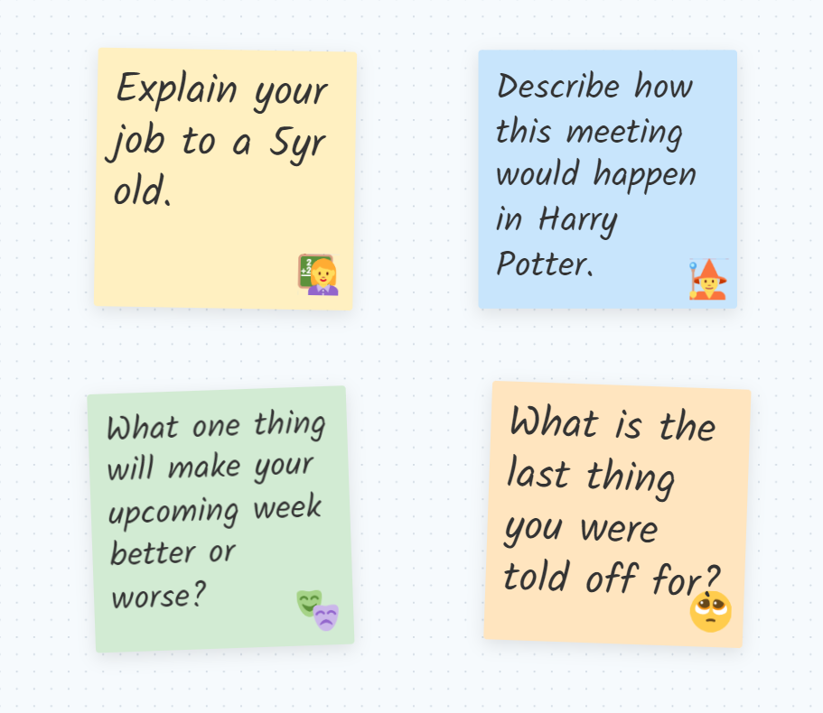
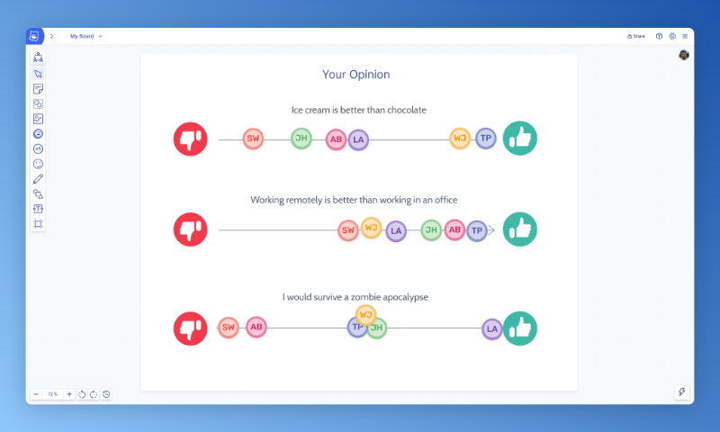

## Icebreakers for meetings & workshops

If you’re running out of ideas to keep your icebreakers fresh, we’ve compiled some questions and games to get your meetings started with more energy. A good icebreaker will remove the mental barrier of speaking up and leaves the group feeling more at ease, creative and expressive – ready for the meeting ahead.

## Icebreakers to try in your next meeting

Here is our curated list of suggested icebreakers. Use your judgment to choose the most suitable icebreakers for the audience & context of your next meeting.

### Icebreaker questions to make people smile

These questions will lighten the air and raise a few smirks:

1.  If you weren’t here today, what would you be doing instead that you’re glad you don’t have to do?
2.  What is the last thing you were told off for?
3.  If this meeting was a wrestling match, what would your entrance music be? Bonus points if you can pull up 5 seconds of the track! (As a fun twist, have people secretly pick entrance music for each other).
4.  If you could ride on the back of any animal (without harming them), which would it be and why? What would you name them and where would you go?

### Icebreaker games

We are fans of getting stuck in with creative games at Ludi HQ, so here’s a couple that get the group communicating in no time. If you’re a remote team, Ludi is the perfect [tool to run ice breakers](/icebreakers-and-energizers) like these:

1.  **Word play** – each person in turn tells a short summary of their week. The catch is that they have to use three words supplied by the person next to them. The other person can choose any words they like!  
    ‍
2.  **Quick sketching** – draw another member of the group, but in an unlikely scenario. For example, performing at the circus / surviving in Antarctica / demonstrating your product to aliens.  
    ‍
3.  **Pictionary** – Split the group into two teams. Nominate one person per team to draw for 1 minute each. Generate the prompts with a [random word generator](https://randomwordgenerator.com/pictionary.php).[  
    ‍](https://randomwordgenerator.com/pictionary.php)‍
4.  **Sketching** – draw your perfect house and three of your must-have objects. Try the [Draw a Scene](/templates/icebreakers/draw-a-scene) activity in Ludi if you are a remote team!  
    ‍
5.  **Share opinions** – ask the team “would you rather” questions using the [Agree / Disagree](/templates/agree-or-disagree-icebreaker) template.  
    ‍
6.  ‍**Claim your trait** – prepare a bunch of general statements beforehand and have everyone claim the one that best describes them. If two or more people select the same trait, have them explain their reason and the group picks the winner. Example statements include:  
    ‍  
    – Most likely to have binge-watched the latest Netflix series  
    – Does the most high-adrenaline sport / activity  
    – Hates icebreakers more then anyone  
    – Speaks the most languages  
    – Knows the corniest jokes

Share opinions with the [Agree / Disagree activity](/templates/agree-or-disagree-icebreaker)

### Icebreakers to get to know each other

If your group don’t know each other, use these questions to start sharing:

1.  Give us a fun way to remember you / your name?
2.  Explain your job to a 5 year old.
3.  What is your superpower (either useful or completely useless)?
4.  What is your favorite hobby that you are useless at?
5.  Who is the most influential person in your life?
6.  What is your favorite quote?
7.  What is one thing we would never guess about you?
8.  What are you currently learning?

### Icebreakers about the meeting

If the meeting is a regular one, or you want the group to reflect on why the meeting happens, use these questions:

1.  If this meeting were an animal, what would it be and why?
2.  Explain this meeting to a 5 year old.
3.  Describe how this meeting would happen in the Harry Potter / Lord of the Rings / Stranger Things universe. Bonus – split people into groups to act out a scene.
4.  How would you improve this room to make our meeting better?

### Pure icebreaking questions

These general icebreakers can be used at the start of any meeting:

1.  You’re given one million dollars to work on one thing – what is it?
2.  Who is the most famous person you’ve met – would you recommend meeting them?
3.  You have 25 hours in a day, what do you do with the extra 1 hour?
4.  Where have you recently been for the first time ever?
5.  What was the best thing about your first job?
6.  You get given a lifetime supply of something – what do you choose and why?
7.  What current fact about your life would most impress your 14 year old self?
8.  What is your favorite smell, and why?
9.  What one thing will make your upcoming week better or worse?

## Build your next icebreaker in Ludi

Icebreakers really come alive for remote teams when you use a visual format on a shared board. Ludi’s [icebreaker templates](/templates/icebreakers) and easy board customization mean you can get started in seconds, or design any activity.

Alongside icebreakers, Ludi has templates and tools to make your any meeting a fun & enjoyable experience – whether that is for retrospectives & agile ceremonies, planning & strategy workshops, decision making, team games, product & project management or brainstorming.

[Create a free team space](/setup) to transform your next meeting.
