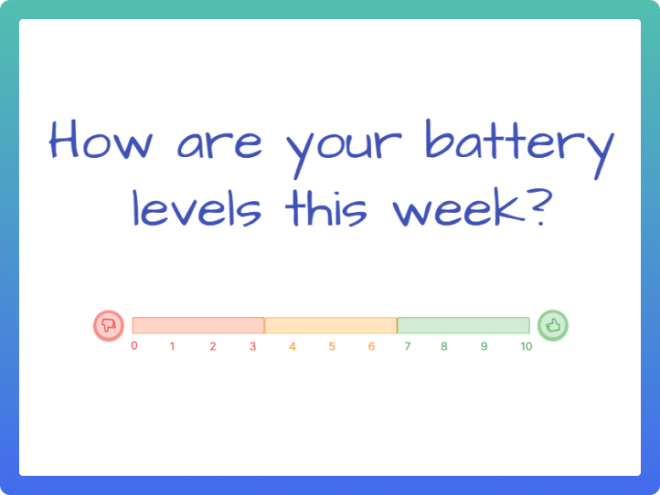

If your regular retrospective process isn’t hitting the mark, try sparking energy back into the conversation with our favorite questions and prompts, listed below.

A fun way to ask “How was this week?”

## What to do when retrospectives get stale?

Picture this – your retrospective has just finished. Everyone attended, and the team has a new set of actions. Job done, right?

_Technically_ yes, but you can’t help feeling that it was flat. There was little back-and-forth discussion, and the team were just going through the motions. Hmm.

If you find the team are treating the retro as “just another meeting” it will become a waste of time. But don’t go cancelling the meeting series just yet. Try asking a different set of questions to snap the team out of auto-pilot mode, like the ones we’ve provided below. We’ve tried and tested them all.

## Questions to ask in your retrospective

Pick one of these questions to start your next retro with or sprinkle them into your data-gathering phase. Allow time and space for people to respond to each other’s answers, and use follow-up questions to explore the responses (more examples below).

1\. “How are your personal battery levels this week?”**  
‍** “_What drained your battery, and what recharged it?_“

2\. “How ready are you for the retrospective?”This can be a really useful question to unearth the real issues. An example:

> “We don’t have time for the retrospective because we have too much work.”_  
> “I’m sorry to hear, why is that?”_  
> “We have loads of urgent requests to deal with.”  
> “_Ah…”_ (a talking point appears…)

3\. “What was the highlight of the week, and why?”

4\. “What surprised you the most this week?”

5\. “What would you like to repeat from this week?”

6\. “Who helped or surprised you the most this week?”

7\. “What’s the one thing you’ll remember from this week?”

8\. “Did we keep all the plates spinning?”

9\. “What made you feel [Joy / Fear / Excitement](/templates/joy-fear-excitement) about this week / next week?”

10\. “What’s one thing you could teach your colleagues from this week?”

11\. “What was the stupidest thing you did this week?”

12\. “What one thing inspired you the most this week?”

13\. “What was the most satisfying thing to happen this week?”

14\. “How much of your time was planned vs reactive?”

15\. Would you choose to do this past sprint, in this way, again? (credit to [Ben Wilson](https://www.linkedin.com/in/ben-wilson-30b84075/))

### Follow-up questions

Once people start responding and discussion blooms, you can follow-up with variants on the 5 Whys technique:

1.  “Why is this?”
2.  “Will it happen again?”
3.  “How have you dealt with this before?”
4.  “Has anyone else here experienced this, can you help?”
5.  “How bad (or good) is it?”
6.  “Do you think this affects anyone else, but they are unaware?”

## Questions to close the retrospective with

You can also ask questions at the end of the meeting to reflect on the meeting itself:

1.  “How do you feel after the retro?”
2.  “Do you feel different to before the retro?”
3.  “Please summarize – what did we learn in this retro?”
4.  “How useful was this retro?”
5.  “What topics shall we cover in the next retro?
6.  “Shall we change anything about the retro?”
7.  Or the ultimate: “Why do we even do retros?”

## Free retrospective templates

[Claim your free team space](/setup) in Ludi for more unique retrospective ideas & interactive templates – you’ll never have a stale retro again!
