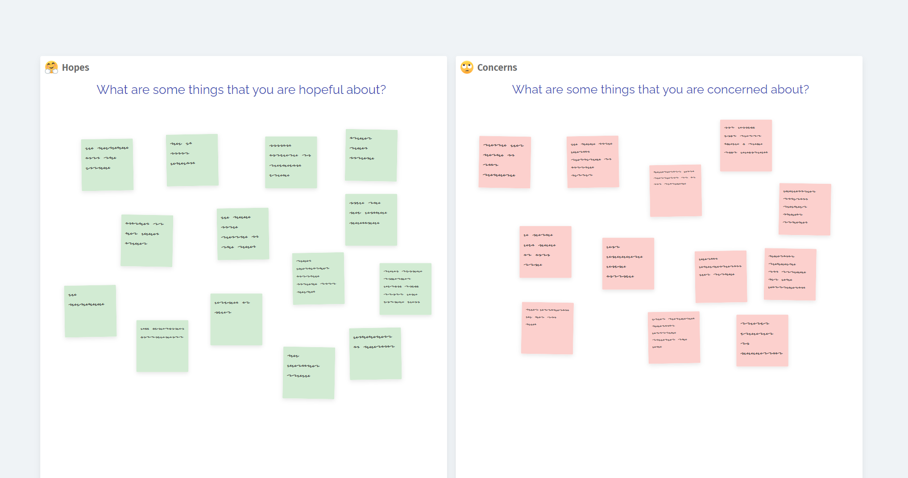
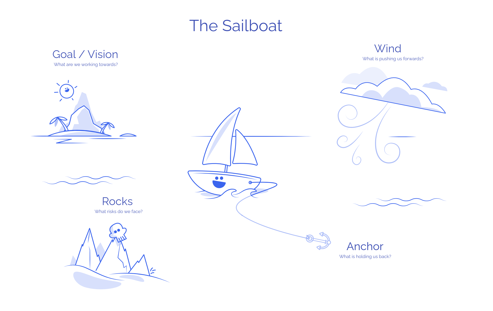

## Imagining the future

A futurespective asks a team to look into the future at their upcoming work, projects or events and decide what their goals are, what success will look like, but also figure out what could cause them problems.

A futurespective is great for:

- Setting the scene for upcoming projects
- Creating team goals together
- Keeping an end goal in sight – useful in the middle of a tough project
- Management of future risks
- It’s fun to imagine the best (and worst) possible future!

## Retrospective vs futurespective

A retrospective looks back at events that have already happened, whereas a futurespective looks ahead to a future goal and what stands in the way. A futurespective usually covers a wider range of time than a retrospective.

## Five tips for running a futurespective

1.  The future is an unknown and scary place. Ensure the team are comfortable with this. You can run a safety check exercise before the session to gauge if individuals feel OK to share their opinions.
2.  Futurespectives can take longer than retrospectives, especially the first time you run one.
3.  Individuals across the team will have different concerns and goals. This session helps create a shared understanding of those.
4.  A lot of futurespectives also include a backward-looking element, so you can use them in place of your normal retrospective session.
5.  Futurespectives can be known as ‘pre-mortems’. Don’t call it that, unless you want a morbid smell hanging around.

## Three futurespective examples

### 1\. Hopes and Concerns

[Use the Hopes and Concerns template now](https://metroretro.io/BOTYPMZZ370W)

Hopes and Concerns is a lightweight futurespective template

The Hopes and Concerns exercise asks team members to open up and communicate what they’re optimistic or worried about. Reviewing the Hopes together is motivating for the group, who can then use that energy to collectively address the Concerns. This exercise is great for the beginning of a workshop.

The first futurespective I ever ran was a _Hopes and Concerns_ exercise with a client team at the beginning of a quarterly planning workshop. We covered a lot of topics that cleared the air, and realised that addressing the Concerns together was more effective than filling in a RAID Log that no one ever reads!

### 2\. The Sailboat Futurespective

[Use the Sailboat Futurespective template now](https://metroretro.io/BO6B8SOH6DL5)

The Sailboat – how does your team get to their tropical island?

Get the team to work from the goal backwards (in this case the tropical island is your goal), then focus on the things that help and prevent the team’s boat from reaching the island.

### 3\. The newspaper headline futurespective

The ‘News Headline’ is a creative futurespective – imagine a future where a newspaper is reporting the team’s success on their front page. To run this futurespective, split the group into small teams and have them create:

- The Headline – what’s the snappy title that conveys their success?
- Lead picture – choose or create an image, maybe you’ll allow a GIF or two.
- Bullet points and the first few paragraphs – go into detail here, what is the success story? What did the team overcome to get here?
