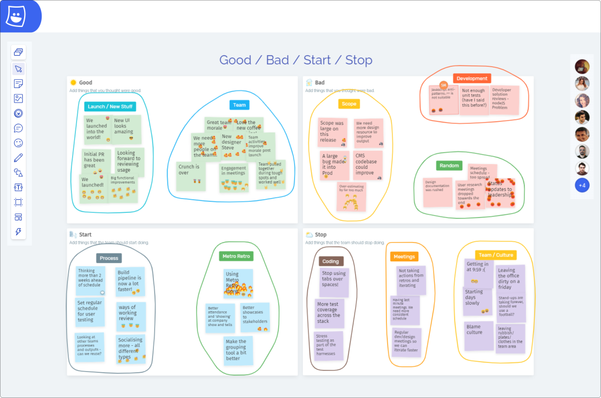

*Whiteboarding has become a prevalent practice in various fields, from education to business, serving as a versatile tool for brainstorming, planning, and problem-solving.* 

In the realm of Agile development methodologies, particularly in retrospectives, digital whiteboarding is an invaluable activity for teams seeking to reflect on past projects, identify areas for improvement, and strategize for future success. So, let’s take a deeper look at the question “what is whiteboarding?”, and how it can be used in a sprint retrospective.

## What is Whiteboarding?

Whiteboarding involves using a whiteboard—a blank, erasable surface —to visually represent ideas, concepts, or plans. Traditionally, the whiteboard would be in the form of a white panel or board, but, in this digital world, we now have [online whiteboards](/online-whiteboard) like our own tool — [Metro Retro](/). 

Whiteboarding offers a way for individuals or groups to sketch diagrams, jot down notes, share ideas, create charts, and illustrate workflows. This visual aid facilitates clearer communication, enhances collaboration, and stimulates creative thinking. Within retros, using an online whiteboard enables teams to document “what happened” — from evidence and data, to screenshots and artifacts — before then using the whiteboard format to arrange and annotate this information.

## Why a Whiteboard is the Ultimate Retro Tool

Non-whiteboard format retro tools often consist of uninspiring columns, limited creativity, no space to bring in visual or unstructured data, and limited differentiation in ways to pose questions. Using an online whiteboard removes the linearity of meetings, instead leaning on creativity to inspire more inclusivity and engagement amongst the team, whilst also enabling a more natural flow for the retrospective phases to fully function. 

## How to Incorporate Whiteboarding Into Your Retrospectives

Now that we have answered the question “what is whiteboarding?”, we should take a look at how to use Metro Retro’s online whiteboard as a retro tool. Here are seven steps for ensuring success:

### 1\. Choose the Right Format

Select from our library of [customizable templates](/templates) or start creating your own so that you begin with a board that best suits your retrospective goals.

Popular pre-made Metro Retro sprint retrospective templates:

The Sailboat retrospective

Genie in a Bottle retrospective

- [The Sailboat](/templates/the-sailboat-retrospective): Use this illustrated template that uses a sailing boat metaphor to help your team visualize their goal and how they get there.
- [Elephant in the Room](/templates/elephant-in-the-room): Feel like real issues are not being raised in your regular retrospectives? Use this exercise to help the team open up in a more fun and engaging way.
- [Genie in a Bottle](/templates/genie-in-a-bottle-retrospective): Unleash some magic with the Genie in a Bottle retrospective. Ask your team to make three wishes for: themselves, the team, and the project. Use your three wishes wisely!
- [The Hot Air Balloon](/templates/the-hot-air-balloon-retrospective): Use this hybrid retrospective / futurespective that looks at what is helping and hindering the team, and what positive and negative things are on the horizon.

### 2\. Invite your team and guests to join

Begin your retrospective session by inviting your team to join your board in Metro Retro. You can easily [share your board](https://docs.metroretro.io/on-the-board/share-your-board) by sharing your board URL with those you want to join. 

On the free plan, those you share the link with will need to sign-in and will be added to your team, granting them access to your team dashboard and all the boards inside it. If you are on a paid plan, and the person joining is not a member of your team, they will join as a guest and only have access to the board you are sharing. 

Welcome the team and encourage everyone to actively participate throughout the session by beginning with a visual check-in activity to [gauge the team’s energy levels](/templates/energy-levels).

Energy levels template: A battery-themed check-in activity to gauge the team’s energy levels.

### 3\. Generate Insights

Utilize the online whiteboard to capture key insights, notable events, challenges faced, and successes achieved during the sprint. With Metro Retro, you can [enable private writing](https://docs.metroretro.io/on-the-board/how-to-hide-and-reveal-sticky-notes), only revealing the sticky notes when team members are ready, offering a depressurized space for sharing honest thoughts and feelings.

### 4\. Facilitate Discussion

As ideas are presented on the board, facilitate an open discussion among team members. Encourage constructive feedback, active listening and emoji reactions, and collaborative problem-solving. Use the visual cues provided by the whiteboard to guide the conversation and ensure that all relevant topics are addressed. With our whiteboard, you can use the “[Topic Tool](https://docs.metroretro.io/boards/the-tools#topic-tool)” to group similar stickies into themes. Utilize our “Everyone to Me” feature to bring everyone to your current view, maintaining focus at all times. Run polls, set timers, and use the “Ready Check” to keep the retro running smoothly. 

Identify topics with the Grouping tool

### 5\. Identify Action Items with Voting

Based on the insights generated and discussions held, work together to identify actionable items for improvement using our [voting functionality](https://docs.metroretro.io/boards/the-tools#voting-tool). You can vote on stickies, topics, index cards, and task cards, before using our “ranking results” button to present an overview. Use the whiteboard to document these action items, assign responsibilities, and establish deadlines. Save them to your team space within Metro Retro to review next time.

Voting and ranking the outcome in Metro Retro

### 6\. Follow Up

After the retrospective, keep the whiteboard visible and accessible to team members by keeping it in your team space within Metro Retro. Use it as a reference point to track progress, monitor the status of action items, and revisit discussions as needed. Revisit your previous board in the next retro to review the status of action items. This approach creates an incremental, compounding improvement effect.

## In summary

Whiteboarding offers a dynamic and interactive approach to retrospectives, empowering teams to collaborate effectively, visualize complex concepts, and drive continuous improvement. By incorporating whiteboarding into your retrospectives, you can foster a culture of transparency, accountability, and innovation within your Agile team, ultimately leading to greater success and satisfaction in your projects.
