## Looking for a replacement for Jamboard?

Google have [announced the decision](https://support.google.com/jamboard/answer/14084927) to wind down Jamboard, starting on **October 1st 2024**, when the Jamboard application and Jams will become read-only, and then on **December 31st 2024** the Jamboard service will become unavailable.

Tools like Google Jamboard have been helpful for teams getting started with remote collaboration activities like brainstorming or running virtual meetings. However, with Google’s recent decision to wind down support for Jamboard, there will be some agile teams that are left searching for an alternative for their collaboration.

Metro Retro is a Jamboard alternative that aligns with agile methodologies, and helps teams run engaging retrospectives, efficient sprint planning, collaborative estimation, and other agile team meetings. With features and a personality that emphasize real-time collaboration, fun, and flexibility, Metro Retro isn’t just a replacement for Jamboard—it’s an upgrade.

### Why Did Google Jamboard Wind Down?

In September 2023, Google announced the [winding down of Jamboard](https://support.google.com/jamboard/answer/14084927), citing a shift in focus toward Google Meet and Google Workspace (Docs, Slides, Sheets) as central platforms for collaboration, as well as seeing other tools like Metro Retro, Miro, Figjam, and Lucidspark better fulfilling the needs of the whiteboard market. This change leaves many users seeking a new tool that offers the interactive, collaborative experience they once enjoyed on Jamboard.

Metro Retro is here to help fill the void for agile teams with its comprehensive, purpose-built features that help teams run effective retrospectives, sprint planning, backlog estimation, workshops, and more.

## Why Metro Retro is the Best Jamboard Alternative for Agile Teams

### 1\. Interactive Canvas for Seamless Collaboration

Metro Retro is an [online whiteboard](/blog/use-case/online-whiteboard) with an unlimited, **interactive canvas** that allows users to create, move, and edit elements freely and simply, whether you’re brainstorming, mapping user stories, or conducting retrospectives. You don’t need to be a designer to create great-looking boards for your team!

[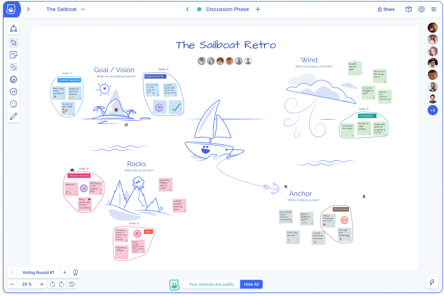](/templates/retrospectives/the-sailboat-retrospective)

We love the [sailboat retrospective template](/templates/retrospectives/the-sailboat-retrospective) to structure a great retro!

### 2\. Real-Time Collaboration with Team Spaces and Shareable Board Links

Collaboration is simple with Metro Retro.

Users can simply **share a link to the board** with their teammates, allowing everyone to join and collaborate in real-time. Changes appear instantaneously, fostering a sense of connection and teamwork—even when working remotely.

This is especially valuable for agile teams, where constant collaboration and communication are essential for productive retrospectives.

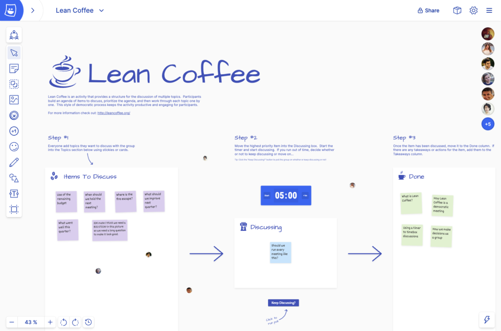

Virtual team meetings are simple and effective – example shown is a [Lean Coffee](/templates/decision-making/lean-coffee) session.

### 3\. A Fun and Engaging Experience

Metro Retro brings a level of fun that keeps teams engaged – especially in remote working environments.

With features like a **confetti cannon** to celebrate milestones, **virtual hats** that add a playful vibe, and a tongue-in-cheek **sense of humour** that you don’t get in other whiteboard tools, Metro Retro turns every session into an enjoyable experience. These small touches can make a big difference in energizing the team and making meetings something to look forward to, rather than a monotonous obligation.

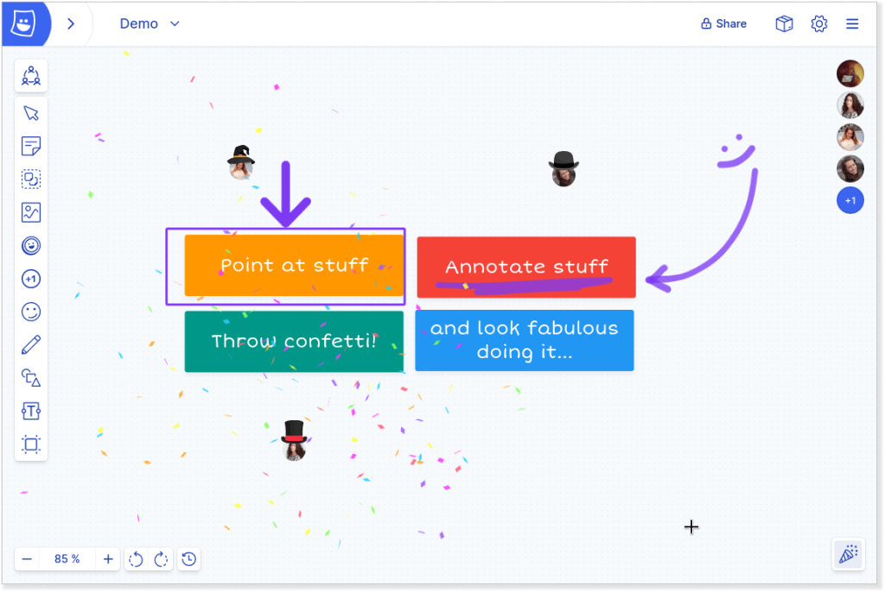

Confetti and hats – what more could you want?

### 4\. Voting Tools for Better Decision-Making

Decision-making is simplified with Metro Retro’s **[topic](https://docs.metroretro.io/boards/the-tools#topics-meeting-mode-only)** and **[voting](https://docs.metroretro.io/boards/voting) tools**.

A board that is chock full of ideas is sorted and organised in minutes with the Topic tool. Team members can vote on ideas, prioritize tasks, or rate discussion points directly on the board.

This voting capability enables teams to arrive at a consensus more efficiently and democratically, keeping retrospectives focused and actionable.

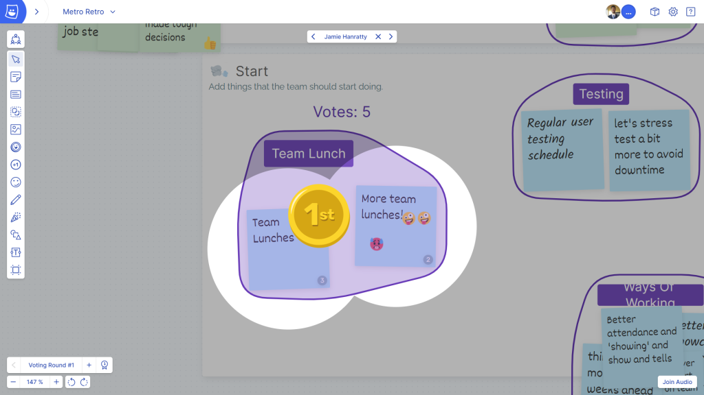

Group stickies into similar topics and vote!

### 5\. Meeting Management Features

Metro Retro offers a suite of **[meeting management controls](https://metroretro.io/features/facilitation)** that streamline the retrospective process.

A built-in **timer** keeps discussions on track, **polls** gauge team sentiment, and **facilitation guides** help scrum masters or agile coaches keep the session organized.

Metro Retro even allows the meeting leader to hide sections of the board until needed, enabling a focused, distraction-free environment.

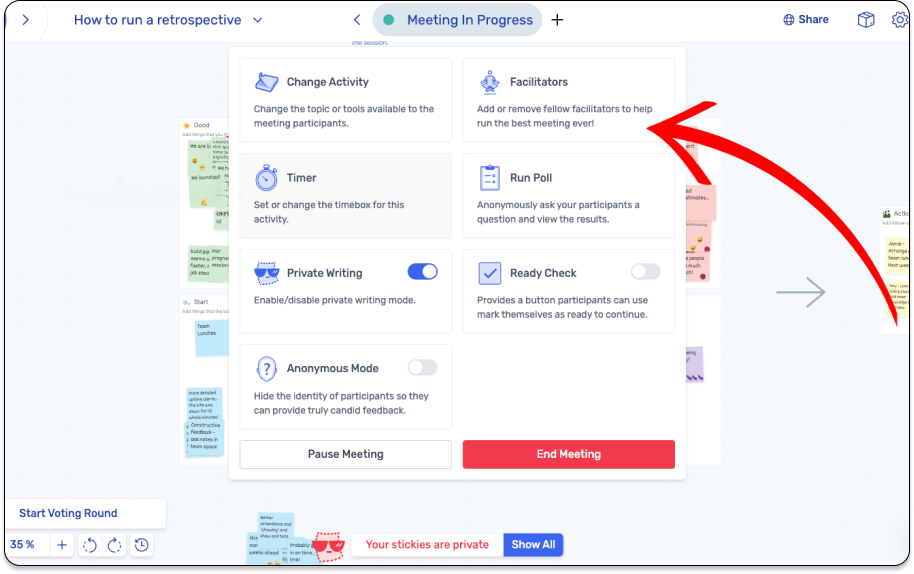

The Meeting Host controls the tempo.

### 6\. Private Writing and Anonymity for Unbiased Contributions

One of the key challenges in retrospectives is encouraging open, honest feedback.

Metro Retro tackles this issue by offering **[private writing](https://docs.metroretro.io/boards/hide-and-show-sticky-notes)** and **[anonymity options](https://docs.metroretro.io/boards/host-controls#hide-identities)**. Team members can contribute ideas and insights without the pressure of judgment, leading to unbiased brainstorming.

This is especially helpful when working with introverted or shy team members who might hesitate to share openly.

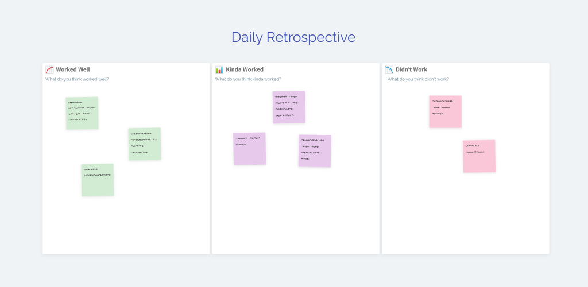

Private Writing lets team members write their notes without others reading them, until ready.

### 7\. Beautiful Templates that Spark Creativity

Say goodbye to boring, cookie-cutter templates, or spending an age making the next retro template.

Metro Retro offers **beautifully illustrated, fully customisable [retrospective templates](/templates/retrospectives)** that are designed to engage and inspire. Each template is thoughtfully crafted to facilitate different aspects of agile workflows, from retrospectives to sprint planning and even brainstorming sessions.

Plus, they’re fully customizable—there’s plenty of space for your team’s in-jokes and memes!

[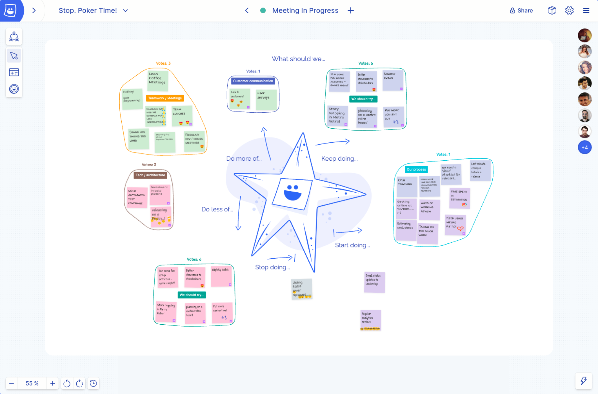](/templates/retrospectives/the-starfish-retrospective)

The [Starfish Retro](/templates/retrospectives/the-starfish-retrospective) – what a fun guy

### 8\. Privacy and Security

Metro Retro prioritizes **privacy and security** by hosting its data in the EU and complying with GDPR standards.

With features like **Single Sign-On (SSO), private boards, and access controls**, Metro Retro is built for business and enterprise use, making it a trustworthy choice for organizations concerned with data security. See our [Security page](/security) for more details.

### 9\. Encourages Innovation

Metro Retro is more than a replacement for Jamboard; it’s a tool for fostering **innovation within remote teams**.

With all of its interactive and collaborative features, Metro Retro creates a [virtual team innovation space](https://metroretro.io/blog/10-tips-to-help-you-run-great-virtual-meetings) that encourages experimentation, exploration, and creative problem-solving—qualities that are essential for agile teams looking to stay competitive.

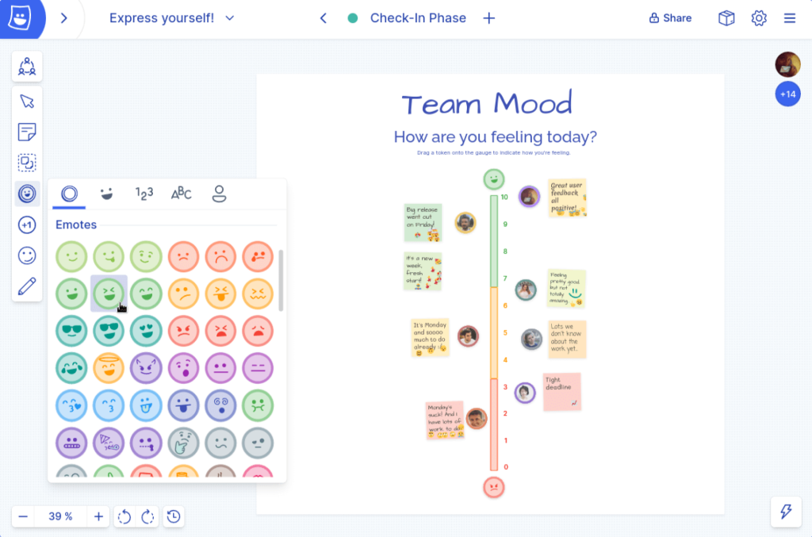

### 10\. Automated Sprint Planning and Estimation Templates

As well as a huge library of guided retrospective templates, Metro Retro includes **automated sprint planning and estimation templates** tailored to agile processes.

These templates simplify sprint planning, providing structured frameworks that make estimating tasks and setting goals straightforward.

Agile teams spend less time configuring and more time on the detail of planning.

See Metro Retro’s [free Planning and Estimation Tools](https://metroretro.io/templates/planning-and-estimation).

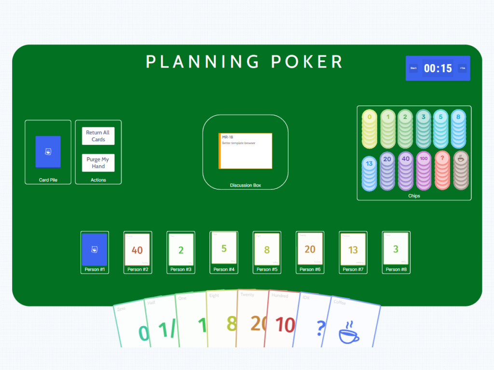

Run interactive [Planning Poker meetings](/templates/planning-and-estimation/planning-poker) on your board!

### 11\. Integration with Jira

Metro Retro [integrates seamlessly with **Jira**](https://docs.metroretro.io/boards/jira-integration), a tool that needs no introduction to software teams – for better or worse 🤭.

This integration allows teams to transfer actions from retrospectives directly into their Jira board, and visualise their backlog as cards on the interactive canvas.

The integration between Metro Retro and Jira eliminates the need for manual data entry and keeps everything centralized.

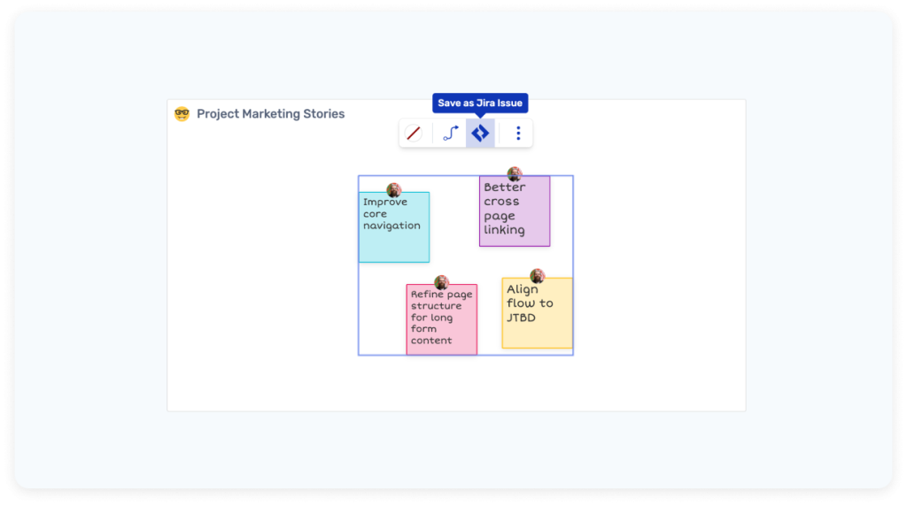

Send action items to Jira from your sticky notes

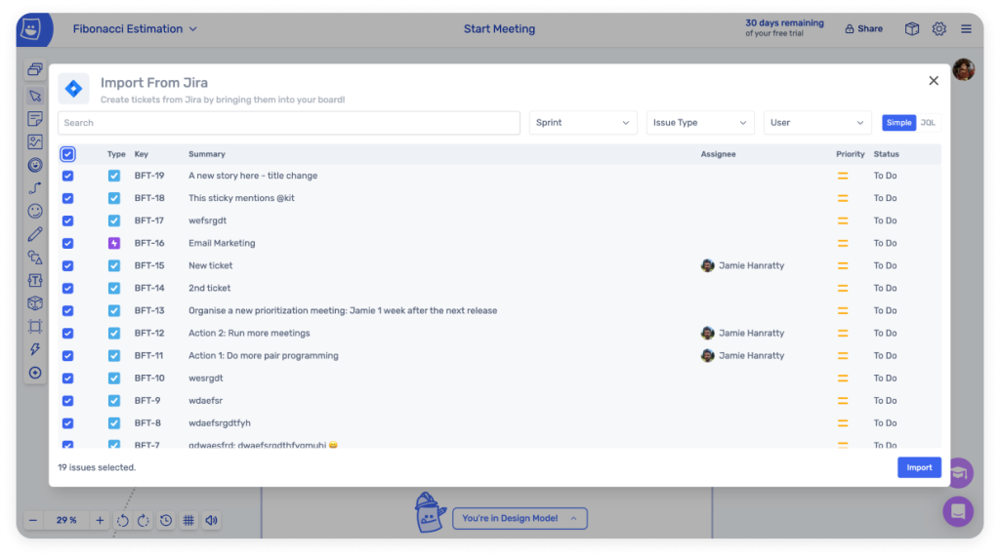

Import Jira issues to your team board as Jira cards

### 12\. Data Export Options

With Metro Retro, your data is never locked into one platform.

Users can **[export their meeting data](https://docs.metroretro.io/boards/export-your-board), export boards as PDFs, and copy-paste meeting notes** into their other work tools, allowing for easy sharing and record-keeping.

This flexibility is ideal for teams who need to incorporate retrospective insights into larger projects or organizational records.

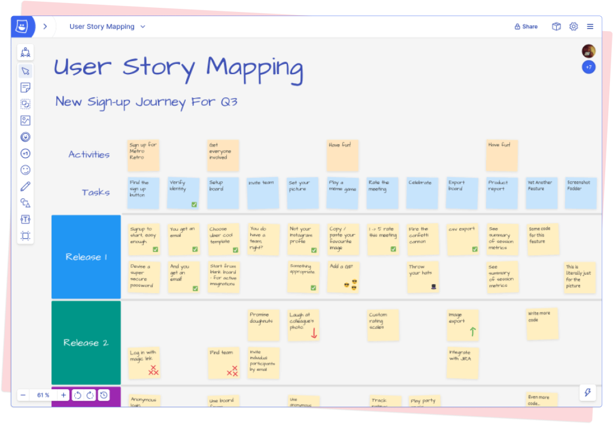

Export your board to share the results

## FAQs for Agile Teams About Jamboard’s Wind-Down and Metro Retro as an Alternative

### What is happening to Google Jamboard?

Google announced in mid-2024 that they would discontinue support for Jamboard, phasing it out in favor of collaborative tools within Google Workspace. While Google has provided some alternatives, agile teams may find these replacements lack the specific functionality needed for effective retrospectives.

Jamboard goes read-only on October 1st 2024 and is completely retired on December 31st 2024.

### Why should I choose Metro Retro as my Jamboard alternative?

Metro Retro offers all the features you may have loved about Jamboard—real-time collaboration, interactive canvases—along with a suite of additional tools that add structure for agile workflows. With fun, engaging features and robust privacy controls, it’s a perfect fit for [sprint retrospectives](/blog/use-case/sprint-retrospectives), sprint planning, and backlog estimation.

### How does Metro Retro enhance the retrospective process?

Metro Retro is built to facilitate productive retrospectives with customizable templates, voting tools, anonymity options, and meeting management features. These tools enable agile teams to brainstorm, prioritize, and decide on action items more effectively.

### Is Metro Retro secure?

Yes, Metro Retro takes data security seriously. Hosted in the EU and compliant with GDPR, it provides enterprise-grade privacy features, including private boards, SSO, and access controls, ensuring your data stays safe and secure.

### Can I use Metro Retro for free?

Yes! Metro Retro offers a [free 30 day trial](https://metroretro.io/login) (no payment card needed) that allows teams to experience all the essential features at no cost. It’s a fantastic opportunity for agile teams to try Metro Retro as a Jamboard alternative without committing financially.

### How does Metro Retro integrate with Jira?

Metro Retro’s integration with Jira allows users to transfer data, tasks, and insights directly from retrospectives into their project management workflows, and vice versa. Visualising your backlog on an interactive canvas gives a team a new way to plan together.

## Try Metro Retro for a Better Retrospective Experience

With Metro Retro, agile teams have a powerful alternative to Jamboard that meets the needs of retrospective sessions, sprint planning, and beyond. Metro Retro’s interactive canvas, unique meeting tools, fun personality, and privacy controls make it the best Jamboard alternative for retrospectives.

And the best part? You can [start for free](https://metroretro.io/account/register), no payment card needed. So, if you’re searching for the perfect Jamboard alternative for agile teams, look no further than Metro Retro—built to enhance your retrospectives, foster collaboration, and make every meeting more enjoyable.
