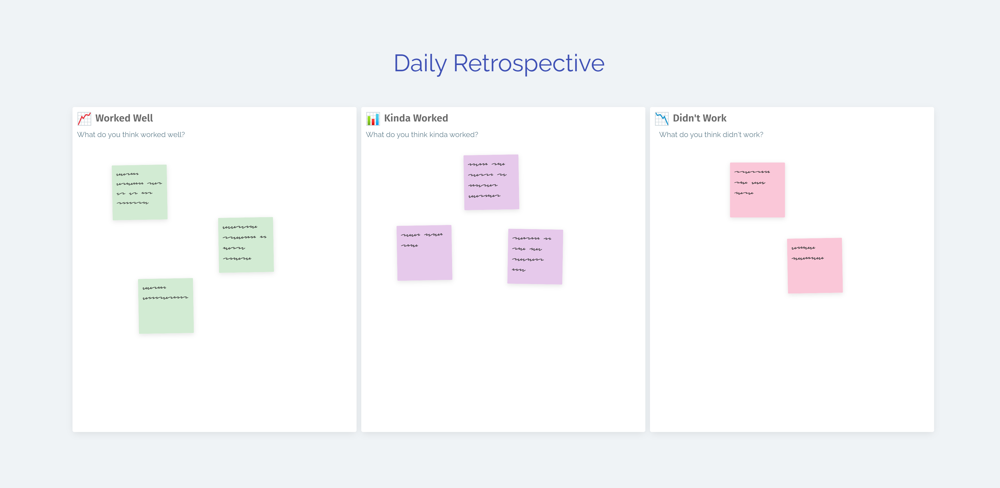

## That’s right, everyday!

Obviously we’re big fans of retrospectives at Metro Retro and it may seem like a clickbait title, but I promise I’m being serious here.

Most people hold their retrospectives at fixed intervals or after significant events like the end of a Scrum team’s sprint, or after a marketing campaign. The retrospective is used to improve the team going forward by looking back on how the team worked together. Most retrospectives are held every two weeks, but they can be monthly or longer.

When we ask Agile coaches what the first thing they do with a new team is, the majority say:

> “Retrospective, retrospective, retrospective!”

At the risk of sounding like a [crazy person](https://www.youtube.com/watch?v=Vhh_GeBPOhs), there’s a reason for it – they believe the retrospective is one of the most valuable exercises for a team to do together.

## Lots of little improvements

My point here is to ask: is it better to wait long periods of time for your next valuable retrospective – attempting to tackle one or two big improvements, or could it be beneficial to make smaller improvements at quicker intervals?

Running a small, daily retrospective is one way to focus on constant improvement, and I encourage you to try it as an experiment.

A simple and casual daily retrospective board

## Why run a retro every day?

- Faster inspection and feedback on what’s working and not working
- To accelerate the alignment of a team that is new to working together
- The team make quick but thoughtful decisions
- If experiments aren’t working out, you have an early opportunity to end them
- It introduces constructive feedback to the team – flexing the brain’s muscle to give and take criticism. A key skill in high-performing teams!

## A few practical tips:

- Keep it short and simple
- Force limits – for example limit to one sticky note each
- Keep the resulting actions small. Choose a maximum of one action, none at all, or even just to continue working on an action in progress
- The daily retro should take no longer than 15-20 minutes
- Don’t replace your normal retrospective with this, as there is still value in learning from longer time periods. You will need that dedicated time to address bigger issues
- Frame this as an experiment that the team can end if they don’t feel any benefit
- Some team members might not have a contribution every day. This is fine
- Do not use this session for micro-management or checking tasks are done

Lastly, you do not _have_ to use a tool like Metro Retro to run this retrospective, it can be as lightweight as just having a group conversation. However if you did want to use a template, I suggest something simple like the Worked Well / Kinda Worked / Didn’t Work retrospective template.
