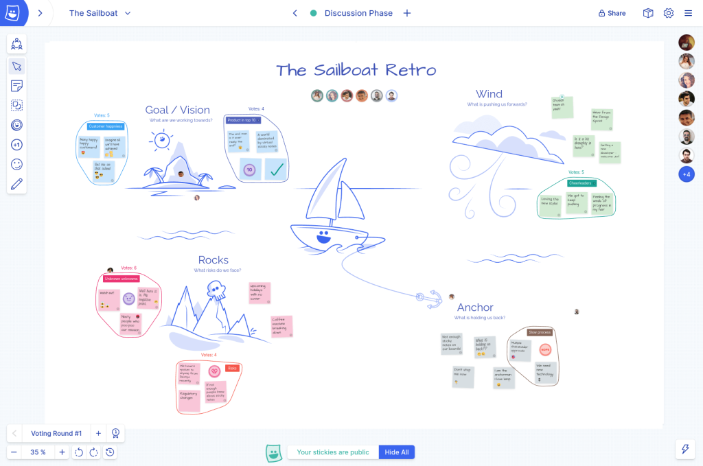

## Setting the scene

Built by musicians for musicians, Gear4Music is one of the biggest online retailers of musical instruments. First launched in 2003 and IPO’d in 2015, they sell over 63,000 different products, everything from your first tin whistle to a custom Les Paul guitar. 

## Discovering — and falling in love with — Metro Retro

Gear4Music first discovered Metro Retro in 2021 when looking for tools to support their employees working remotely across different countries. It is now an essential part of the workflow and culture across their engineering teams.

The Quality Engineering team in particular has taken to Metro Retro like ducks to water, as Aimi Lightowler, Quality Engineering Manager explains:

> “When one of the team introduced Metro Retro, everyone saw it and loved it instantly. There was none of the friction that usually accompanies a change; everyone was extremely happy to adopt it.”

## Raising the mood after a tough sprint

Metro Retro is primarily used by Gear4Music’s teams for their retrospectives. The themed templates, [icebreakers](/templates/icebreakers), and interactive tools make team sessions an engaging prospect: 

> “If your sprint is not going to plan or you’ve hit some blockers, the retro can be a challenge. So having a tool that offsets any negativity really lightens the mood. It makes a lot of difference to our team. We even get different team members asking to lead the retrospective, that’s something I’ve never seen before. The team gets into the spirit of theming the retrospective – there’s even been some fancy dress going on!”
>
> It’s easy to dismiss these things as whimsical, but Metro Retro’s customizable templates and boards allow a team to fully express their personalities and create shared values, which can be difficult when team members are not co-located:
>
> “If you can imagine it, you can create it in a board. The sky’s the limit. The personalization of our meetings lets us learn more about each other, which in turn builds better team cohesion”.

## Gear4music use MetroRetro in nearly all meetings

As well as being their sprint retrospective tool, Metro Retro is used across Gear4Music for a variety of other meetings and workshops including process mapping, guild & squad catchups, brainstorming, and prioritization sessions. Metro Retro’s [online whiteboard](/online-whiteboard-for-agile-teams) is an infinite canvas that is used any time that a team needs to collaborate closely.

### Example 1: Creating new processes 66% faster

After a recent reshuffle, the team had to come up with new processes for onboarding new projects. Aimi and the leadership team turned to Metro Retro to kick this off. They quickly mapped out the old process with stickies, annotated what they liked and didn’t like, brainstormed and prioritized new ideas, then mapped out the new process and presented it to the Leadership.

> “It would have been incredibly challenging if we didn’t have Metro Retro to collaborate on this. What took us a week with Metro Retro would have taken 3 weeks without.”

– **Aimi Lightowler** Quality Engineering Manager | Gear4music

### Example 2: Saving time with exploratory testing templates

The Quality Engineering team uses Metro Retro to run their team’s exploratory testing sessions, using a template they created to help them visualize who is testing which area, time-box the session effectively, and easily share the results with the development team.

> “Metro Retro ultimately helps us do more exploratory testing because it saves us time and prevents duplicated effort. Doing more exploratory testing helps us find bugs earlier in the project lifecycle, which saves a huge amount of time and expense compared to finding and fixing the issues later.”

## Replicate Gear4music’s success

Gear4music has saved time and expense when it comes to testing and solution-finding. Their teams also have a new-found collaborative, harmonious approach to working thanks to the enjoyment and transparency brought to meetings by using Metro Retro. Is your team next?
