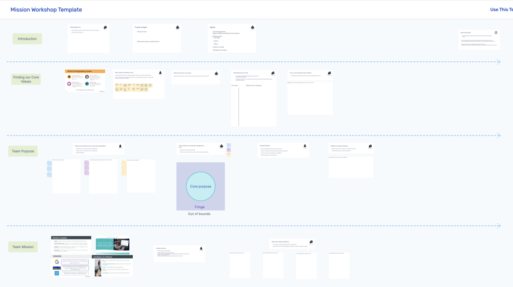
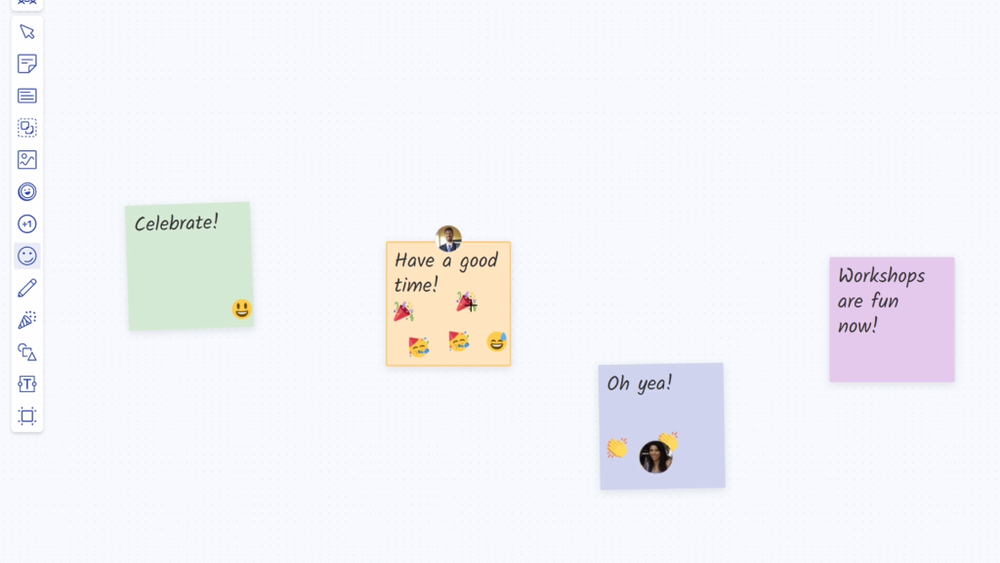

## Meltwater: Uncovering media, social, and consumer insights for 27,000 customers

Meltwater empowers companies with a suite of solutions that spans media, social, consumer and sales intelligence. By analyzing ~1 billion pieces of content each day and transforming them into vital insights, Meltwater unlocks the competitive edge to drive results. With 27,000 global customers, 50 offices across six continents and 2,300 employees, Meltwater is the industry partner of choice for global brands making an impact.

Meltwater has 20+ cross-functional R&D engineering teams building this suite of solutions. Each team focuses on fulfilling a specific customer need. Teams plan their roadmaps around their customer focus, and collaborate with other teams to streamline their efforts.

## Using Metro Retro’s whiteboard for online meetings

Meltwater started using Metro Retro in 2020 to facilitate collaboration for their distributed teams – for anything that involves visualization online, like planning & strategy meetings, brainstorming, retrospectives, or any time where you need a whiteboard at the center of collaboration.

For the teams that work from anywhere and are distributed across different continents, it has become part of their daily toolset.

## Metro Retro has been adopted across the entire organization

Samantha Corbett, Product Manager at Meltwater describes the uptake of Metro Retro:

“It was so simple to pick up that Metro Retro was adopted by the different teams for daily activities like team standups, parking lot discussions, retros, workshops, and any time you need a general whiteboard space. It embedded into the different teams without any training or prompting from leadership, even though each team uses Metro Retro for different purposes.”

> “**In other tools it can be tempting to overcomplicate brainstorming or planning, and it’s hard to find a tool that makes processes quicker when everyone’s not together, but Metro Retro does just that.**“

## Metro Retro saves time in team retros

Metro Retro has over 100+ high-quality templates for meetings across retrospectives, planning, strategy, project management, and team health exercises.

“The area where Metro Retro is a huge time saver is for team retros. The templates have been a lifesaver – a team can just pull up a template, read the instructions, and get going. This is great because if there were an extra step or thinking the teams had to do to set up their retro, the practice would probably fall off.”

“In the teams I’ve worked in the last year, the retros help us focus on the common themes for improvements, but it’s also nice to track the accomplishments and see the positivity for things we’re doing right.”

## Metro Retro’s interactivity promotes engagement

As a Product Manager, Sam uses Metro Retro when kicking off a new feature. She uses a board to organize discussions, plan the initial approach, and gather any risks or questions from the team.

“I’m repeating myself here because it’s important – Metro Retro is so easy for people to use, and more interactive than say a Google sheet, it means you get detailed input from everyone, without needing to prod them!.”

> **“Metro Retro elicits reactions from team members that I’ve not seen in any other tool. If people feel a certain way about a topic, they’ll let you know – stamping emojis all over a sticky to reinforce their point!”**

## Strategic planning starts in Metro Retro

Aside from retros, Sam says Metro Retro is perfect for kicking off strategic thinking exercises:

“For example, for an annual planning exercise I held recently, it’s quick and easy to open a board and throw some stickies up, it stops you from over-complicating and wasting time.”

“Metro Retro solves those barriers for distributed teams to work together. In other tools it can be tempting to overcomplicate brainstorming or planning, and it’s hard to find a tool that makes processes quicker when everyone’s not together, but Metro Retro does just that. People can quickly join a board and get up to speed immediately, it’s so easy to use. For retros and brainstorming it’s a level above the other tools out there.”

## Replicate Meltwater’s success

Meltwater has cut out complicated processes and saved time with Metro Retro. Is your team next? Get started with [better remote collaboration](/remote-collaboration) today – try with your team for free!
