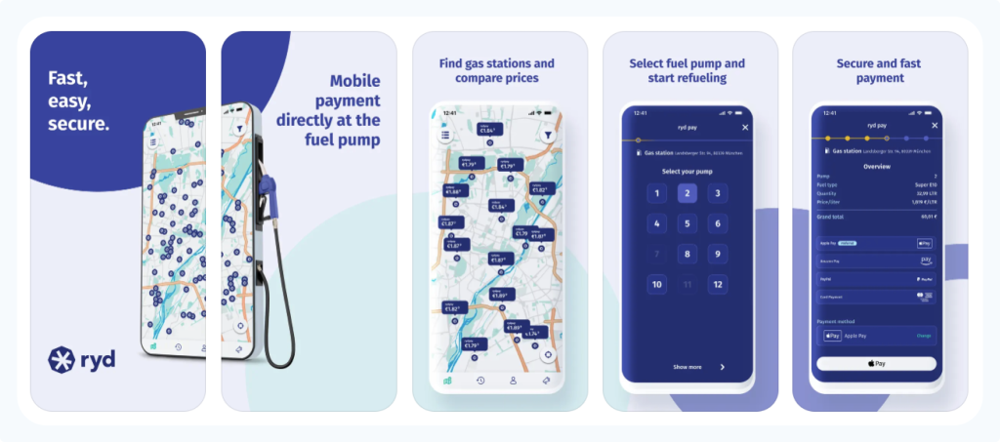
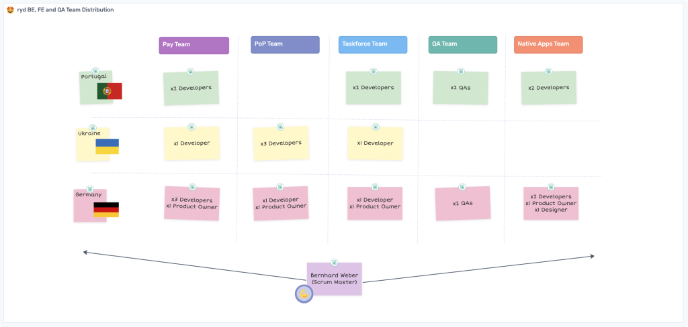
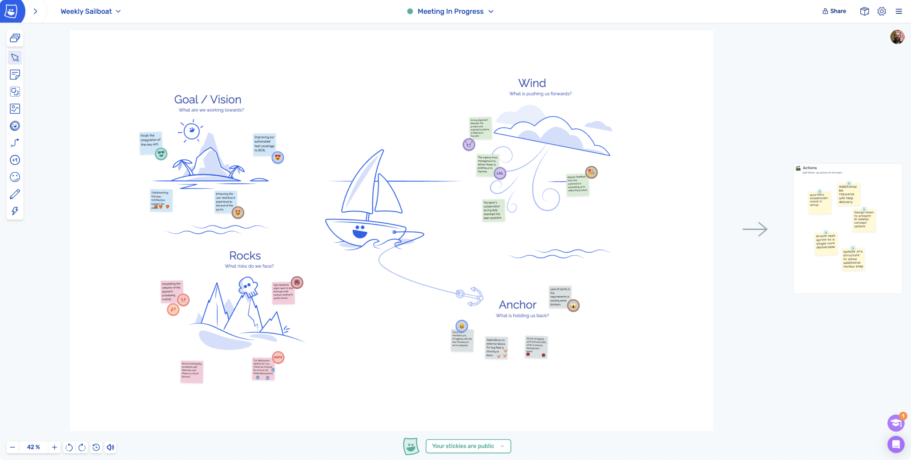
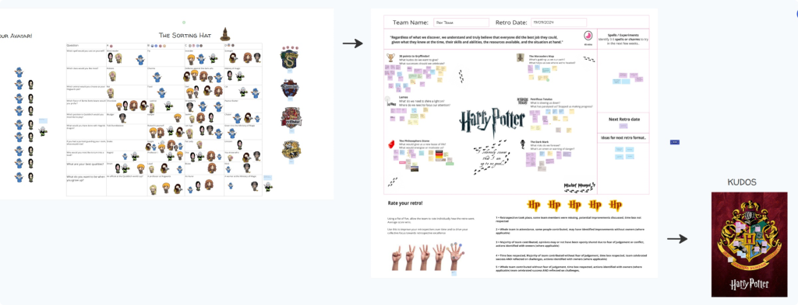
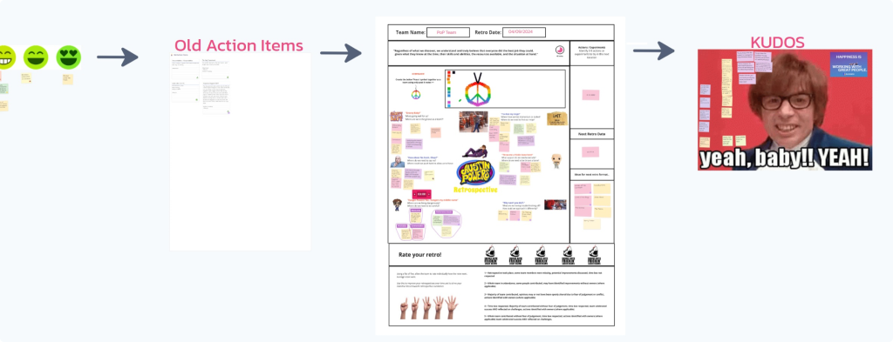
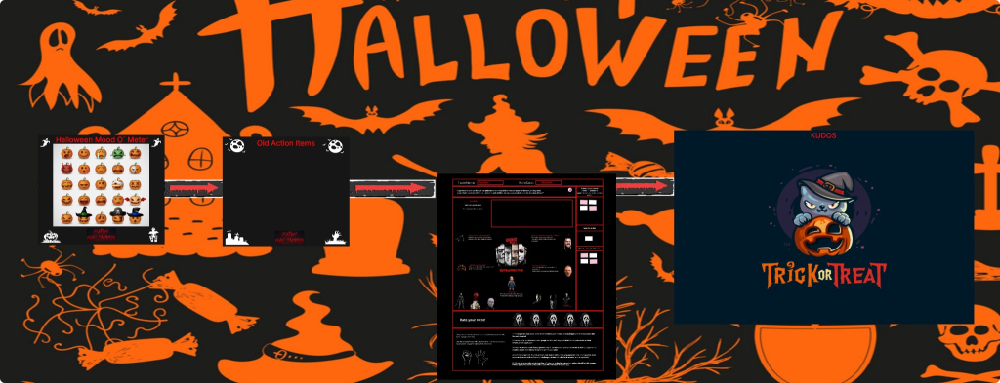

[ryd](https://www.ryd.one/) is driving the future of in-car payment, building an advanced technological infrastructure for car manufacturers to allow secure payments from the car. Additionally ryd provides third-party integrations with navigation, app or car-sharing providers, to generate additional target groups. ryd easily adapts to the changing demands of mobility, enabling payments for Fueling, Hydrogen, E-fuels, Washing or Charging.

## Building a culture of efficient and effective remote collaboration

Bernhard Weber is a Scrum Master at ryd for 5 remote teams split between Munich, Portugal, and Ukraine. The teams handle back-end, QA and front-end development of the [ryd pay](https://www.ryd.one/int/ryd-pay/) application.

_Click to expand the ryd team distribution chart_

Bernhard recently made the change from [Miro to Metro Retro](https://metroretro.io/compare/miro-alternative) because he needed a tool with a more focused experience.

“Metro Retro is an intuitive product, the templates and user experience are ‘loveable’. It pulls you out of a stressful day of working and lets you enter a different mindset. It calms you and allows you to focus. It’s a place our teams like to be.”

[The Sailboat Retrospective](https://metroretro.io/templates/retrospectives/the-sailboat-retrospective), one of our most popular pre-built templates

Bernhard sat down with [Steve](https://www.linkedin.com/in/steven-moseley-80b63314/), our VP of Creative Strategy, to discuss how they use Metro Retro as their collaboration platform to run all meetings, including their project kickoffs, sprint planning, backlog estimation, brainstorming and retrospectives.

## Metro Retro improves the team’s internal feedback loop

The ryd team feel their retrospective process has improved with Metro Retro:

“People feel like they’re more in sync, and there’s less ambiguity post-retrospective. It’s even encouraged a bit of creativity in the way people express feedback.”

“Metro Retro has fostered a more open environment; even quieter team members contribute more freely in the digital format. It’s also led to a bit of fun competition around ideas, which has energized the team.”

Below are a few examples of the ryd teams’ custom board designs

> “The tool has helped us capture ideas in real time and facilitated smoother retrospective meetings. We’re able to collect insights from everyone more systematically, so nothing slips through the cracks.”

## Flexibility with Metro Retro lets our teams work the “ryd way”

Beyond Metro Retro’s collaborative whiteboard tools, Bernhard explained what benefits he’s found from using Metro Retro in his day-to-day processes from meeting prep to idea management.

“We don’t use Microsoft products like Powerpoint etc, we use Metro Retro for daily organization and planning of work, not just for meeting formats. If I need to create an internal presentation, I will use a Metro Retro board.”

The ryd team also enjoy the ‘lighter’ side of Metro Retro. The wearable Hats for team avatars were one of the first thing Bernhard mentioned in our discussion – as they help create a relaxed environment that leads to better collaboration. But besides hats, emoji’s and confetti, the team at ryd are confident Metro Retro is building in the right direction for Agile teams who need a product that understands and supports their needs.

> “The flexibility of MetroRetro really stands out. It’s helped us streamline the feedback loop within the team, making retros more efficient and inclusive, particularly for remote contributors. People can contribute without feeling like they’re interrupting.”

## The Results from Metro Retro

It can be difficult to get a remote development team engaged in a genuine retrospective process, but speaking of Bernhard’s work with the team in Metro Retro, a Developer chimes in:

“Oh it’s fun! It is a lot of fun, emojis, stickers, memes, and the amazing work that our Scrum Master, Bernhard has been putting in to facilitate our process improvements.”

## How we practice flexibility in building Metro Retro

In game design, there is a saying called “follow the fun”, which means if you see players doing fun stuff that wasn’t part of the intended design, lean into it instead of “fixing it”. 

We follow this philosophy with Metro Retro.  A great example is the [Topic Tool](https://docs.metroretro.io/boards/the-tools#topics-meeting-mode-only), which was added after we spoke to customers and saw they were naturally grouping stickies together in their meetings, and trying to draw a line around them with boxes. 

With Topics, the lines are now drawn around grouped elements automatically, and in the near future we’ll be using AI to help automate the grouping process.

All lead by simply listening to and understanding how people work with Metro Retro.

## How can we make your team collaboration better?

Sign up to [try Metro Retro free for 30 days](https://metroretro.io/account/register) and see how your product teams can be more efficient using the collaborative platform trusted by teams worldwide to deliver fun and engaging whiteboard sessions.

If you’d like to chat about your experiences with Metro Retro, or suggest features you would like to see in our future releases then please get in touch and [book a call with Steve](https://calendly.com/steve-moseley-metroretro/30min), we’d love to hear from you.
