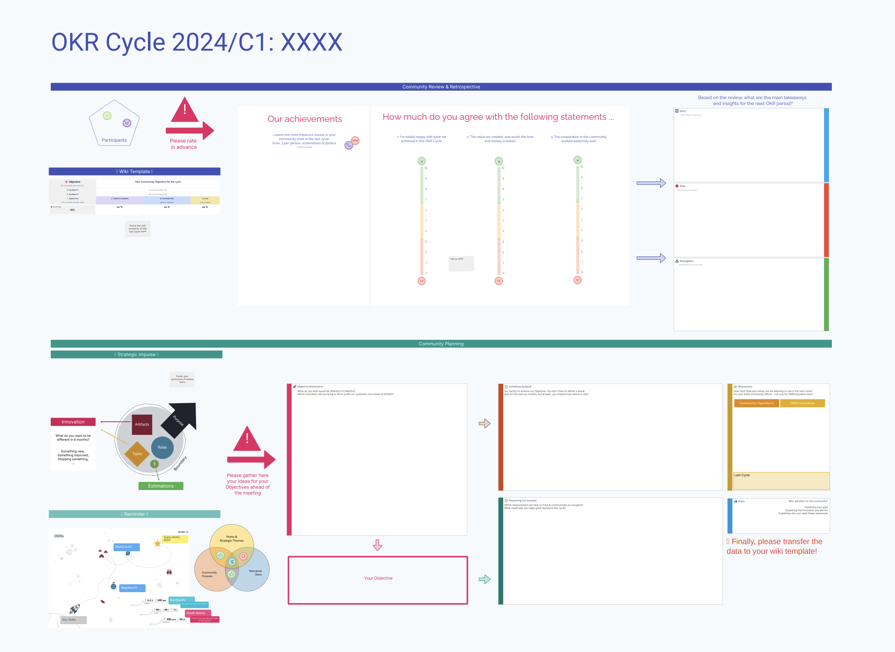
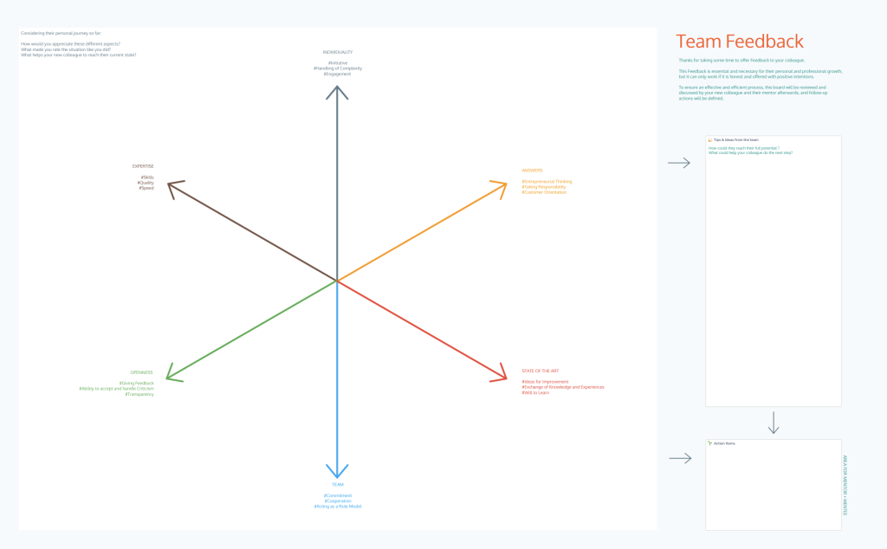

## About XITASO

[XITASO](https://xitaso.com/) is a high-end software engineering and consulting company that specializes in developing and implementing digital solutions for businesses. Their clients operate in various industries, such as MedTech, mechanical engineering, tool-building industries, and the public sector.

Unlike traditional corporate structures, the 18 teams at XITASO are genuinely self-organizing, adeptly integrating principles and processes from frameworks like [Agile and Holacracy](https://xitaso.com/en/services/agile-consulting/) to successfully deliver client projects.

## Ludi at the Center of Collaboration

The Agile Coaches at XITASO help the teams implement their unique ways of working, and they do this with [Ludi](https://ludi.co/) as the central collaboration tool.

Since 2020, XITASO teams have used Ludi for their meetings and workshops, including:

- Project Kickoffs
- Decision making
- Requirements & story slicing
- Sprint retrospectives
- Product Planning and Prioritization maps
- Multi-day workshops
- Mentoring frameworks and Feedback rounds
- Catch-up meetings
- Communities of Practice, like the Agile Coach Community

> Aline Sillet, Agile Coach remembers her first experience with Ludi:
>
> "The first two things that made me fall in love with Ludi were the [facilitation tools](/features/facilitation), like the Ready Check that keeps the workshop moving efficiently – no need to waste time asking if people are done with the current activity."
>
> "The second thing was the [hats](https://www.youtube.com/watch?v=qTPzclwlM7Y). Everyone put a hat on their avatar in our first session and that was the moment we all collectively said "hmm, this tool is a bit different to the others!"

## Ludi's Impact on Customer Collaboration

Close collaboration with their clients is key to XITASO's success. Luckily, according to Aline, "Ludi helps our clients to get more creative – it gives them a way to express their ideas in workshops. We get much better results than we used to have with other tools."

> "Ludi makes it visually obvious what the status of a project is, and it is so easy to use that clients will update boards without being prompted. Our clients are really comfortable with using Ludi as we run all our online workshops in there. At first they are curious about the tool but by the end of the workshop they are whizzing around in the boards."
>
> "The boards also act as great documentation of the workshop, much better than us creating a separate report, so the client always have access to that too."

## Ludi Produces Creative Retrospectives

Whilst creativity may not be a bonus the team at XITASO were initially expecting, it has been one of the most valuable aspects of using Ludi. Nadine Porkert (Agile Coach) explains: "XITASO teams used to run their [retrospectives](/agile-retrospectives) and weekly meetings in Confluence pages, but we could see that people were disengaged with the process, mainly because it was so boring. After we switched to Ludi the meetings became more interactive and productive."

> "In retrospectives you want to bring some creativity and new ways of thinking, and Ludi is the best tool for that. The [templates](https://ludi.co/templates) you get inside Ludi are great to start with, and now we make our own templates in the tool and share them with our colleagues."
>
> "Ludi is the one central tool in my work as an Agile Coach. I don't dare think about doing retrospectives without it. But it's not just for creativity – we also track the actions and improvements the team are building on each week."

## Comparison to other tools

As far as other tools, for XITASO there is no competition when it comes to interactivity, engagement, and ease of use. Nadine says: "Ludi has the best tools for the facilitator, it's better than Miro, for instance. When you invite customers to your Ludi board, you don't have to explain how to use Ludi, it is much simpler"

"Ludi has so much more interactivity and creates engagement in the team, bringing out the team personalities. This is night and day compared to using a Confluence page that just asks the team what was good and bad about the sprint."

## Relationship with the Ludi team

XITASO has grown a partnership with Ludi: "We have a direct line to the Ludi founders. It's a lovely surprise when we give them feedback and they address it in the next update. There's always some new functionality in Ludi that we keep discovering, it feels like each workshop we find something new that gets the team excited to try."

If you want to add creativity and interaction to your workshops with Ludi's [online whiteboard](/online-whiteboard-for-agile-teams), sign up and try for free with your team!
